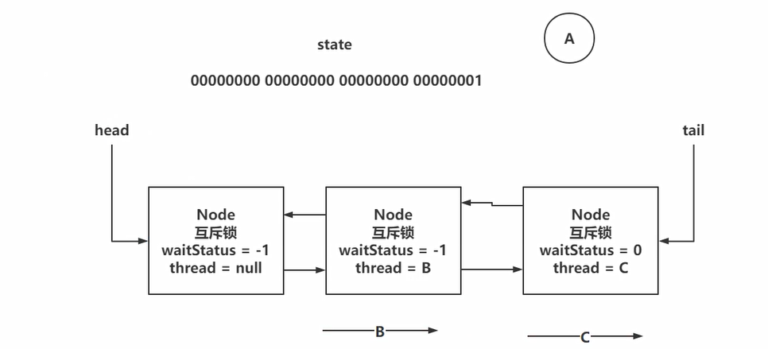
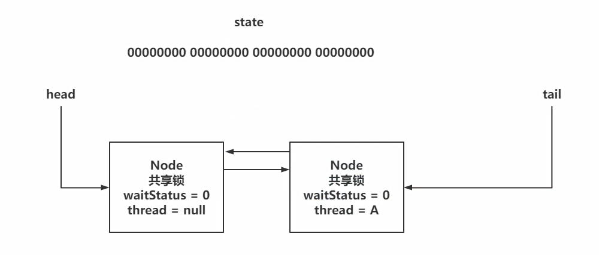
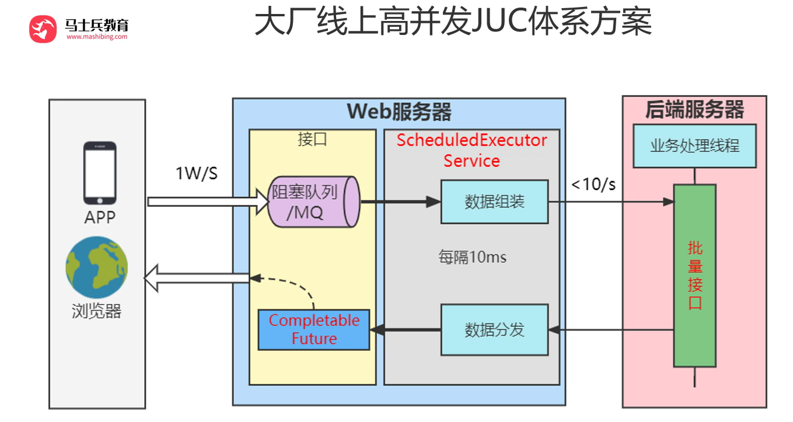

# AQS

## 1. 什么是AQS

在java中是juc包下的一个抽象类AbstractQueuedSynchronizer，规定了一系列和锁相关的规范

```java
public abstract class AbstractQueuedSynchronizer
```

在java中有很多并发类就是实现了AbstractQueuedSynchronizer，比如：

1. CountDownLatch
2. ThreadPoolExecutor
3. ReentrantLock
4. ReentrantReadWriteLock
5. Semaphore

> 其实都是这些类中的某个静态内部类实现了AbstractQueuedSynchronizer

## 2.AQS中核心内容是什么

主要有三个属性：

1. state 

   ```java
   private volatile int state;
   ```

   

   > 在不同实现类中表达的意思不同，在ReentrantLock中代表当前锁是否被占用

2. 同步队列

   ```java
   /**
    * Head of the wait queue, lazily initialized.  Except for
    * initialization, it is modified only via method setHead.  Note:
    * If head exists, its waitStatus is guaranteed not to be
    * CANCELLED.
    */
   private transient volatile Node head;
   
   /**
    * Tail of the wait queue, lazily initialized.  Modified only via
    * method enq to add new wait node.
    */
   private transient volatile Node tail;
   ```

   > 如果线程没能抢到锁就进入同步队列等待，此队列为双向队列

3. 单向链表

   ```java
   public class ConditionObject implements Condition, java.io.Serializable {
       private static final long serialVersionUID = 1173984872572414699L;
       /** First node of condition queue. */
       private transient Node firstWaiter;
       // ...
   }
   ```

   > AQS中内部类ConditionObject的firstWaiter来管理，await和signal方法

## 3.ReentrantLock

哪个线程基于CAS将state从0修改为1，就代表拿到了锁资源

1. 线程A先执行CAS，将state从0修改为1，线程A就获取到了锁资源，去执行业务代码即可
2. 线程B再执行CAS，发现state已经是1了，无法获取到锁资源
3. 线程B需要去排队，将自己封装为Node对象
4. 需要将当前B线程的Node放到双向队列保存，排队
   - 但是双向链表中，必须先有一个伪节点（保安节点）作为头节点，并且放到双向链表中
   - 将B线程的Node挂在head的后面，并且将上一个节点的状态修改为-1，再挂起B线程

### 加锁源码分析

#### lock()

- NonfairSync

  非公平锁，首先会抢一次锁，失败后再判断当前锁是否被占用，没被占用则再抢一次，如果被当前线程占用，state + 1，如果还是没有抢到则进入同步队列

  主要方法：

  - lock()

    ```java
    // 先CAS抢一次锁，成功则将exclusiveOwnerThread赋值为当前线程
    if (compareAndSetState(0, 1))
        setExclusiveOwnerThread(Thread.currentThread());
    // 失败则执行acquire方法
    else
        acquire(1);
    ```

    

  - tryAcquire()

    ```java
    return nonfairTryAcquire(acquires);
    // nonfairTryAcquire方法
    final Thread current = Thread.currentThread();
    int c = getState();
    // 如果锁没被占，则再CAS抢一次锁
    if (c == 0) {
        if (compareAndSetState(0, acquires)) {
            setExclusiveOwnerThread(current);
            return true;
        }
    }
    // 如果锁被占，但占用锁的线程为当前线程，则state加1
    else if (current == getExclusiveOwnerThread()) {
        int nextc = c + acquires;
        if (nextc < 0) // overflow 说明重入次数加1超过界限
            throw new Error("Maximum lock count exceeded");
        setState(nextc);
        return true;
    }
    // 没抢到锁，返回false
    return false;
    ```

    之后在队列中也是调用此方法尝试获取锁

- FairSync

  公平锁，首先判断锁是否被占用，如果没有则判断当前线程是否为同步队列的第一个，是则抢一次锁，否则判断占用锁的线程是否为当前线程，是则state + 1，没抢到锁则进入同步队列

  - lock

    ```java
    // 直接调用acquire
    acquire(1);
    ```

    

  - tryAcquire

    ```java
    // 与非公平锁几乎一样
    final Thread current = Thread.currentThread();
    int c = getState();
    if (c == 0) {
        // 判断同步队列是否为空或者当前线程是否为同步队列中的排头，是则抢锁
        if (!hasQueuedPredecessors() &&
            compareAndSetState(0, acquires)) {
            setExclusiveOwnerThread(current);
            return true;
        }
    }
    else if (current == getExclusiveOwnerThread()) {
        int nextc = c + acquires;
        if (nextc < 0)
            throw new Error("Maximum lock count exceeded");
        setState(nextc);
        return true;
    }
    return false;
    ```

    之后在队列中也是调用此方法尝试获取锁

acquire方法

```java
public final void acquire(int arg) {
    // 执行子类重写的tryAcquire方法，尝试获取锁资源
    if (!tryAcquire(arg) &&
        // 失败则将当前线程封装为Node节点，加入到AQS双向链表同步队列的结尾
        // acquireQueued 查看我是否是第一个排队的节点，如果是可以再次尝试获取锁资源，如果长时间拿不到，挂起线程
        // 如果不是第一个排队的节点，就尝试挂起线程
        acquireQueued(addWaiter(Node.EXCLUSIVE), arg))
        selfInterrupt();
}
```

addWaiter方法

```java
// 将当前线程封装到Node中
Node node = new Node(Thread.currentThread(), mode);
// Try the fast path of enq; backup to full enq on failure
Node pred = tail;
// tail默认为null，判断是否为第一次向同步队列中添加Node
if (pred != null) {
    // 不是第一次则将新添加的Node的prev指向原tail指向的节点
    node.prev = pred;
    // CAS将tail从原来的指向的节点改为指向新添加的Node
    if (compareAndSetTail(pred, node)) {
        // 原tail指向的节点的next指向新添加的next
        pred.next = node;
        return node;
    }
}
// 第一次添加则初始化同步队列，添加一个保安（排头Node，由head指针指向），再将新添加的Node放在保安的next
// 如果是compareAndSetTail失败了，则死循环将这个Node添加到同步队列的尾部
enq(node);
return node;
```

acquireQueued方法

```java
final boolean acquireQueued(final Node node, int arg) {
    // 记录
    boolean failed = true;
    try {
        boolean interrupted = false;
        // 无限循环获取锁和挂起？
        for (;;) {
            // 获取node的prev节点p
            final Node p = node.predecessor();
            // 如果p为head节点（保安）则代表当前节点已经是同步队列的排头，可以尝试获取锁
            if (p == head && tryAcquire(arg)) {
                // 获取锁成功后，则将当前节点变为head节点（保安）
                setHead(node);
                // 原保安节点的next置为null
                p.next = null; // help GC
                failed = false;
                return interrupted;
            }
            // 如果不是排头则挂起
            if (shouldParkAfterFailedAcquire(p, node) &&
                // 基于Unsafe类的park方法，将当前线程挂起，WAITING状态
                parkAndCheckInterrupt())
                interrupted = true;
        }
    } finally {
        if (failed)
            cancelAcquire(node);
    }
}
```

shouldParkAfterFailedAcquire挂起方法

```java
/** waitStatus value to indicate thread has cancelled */
static final int CANCELLED =  1;
/** waitStatus value to indicate successor's thread needs unparking */
static final int SIGNAL    = -1;
/** waitStatus value to indicate thread is waiting on condition */
static final int CONDITION = -2;
/**
 * waitStatus value to indicate the next acquireShared should
 * unconditionally propagate
 */
static final int PROPAGATE = -3;
// 在队列里不是头节点或者获取锁资源失败了，尝试挂起当前线程
private static boolean shouldParkAfterFailedAcquire(Node pred, Node node) {
    // 获取前一个节点的waitStatus
    int ws = pred.waitStatus;
    // 如果waitStatus为-1，则可以挂起
    if (ws == Node.SIGNAL)
        /*
         * This node has already set status asking a release
         * to signal it, so it can safely park.
         */
        return true;
    // 如果waitStatus为1，代表CANCELLED，表示上一个节点要跑路了
    if (ws > 0) {
        /*
         * Predecessor was cancelled. Skip over predecessors and
         * indicate retry.
         */
        // 循环向之前的节点遍历，找到waitStatus不为1的
        do {
            node.prev = pred = pred.prev;
        } while (pred.waitStatus > 0);
        // 将此节点作为当前节点的prev节点
        pred.next = node;
    } else {
        /*
         * waitStatus must be 0 or PROPAGATE.  Indicate that we
         * need a signal, but don't park yet.  Caller will need to
         * retry to make sure it cannot acquire before parking.
         */
        // 否则CAS将prev节点的waitStatus置为-1
        compareAndSetWaitStatus(pred, ws, Node.SIGNAL);
    }
    return false;
}
```

#### trylock()

```java
// 无论是公平锁还是非公平锁，都以非公平锁的方式获取锁
public boolean tryLock() {
    return sync.nonfairTryAcquire(1);
}
// 如果state为0，就CAS抢锁，抢锁成功返回true
// 如果state为1，可重入操作，则返回true
// 否则没有抢到锁，返回false
final boolean nonfairTryAcquire(int acquires) {
    final Thread current = Thread.currentThread();
    int c = getState();
    if (c == 0) {
        if (compareAndSetState(0, acquires)) {
            setExclusiveOwnerThread(current);
            return true;
        }
    }
    else if (current == getExclusiveOwnerThread()) {
        int nextc = c + acquires;
        if (nextc < 0) // overflow
            throw new Error("Maximum lock count exceeded");
        setState(nextc);
        return true;
    }
    return false;
}
```

#### trylock(time, unit)

```java
public boolean tryLock(long timeout, TimeUnit unit)
        throws InterruptedException {
    return sync.tryAcquireNanos(1, unit.toNanos(timeout));
}

public final boolean tryAcquireNanos(int arg, long nanosTimeout)
        throws InterruptedException {
    if (Thread.interrupted())
        throw new InterruptedException();
    return tryAcquire(arg) ||
        doAcquireNanos(arg, nanosTimeout);
}

private boolean doAcquireNanos(int arg, long nanosTimeout)
        throws InterruptedException {
    if (nanosTimeout <= 0L)
        return false;
    final long deadline = System.nanoTime() + nanosTimeout;
    final Node node = addWaiter(Node.EXCLUSIVE);
    boolean failed = true;
    try {
        for (;;) {
            final Node p = node.predecessor();
            if (p == head && tryAcquire(arg)) {
                setHead(node);
                p.next = null; // help GC
                failed = false;
                return true;
            }
            nanosTimeout = deadline - System.nanoTime();
            if (nanosTimeout <= 0L)
                return false;
            if (shouldParkAfterFailedAcquire(p, node) &&
                nanosTimeout > spinForTimeoutThreshold)
                LockSupport.parkNanos(this, nanosTimeout);
            if (Thread.interrupted())
                throw new InterruptedException();
        }
    } finally {
        if (failed)
            cancelAcquire(node);
    }
}
```

取消节点整体操作流程：

1. 线程设置为null
2. 往前找到有效节点作为当前节点的prev
3. 将waitStatus设置为1，代表取消
4. 脱离整个AQS队列：
   1. 当前Node为tail
   2. 当前Node为head的后继节点
   3. 不是tail节点，也不是head的后继节点

#### lockInterruptibly()

```java
public void lockInterruptibly() throws InterruptedException {
    sync.acquireInterruptibly(1);
}    

public final void acquireInterruptibly(int arg)
        throws InterruptedException {
    if (Thread.interrupted())
        throw new InterruptedException();
    if (!tryAcquire(arg))
        doAcquireInterruptibly(arg);
}

private void doAcquireInterruptibly(int arg)
    throws InterruptedException {
    final Node node = addWaiter(Node.EXCLUSIVE);
    boolean failed = true;
    try {
        for (;;) {
            final Node p = node.predecessor();
            if (p == head && tryAcquire(arg)) {
                setHead(node);
                p.next = null; // help GC
                failed = false;
                return;
            }
            if (shouldParkAfterFailedAcquire(p, node) &&
                parkAndCheckInterrupt())
                throw new InterruptedException();
        }
    } finally {
        if (failed)
            cancelAcquire(node);
    }
}

private final boolean parkAndCheckInterrupt() {
    // 挂起线程
    LockSupport.park(this);
    // 返回是否是被中断唤醒
    return Thread.interrupted();
}
```

### 释放锁源码分析

#### 释放锁流程概述

线程A持有当前锁，重入了一次，state=2

线程B和线程C获取锁资源失败，在AQS中排队

---------------------------------------------------------------------

线程A释放锁资源调用unlock方法， 就是执行了tryRealease方法

首先判断是不是线程A持有者锁资源，如果不是就抛异常

如果是线程A持有着锁，对state - 1

-1成功后，会判断state是否为0，如果不是，方法结束

如果是0，证明当前锁资源释放干净

查看头节点的状态是否不为0（即是否为-1），如果为0，代表后面没有挂起的线程

如果不为0，后续链表中有挂起的线程，需要唤醒

在唤醒线程时，需要先将当前节点状态从-1改为0，找到有效节点唤醒

找到之后，唤醒线程即可

#### 源码

```java
public void unlock() {
    sync.release(1);
}

public final boolean release(int arg) {
    if (tryRelease(arg)) {
        Node h = head;
        if (h != null && h.waitStatus != 0)
            unparkSuccessor(h);
        return true;
    }
    return false;
}

protected final boolean tryRelease(int releases) {
    int c = getState() - releases;
    if (Thread.currentThread() != getExclusiveOwnerThread())
        throw new IllegalMonitorStateException();
    boolean free = false;
    if (c == 0) {
        free = true;
        setExclusiveOwnerThread(null);
    }
    setState(c);
    return free;
}

private void unparkSuccessor(Node node) {
    /*
     * If status is negative (i.e., possibly needing signal) try
     * to clear in anticipation of signalling.  It is OK if this
     * fails or if status is changed by waiting thread.
     */
    int ws = node.waitStatus;
    if (ws < 0)
        compareAndSetWaitStatus(node, ws, 0);

    /*
     * Thread to unpark is held in successor, which is normally
     * just the next node.  But if cancelled or apparently null,
     * traverse backwards from tail to find the actual
     * non-cancelled successor.
     */
    Node s = node.next;
    if (s == null || s.waitStatus > 0) {
        s = null;
        // 从后往前找被挂起的线程，prev指针先改，所以靠prev指针一定能遍历到
        for (Node t = tail; t != null && t != node; t = t.prev)
            if (t.waitStatus <= 0)
                s = t;
    }
    if (s != null)
        LockSupport.unpark(s.thread);
}
```

### AQS常见的问题

#### AQS中为什么要有一个虚拟的head节点

AQS可以没有head，设计之初指定head只是为了更方便的操作，方便管理双向链表而已，一个哨兵节点的存在

比如ReentrantLock中释放锁资源时，会考虑是否需要唤醒后继节点，如果头节点的状态不是-1，就不需要去唤醒后继节点。唤醒后继节点时，需要找到head的next节点，如果head的next为null，或者是取消了，此时需要遍历整个双向链表，从后往前遍历，找到离head最近的Node，规避了一些不必要的唤醒操作

如果不用虚拟节点（哨兵节点），当前节点挂起，当前节点的状态设置为-1，可行，AQS本身就是是用了哨兵节点做双向链表的一些操作

网上说虚拟的head，可以避免重复唤醒操作，虚拟的head并没有处理这个问题，依然会出现重复唤醒

#### AQS中为什么使用双向链表

AQS的双向链表就是为了更方便的操作Node节点

在执行tryLock，lockInterruptibly方法时，如果在线程阻塞时，中断了线程，此时线程会执行cancelAcquire取消当前节点，不在AQS的双向链表中排队。如果是单向链表，此时会导致取消节点，无法直接将当前节点的prev节点的next指针，指向当前节点的next节点

### ConditionObject

像synchronized提供了wait和notify的方法实现线程在持有锁时，可以实现挂起，以及唤醒的操作

ReentrantLock也拥有这个功能

ReentrantLock提供了await和signal方法去实现类似wait和notify的功能

想执行await或者是signal就必须先持有lock锁的资源

> 先放着

## 4.ReentrantReadWriteLock

### 为什么要出现读写锁

synchronized和ReentrantLock都是互斥锁

如果有一个操作是读多写少，还要保证线程安全的话，如果采用上述的两种互斥锁，效率方面肯定是很低的

在这种情况下，就可以使用ReentrantReadWriteLock读写锁去实现

读读之间是不互斥的，可以读和读操作并发执行

但是如果涉及到了写操作，那么还是得互斥

### 读写锁的实现原理

ReentrantReadWriteLock还是基于AQS实现的，还是对state进行操作，拿到锁资源就去干活，如果没有拿到，依然去AQS队列中排队

- 读锁操作：基于state的高16位进行操作

- 写锁操作：基于state的低16位进行操作

ReentrantReadWriteLock依然是可重入锁

- **写锁重入：**读写锁中的写锁的重入方式，基本和ReentrantLock一致，没有什么区别，依然是对state进行+1操作即可，只要确认持有锁资源的线程，是当前写锁线程即可。只不过之前ReentrantLock的重入次数是state的正数取值范围，但是读写锁中写锁范围就变小了
- **读锁重入：**因为读锁是共享锁，读锁在获取锁资源操作时，是要对state的高16位进行+1操作。因为读锁是共享锁，所以同一时间会有多个读线程持有读锁资源。这样一来，多个读操作在持有读锁时，无法确认每个线程读锁重入的次数。为了去记录读锁重入的次数，每个读操作的线程，都会有一个ThreadLocal记录锁重入的次数

> **写锁的饥饿问题：**读锁是共享锁，当有线程持有读锁资源时，再来一个线程想要获取读锁，直接对state修改即可。在读锁资源先被占用后，来了一个写锁资源，此时，大量的需要获取读锁的线程来请求锁资源，如果可以绕过写锁，直接拿到资源，会造成写锁长时间无法获取到写锁资源
>
> 读锁在拿到锁资源后，如果再有读线程需要获取读锁资源，需要去AQS队列排队，如果队列的前面需要写锁资源的线程，那么后续读线程是无法拿到锁资源的。持有读锁的线程，只会让写锁线程之前的读线程拿到锁资源

### 写锁分析

#### 写锁加锁流程概述



写锁的加锁流程:

1. 写线程来竞争写锁资源
2. 写线程会直接通过tryAcquire获取写锁资源（公平锁&非公平锁）
3. 获取state值，并且拿到低16位的值
4. 如果state值不为0，判断是否是锁重入操作，判断当前持有写锁的线程是否是当前线程
5. 如果state值为0：
   - 公平锁：查看队列是否有排队的，有就直接告辞，没有就抢一手
   - 非公平锁：直接抢一手
6. 如果拿到锁资源，直接告辞，如果没有拿到去排队，而排队的逻辑和ReentrantLock一样

#### 写锁释放锁流程概述

释放的流程和ReentrantLock一致，只是在判断释放是否干净时，判断低16位的值

### 读锁分析

#### 读锁加锁流程概述



读锁加锁流程：

1. 读操作线程，竞争读锁资源

2. 会竞争共享锁的资源

3. 拿到state

4. 判断state中的低16位是否为0

   如果不为0，代表有写锁占用着资源

   如果有资源占用着写锁，但是不是当前线程，告辞

   （是当前线程：写锁 -> 读锁的降级）

5. 拿到state高16位的值

   - 公平锁：如果有人排队，直接拜拜，排队去
   - 非公平锁：查看AQS的队列中，是否有写线程在排队，如果有，排队

6. CAS对state的高16位 + 1

   如果成功，拿到读锁资源

后续操作。。。。。

#### 锁重入流程概述

重入操作：

前面阐述过，读锁为了记录锁重入的次数，需要让每个读线程用ThreadLocal存储重入次数

ReentrantReadWriteLock对读锁重入做了一些优化操作

记录重入次数的核心：

ReentrantReadWriteLock在内部对ThreadLocal做了封装，基于HoldCount的对象存储重入次数，在内部有个count属性记录，而且每个线程都是自己的ThreadLocalHoldCounter，所以可以直接对内部的count进行++操作

第一个获取读锁资源的重入次数记录方式：

第一个拿到读锁资源的线程，不需要通过ThreadLocal存储，内部提供了两个属性来记录第一个拿到读锁资源线程的信息，内部提供了firstReader记录第一个拿到读锁资源的线程，firstReaderHoldCount记录firstReader的锁重入次数

最后一个获取读锁资源的重入次数记录方式：

最后一个拿到读锁资源的线程，也会缓存他的重入次数，这样++起来更方便

基于cachedHoldCounter缓存最后一个拿到锁资源线程的重入次数

最后一个获取读锁资源的重入次数记录方式：

重入次数的流程执行方式：

1. 判断当前线程是否是第一个拿到都锁资源的：如果是，直接将firstReader一级firstReaderHoldCount设置位当前线程的信息
2. 判断当前线程是否是firstReader：如果是，直接对firstReaderHoldCount++即可
3. 跟firstReader没关系了，先获取cachedHoldCounter，判断是否是当前线程
   - 如果不是，获取当前线程的重入次数，将cachedHoldCounter设置为当前线程
   - 如果是，判断当前重入次数是否为0，重新设置当前线程的锁重入信息到readHolds（ThreadLocal）中，算是初始化操作，重入次数是0
   - 前后两者最后都做count++

# 高并发场景

### 1. 同一时间内上万请求修改mysql数据库中的一条数据

#### 出现问题的原因： 

mysql中修改某一条数据时会上行锁，所以一万个请求修改需要依次获取一万次锁再进行修改，效率极低

#### 解决方案：

将1w个请求分批传给后端服务器的批量接口，减少请求次数，后端服务器根据修改的行进行合并sql语句，最后针对某一行的修改传给mysql的请求只有几条，减轻mysql的压力

#### 具体实现方法：

创建一个阻塞队列，存放每个请求的请求参数和CompletableFuture返回结果，创建一个定时线程池Executors.newScheduledThreadPool(1)，每10ms从阻塞队列中拉取1000个请求丢给后端服务器处理，后端服务器将这1000个请求进行合并分类并执行，返回的结果再放入阻塞队列中对应请求的CompletableFuture结果中



### 2.同一个请求因为网络原因导致发送了多次，多次修改mysql

#### 出现问题的原因：

多次请求没有判断幂等性，导致执行多次

#### 解决方案：

执行前，通过唯一ID判断当前请求是否已经执行过

#### 具体实现方法：

请求中携带唯一ID参数（如果是库存修改则携带orderId），通过在mysql中建唯一ID的表，执行前先向这个表插入，插入成功则未执行，或是通过redis来判断
