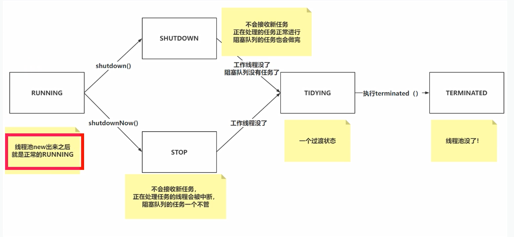
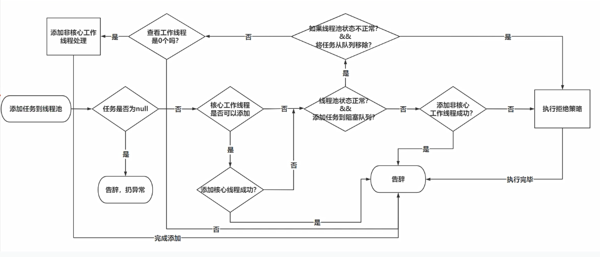

# 阻塞队列

## 基础概念

### 生产者消费者概念

生产者消费者是设计模式的一种，让生产者和消费者基于一个容器来解决强耦合问题

生产者 消费者彼此之间不会直接通讯，而是通过一个容器（队列）进行通讯

所以生产者生产完数据后扔到容器中，不用等待消费者来处理

消费者不需要去找生产者要数据，直接从容器中获取即可

而这种容器最常用的结构就是队列

> 生产者速度很快，而消费者速度很慢的情况下，队列还可以起到一个削峰的作用

### JUC阻塞队列的存取方法

常用的存取方法都是来自于JUC包下的BlockingQueue

生产者存储方法

```java 
add(E) // 添加数据到队列，如果队列满了，无法存储，抛出异常
offer(E) // 添加数据到队列，如果队列满了，返回false
offer(E,timeout,unit) // 添加数据到队列，如果队列满了，阻塞timeout时间，如果阻塞一段时间，依然没添加成功，返回false
put(E) // 添加数据到队列，如果队列满了，挂起线程，等到队列中有位置，再扔数据进去，死等
```

消费者取数据方法

```java
remove() // 从队列中移除数据，如果队列为空，抛出异常
poll() // 从队列中移除数据，如果队列为空，返回null
poll(timeout,unit) // 从队列中移除数据，如果队列为空，挂起线程timeout时间，等生产者仍数据，再获取
take() // 从队列中移除数据，如果队列为空，线程挂起，一直等到生产者仍数据，再获取
```

## ArrayBlockingQueue

### ArrayBlockingQueue的基本使用

ArrayBlockingQueue在初始化的时候，必须指定当前队列的长度

因为ArrayBlockingQueue是基于数组实现的队列结构，数组长度不可变，必须提前设置数组长度信息

### 生产者方法实现原理

#### ArrayBlockingQueue的常见属性

ArrayBlockingQueue中的成员变量

```sh
lock = 就是一个ReentrantLock
count = 就是当前数组中元素的个数
items = 就是数组本身
# 基于putIndex和takeIndex将数组结构实现为队列结构
putIndex = 存储数据时的下标
takeIndex = 取数据时的下标
notEmpty = 消费者挂起线程和唤醒线程用到的Condition（看除sync的wait和notify）
notFull = 生产者挂起线程和唤醒线程用到的Condition（看除sync的wait和notify）
```

## LinkedBlockingQueue

## PriorityBlockingQueue

PriorityBlockingQueue的常见属性

```java
// 数组的初始长度
private static final int DEFAULT_INITIAL_CAPACITY = 11;

// 数组的最大长度
// -8的目的是为了适配各个版本的虚拟机
// 默认当前使用的是hotspot虚拟机 最大支持Integer.MAX_VALUE - 2，但是其他版本的虚拟机不一定
private static final int MAX_ARRAY_SIZE = Integer.MAX_VALUE - 8;

// 存储数据的数组，也是基于这个数组实现的二叉堆
private transient Object[] queue;

// size记录当前阻塞队列中元素的个数
private transient int size;

// 要求使用的对象要实现Comparable比较器，居于Comparator做对象之间的比较
private transient Comparator<? super E> comparator;

// 实现阻塞队列的lock锁
private final ReentrantLock lock;

// 挂起线程操作
private final Condition notEmpty;

// 因为PriorityBlockingQueue的底层是基于二叉堆的，而二叉堆又是基于数组实现的，数组长度是固定的，如果需要扩容，需要构建一个新数组。PriorityBlockingQueue在做扩容操作时，不会lock住，释放lock锁，基于allocationSpinLock属性做标记，来避免出现并发扩容的问题
private transient volatile int allocationSpinLock;

// 阻塞队列中用到的原理，其实就是普通的优先级队列
private PriorityQueue<E> q;
```

## DelayQueue

### DelayQueue介绍&应用

DelayQueue就是一个延迟队列，生产者写入一个消息，这个消息还有直接被消费的延迟时间

需要让消息具有延迟的特性

DelayQueue也是基于二叉堆结构实现的，甚至本身就是基于PriorityQueue实现的功能，二叉堆结构每次获取的是栈顶的数据，需要让DelayQueue中的数据，在比较时，根据延迟时间作比较，剩余时间最短的要放在栈顶

在应用时，外卖，15分钟商家需要接单，如果不接单，这个订单自动取消

可以每下一个订单，就放到延迟队列中，如果规定时间内，商家没有接单，直接通过消费者获取元素，然后取消订单

只要是有需要延迟一定时间后，再执行的任务，就可以通过延迟队列去实现

# @Contended注解

解决内存伪共享问题，CPU的L1内存一次读取缓存行64kb，而需要操作的数据可能只有4kb，其他60kb的数据如果被其他CPU修改了，就可能导致整个缓存行重新读取，效率很低，@Contended就是为数据两端添加无意义数据，使他不会和其他有意义的数据共享一个缓存行

# 线程池

- #### SingleThreadExecutor

  SingleThreadExecutor被称为**单线程线程池**，这个线程池只有一个线程在工作，相当于单线程串行执行所有任务。任务按照指定顺序执行，且任务间的执行互斥。

  - 线程池的核心线程数默认为1。

  - 线程池的最大线程数默认也为1。

  - 阻塞队列为无界队列LinkedBlockingQueue，当任务无限多线程处理不过来时会导致OOM。

  - keepAliveTime-空闲等待时间为0，表示只要结束当前任务，立马执行下一个任务。

- #### FixedThreadPool

  FixedThreadPool被称为**固定大小线程池**。该线程池中的线程数量是固定的，当线程池中的线程都处于活跃状态时，新任务会等待可用空闲线程。若所有线程都忙碌，新任务会在阻塞队列中等待。

  - 核心线程数和最大线程数大小一样，都是通过参数nThreads设置传入。
  - keepAliveTime-空闲等待时间为0，表示只要结束当前任务，立马执行下一个任务。
  - 阻塞队列为无界队列LinkedblockingQueue，当任务无限多线程处理不过来时会导致OOM。

- #### CacheThreadPool

  CacheThreadPool被称为**缓存线程池**。该线程池中的线程数是可以无限增加的，当线程空闲时可以对线程进行回收销毁。

  - 线程池的核心线程数默认为0。
  - 最大线程数为Integer.MAX_VALUE(为 2^31-1)，理论上可以无限大。当无限创建新线程时会导致OOM。
  - 线程池的阻塞队列为SynchronousQueue同步队列。该队列的容量为0，不存储任何任务的阻塞队列，每个插入操作必须等到另一个线程调用移除操作。只负责对任务进行中转和传递，所以效率比较高。
  - keepAliveTime-非核心线程空闲时间设置为60s。当线程空闲时间超过60s时，对非核心线程进行回收销毁。

- #### ScheduledThreadPool

  ScheduledThreadPool被称为定时执行线程池。它支持定时或周期性执行任务。实现周期执行的功能主要有3个方法，分别是 schedule()、scheduleAtFixedRate()、scheduleWithFixedDelay()。

  - 线程池的核心线程数通过参数传入，最大线程数为Integer.MAX_VALUE(为 2^31-1)几乎无限大。

  - 非核心线程空闲时间keeapAliveTime设置为0，表示线程一旦空闲会立即回收销毁。

  - 阻塞队列为DelayedWorkQueue延迟队列。

  - 通过3个方法可以实现不同方式的定时延迟执行任务功能。

## 线程池核心参数

7个

核心线程数

最大线程数

非工作线程存活时间

时间单位

阻塞队列

线程工厂

拒绝策略

## ThreadPoolExecutor核心属性

核心属性主要就是ctl，基于ctl拿到线程池的状态以及工作线程个数

在整个线程池的执行流程中，会基于ctl判断上述两个内容

```java
// ctl是线程池的核心属性
// ctl其实就是一个int类型的数值，内部是基于AtomicInteger套了一层，进行运算时，是原子性的
// ctl表示着线程池中的2个核心状态：
// 线程池的状态：ctl的高3位，表示线程池状态
// 工作线程的数量：ctl的低29位，表示工作线程的个数
private final AtomicInteger ctl = new AtomicInteger(ctlOf(RUNNING, 0));

// Integer.SIZE：在获取Integer的bit位个数
// 声明了一个常量：COUNT_BITS = 29
private static final int COUNT_BITS = Integer.SIZE - 3;

// CAPACITY就是当前工作线程能记录的工作线程的最大个数
private static final int CAPACITY   = (1 << COUNT_BITS) - 1;

// 线程池状态的表示
// 当前五个状态中，只有RUNNING状态代表线程池没问题，可以正常接收任务处理
// 111：代表RUNNING状态，RUNNING可以处理任务，并且处理阻塞队列中的任务
private static final int RUNNING    = -1 << COUNT_BITS;
// 000：代表SHUTDOWN状态，不会接收新任务，正在处理的任务正常进行，阻塞队列的任务也会做完
private static final int SHUTDOWN   =  0 << COUNT_BITS;
// 001：代表STOP状态，不会接收新任务，正在处理任务的线程会被中断，阻塞队列的任务一个不管
private static final int STOP       =  1 << COUNT_BITS;
// 010：代表TIDYING状态，这个状态是否SHUTDOWN或者STOP转换过来的，代表当前线程池马上关闭，就是过渡状态
private static final int TIDYING    =  2 << COUNT_BITS;
// 011：代表TERMINATED状态，这个状态是TIDYING状态转换过来的，转换过来只需要执行一个terminated方法
private static final int TERMINATED =  3 << COUNT_BITS;

// 在使用下面这几个方法时，需要传递ctl进来
// 基于&运算的特点，保证只会拿到ctl高三位的值 ~取反 11100000 00000000 00000000 00000000
private static int runStateOf(int c)     { return c & ~CAPACITY; }
// 基于&运算的特点，保证只会拿到ctl低29位的值
private static int workerCountOf(int c)  { return c & CAPACITY; }
private static int ctlOf(int rs, int wc) { return rs | wc; }
```

## 线程池状态的特点以及转变



## 线程池execute完整执行流程图



## ThreadPoolExecutor的addWorker方法

1. 校验线程池的状态以及核心线程或者工作线程的个数
2. CAS方式将ctl的后29位加一
3. 添加工作线程worker到workers（hashset）中，将task传入worker，调用worker中的thread的start方法

## 线程池为什么构建空任务的非核心线程

场景：execute方法中，当前线程数>=核心线程数，将任务添加到阻塞队列中后，判断当前线程数 == 0，添加空任务的非核心线程

- 核心线程数设置为0，不构建空任务的非核心线程的话，需要等到队列满了，才会构建非核心线程，造成队列中的任务饥饿
- 核心线程数正常设置，但是设置了核心线程也有存活时间，在任务添加到队列后，核心线程刚好到了存活时间被销毁

## 线程池使用完毕为何必须shutdown()

如果不shutdown，线程池中的核心线程Worker由于是Thread，属于GC Root，根据可达性算法，不会被回收，而Worker是ThreadPoolExecutor的内部类，内部类没有被回收，ThreadPoolExecutor也不会被回收

## 线程池的四种拒绝策略

- 直接抛异常
- 啥也不做
- 交给当前线程执行
- 干掉阻塞队列中最早加入的任务

## 线程池的核心参数到底如何设置

判断任务到底是I/O密集型，还是CPU密集型，还是混合型

最好的方式是通过测试，调试出一个符合当前任务情况的核心参数

动态监控和修改线程池

线程池提供了get/set方法支持动态查看和修改的功能

> 这些方法都有加锁

# ConcurrentHashMap

## ConcurrentHashMap在1.8中做了什么优化

存储结构：从数组+链表变为了数组+链表/红黑树

写数据时加锁的优化：锁粒度更小，对于数组的写操作使用CAS，对于链表/红黑树的写操作使用synchronized加锁

扩容：协助扩容，添加数据时发现你在扩容，不会一直等到扩容结束，而是协助扩容

size方法：用了类似LongAdder类的方式，不会让所有线程同时CAS一个值，导致CPU占用时间过长，而是通过很多个Cell，让不同的线程CAS不同的Cell，最后再加到一起获取

## ConcurrentHashMap的散列算法

```java
static final int spread(int h) {
    // 将key的hashcode的高16位与低16位进行异或操作，为了使key的hashcode的高位与低位都参与
    // 再与0x7fffffff与运算，保证最高位为0，值为正数，因为负数在concurrenthasmap中有特殊含义
    return (h ^ (h >>> 16)) & HASH_BITS;
}
```

为什么扩容一定是2的n次幂

```java
(n - 1) & hash
```

只有这样数组长度减1才每位都是1，与hash值与运算后才能使hash值的后面几位全部参与进来，这样也算是mod运算

## ConcurrentHashMap初始化数组的流程

懒加载，putVal的时候判断数组是否为空，为空则初始化

```java
private final Node<K,V>[] initTable() {
    Node<K,V>[] tab; int sc;
    while ((tab = table) == null || tab.length == 0) {
        // sizeCtl为-1代表已经有线程拿到锁，开始初始化了，让出线程
        if ((sc = sizeCtl) < 0)
            Thread.yield(); // lost initialization race; just spin
        // CAS加锁 将sizeCtl修改为-1
        else if (U.compareAndSwapInt(this, SIZECTL, sc, -1)) {
            try {
                // DCL 
                if ((tab = table) == null || tab.length == 0) {
                    int n = (sc > 0) ? sc : DEFAULT_CAPACITY;
                    @SuppressWarnings("unchecked")
                    Node<K,V>[] nt = (Node<K,V>[])new Node<?,?>[n];
                    table = tab = nt;
                    // sc的0.75为下次扩容的阈值
                    sc = n - (n >>> 2);
                }
            } finally {
                // 从-1变回原来的值或者变为当前数组长度的0.75
                sizeCtl = sc;
            }
            break;
        }
    }
    return tab;
}
```

## ConcurrentHashMap扩容的流程

treeifyBin方法触发扩容

```java
// 在链表长度大于等于8时，尝试将链表转为红黑树
private final void treeifyBin(Node<K,V>[] tab, int index) {
    Node<K,V> b; int n, sc;
    if (tab != null) {
        // 当前数组长度小于64
        if ((n = tab.length) < MIN_TREEIFY_CAPACITY)
            // 尝试扩容
            tryPresize(n << 1);
        else if ((b = tabAt(tab, index)) != null && b.hash >= 0) {
            synchronized (b) {
                if (tabAt(tab, index) == b) {
                    TreeNode<K,V> hd = null, tl = null;
                    for (Node<K,V> e = b; e != null; e = e.next) {
                        TreeNode<K,V> p =
                            new TreeNode<K,V>(e.hash, e.key, e.val,
                                              null, null);
                        if ((p.prev = tl) == null)
                            hd = p;
                        else
                            tl.next = p;
                        tl = p;
                    }
                    setTabAt(tab, index, new TreeBin<K,V>(hd));
                }
            }
        }
    }
}
```

putAll

addCount

都有可能触发扩容

扩容2倍，分段迁移，其他线程可以帮忙一起迁移，最后一个线程检查是否全部迁移完毕

## ConcurrentHashMap读取数据的流程

get(Object key)

get方法不会加锁，先求出key的hash值，在数组上判断当前索引为hash值的值是否存在，不存在就返回null，存在的话先判断当前索引值的值是否相等，引用相等或者equals方法相等，如果不相等再看当前节点的hash值是否大于0，如果大于等于0则是链表，遍历链表寻找引用相等或者equals方法相等的值，如果小于0则分几种情况，如果当前数组正在扩容迁移，则需要到新数组上查找是否存在，如果当前是黑红树，则要判断是否有写操作或者等待，如果有则遍历双向链表，如果没有则通过红黑树的方式查找

```java
public V get(Object key) {
    Node<K,V>[] tab; Node<K,V> e, p; int n, eh; K ek;
    int h = spread(key.hashCode());
    if ((tab = table) != null && (n = tab.length) > 0 &&
        (e = tabAt(tab, (n - 1) & h)) != null) {
        // hash值相等判断对象是否相等
        if ((eh = e.hash) == h) {
            if ((ek = e.key) == key || (ek != null && key.equals(ek)))
                return e.val;
        }
        // hash值<0多种情况，红黑树，扩容迁移
        else if (eh < 0)
            return (p = e.find(h, key)) != null ? p.val : null;
        // 链表
        while ((e = e.next) != null) {
            if (e.hash == h &&
                ((ek = e.key) == key || (ek != null && key.equals(ek))))
                return e.val;
        }
    }
    return null;
}
```

## ConcurrentHashMap中计数器的实现

计数器存的其实就是ConcurrentHashMap中元素的个数

弱一致性，查询的时候没有加锁，只能查出当时的情况

```java
// 基础计数器，没有高并发的时候用的
private transient volatile long baseCount;
// 高并发情况下存储
private transient volatile CounterCell[] counterCells;
```

高并发的情况下如果像AtomicInteger一样while循环CAS得话，效率很低，会一直占用CPU，所以借鉴了LongAdder中的方法，当有多个线程的时候，其他线程操作counterCells中的元素，每个线程都会被分配到一个counterCells，最后统计的时候将baseCount和counterCells中的计数合计返回

```java
final long sumCount() {
    CounterCell[] as = counterCells; CounterCell a;
    long sum = baseCount;
    if (as != null) {
        for (int i = 0; i < as.length; ++i) {
            if ((a = as[i]) != null)
                sum += a.value;
        }
    }
    return sum;
}
```

# Semaphore

信号量，state的值可以大于1，多个线程获取，并且还可以归还的

# CountDownLatch

计数器，可以用来标识线程任务是否执行完成，不能复用，如果最后减为0了，需要在创建一个才能使用

初始值设置一个数字，每个线程执行完后，减一，主线程await方法等待其他线程减一

# CycleBarrier

循环使用的屏障，线程之间互相的等待，到达设置的数量后，并行执行，可以在到达设置的数量之后执行一个自定义任务，再并行执行
