## 类加载器

Bootstrap类加载器 -> Ext类加载器（Extension） -> App类加载器 -> Custom类加载器

#### Bootstrap类加载器

加载lib/rt.jar charset.jar等核心类

#### Ext类加载器

加载扩展jar包，jre/lib/ext/*.jar，或由-Djava.ext.dirs指定

#### App类加载器

加载classpath指定内容

#### Custom类加载器

自定义classloader

Bootstrap类加载器由外部C++实现（在代码中获取Bootstrap类加载为null），其他类加载器都由Bootstrap类加载器加载

### 双亲委派机制

类加载器从下往上查询是否已被加载，已加载则返回，从上往下判断是否能加载，能则加载返回

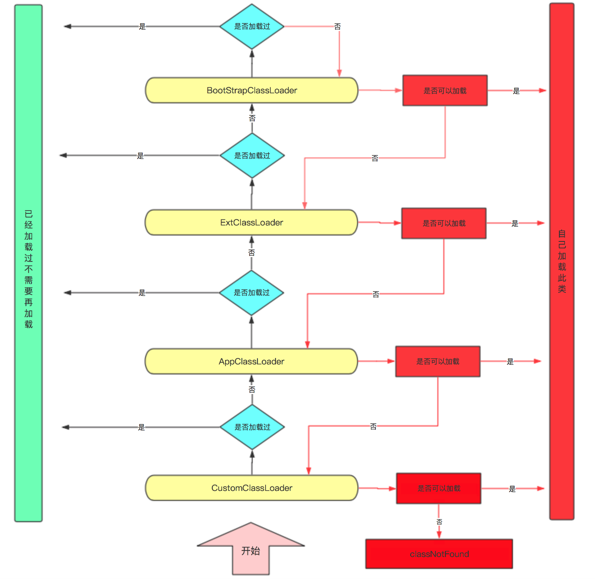

调用类加载器的loadClass方法加载类，加载类之前会先判断是否已经加载过（校验），没有加载过调用父类加载器的loadClass方法，如果都没有加载过则调用findClass方法去真正的加载类，一般自定义类加载器重写findClass方法来将.class文件加载到内存，然后交给defineClass方法，loadClass是按照双亲委派写好的代码

#### 打破双亲委派机制

自定义类加载器并且重写loadClass方法，如Tomcat通过这种方式实现应用之间类隔离

- 一个Tomcat程序中是可以运行多个Web应用的，如果这两个应用中出现了相同限定名的类，比如Servlet类，Tomcat要保证这两个类都能加载并且他们应该是不同的类
- 如果不打破双亲委派机制，当应用类加载器加载Web应用1中的MyServlet之后，Web应用2中相同限定的MyServlet类就无法被加载了

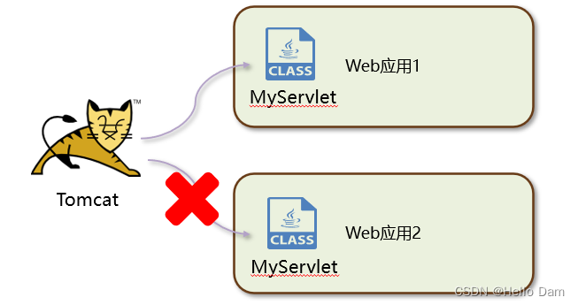

Tomcat使用了自定义类加载器来实现应用之间类的隔离，每一个应用会有一个独立的类加载器加载对应的类

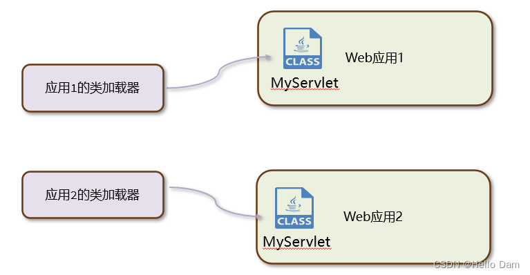

**阿里arthas不停机热部署**

只需要将修改的类的字节码上传，然后让类加载器重新加载，即可实现热部署

## RuntimeDataArea

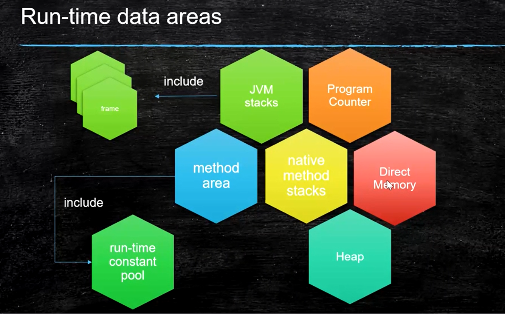

### Method Area

*JVM中所有的JVM线程共享一个方法区，存储了类信息、方法信息、属性信息、常量、静态变量*

- Perm Generation（< 1.8）

  字符串常量位于Perm Generation，FGC不会清理

- Meta Space（>= 1.8）

  字符串常量位于堆，会触发FGC清理

#### Run-Time Constant Pool

存放常量数据，指的是class文件解析后的常量数据，用于存放编译器生成的各种字面量与符号引用

### Heap

*JVM中所有的JVM线程共享一个heap，堆是分配所有的class instances和数组内存空间的运行时数据区*

### JVM stacks

*每个JVM线程有一个私有的JVM栈，和线程同时创建，JVM栈存储栈帧（frames）*

#### 栈帧（Frame）

每个方法对应一个栈帧

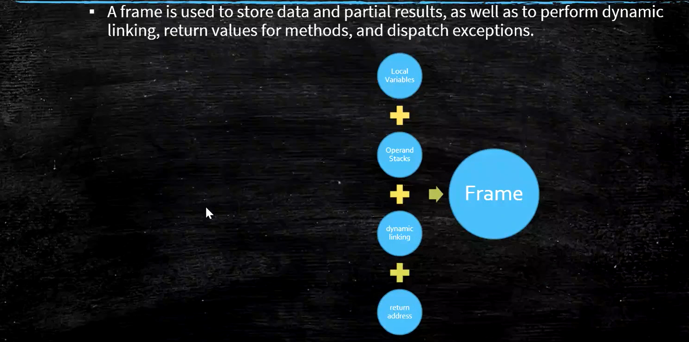

- Local Variables

  局部变量

- Operand Stacks

- Dynamic linking

  指向class文件解析中的常量池，找具体的方法，如果解析过了就直接用，没解析过就解析

  > **多态**的原因，类加载的时候无法知道具体是执行那个类的方法，动态链接是为了支持方法的动态调用过程。动态链接将这些符号方法引用转换为具体的方法引用，符号引用转化为直接引用

- Return Address

  a()->b()，A方法调用了B方法，B方法返回值存放的地方

举例：

1. main方法

```java
public static void main(String[] args) {
	int i = 8;
    i = i++;
    System.out.println(i); // 8
}
```

Local Variables Table

| 索引 | 变量名 |
| :--- | ------ |
| 0    | args   |
| 1    | i      |

指令：

```java
bipush_8 // 将8push到Operand Stacks中
istore_1 // 将Operand Stacks头的值出栈赋值给Local Variables Table中索引为1的i（8）
iload_1 // 将Local Variables Table中索引为1的i的值放入Operand Stacks（8）
iinc 1 by 1 // 将Local Variables Table中索引为1的i的值加1（9）
istore_1 // 将Operand Stacks头的值出栈赋值给Local Variables Table中索引为1的i（8）
getstatic #2<java/lang/System.out>
iload_1
invokevirtual #3 <java/io/PrintStream.println>
return
```

2. main方法调用m1方法

```java
public static void main(String[] args) {
	Hello_03 h = new Hellow_03();
    int i = h.m1();
}

public void m1() {
    return 100;
}
```

Local Variables Table:

- main:

  | 索引 | 变量名 |
  | ---- | ------ |
  | 0    | args   |
  | 1    | h      |
  | 2    | i      |

- m1:

  | 索引 | 变量名 |
  | ---- | ------ |
  | 0    | this   |

指令：

```java
new #2 <com/mashibing/jvm/Hello_03> // 在内存中分配空间，成员变量赋初始值
dup // 压到Operand Stacks中，并复制一份
invokespecial #3 <com/mashibing/jvm/Hello_03.<init>> // 调用构造方法init，成员变量赋值，执行构造方法语句，将复制的对象从栈顶弹出
astore_1 // 将对象出栈赋值给main的Local Variables Table的1号索引h
aload_1 // 将Local Variables Table的1号索引h压栈
invokevirtual #4 <com/mashibing/jvm/Hello_03.m1> // 调用h的m1方法,将方法返回值压入Operand Stacks栈中
istore_2 // 将方法返回值弹出赋值给main的Local Variables Table的2号索引i
return
```

### Program Counter（PC）

存放指令位置，*每一个JVM线程都有一个自己的PC*

虚拟机的运行，类似这样的循环

```java
while(not end) {
    获取PC的值，找到对应指令的位置;
    执行该指令;
    PC++;
}
```

### native method stacks

调用JVM内部c++方法存放的位置

### Direct Memory

直接内存，JVM可以直接访问的内核空间的内存（OS管理的内存），NIO，提高效率，实现zero copy

> 之前是JVM管理部分内存，如果IO过来数据，先放在操作系统内存中，再复制到JVM的内存中，效率低

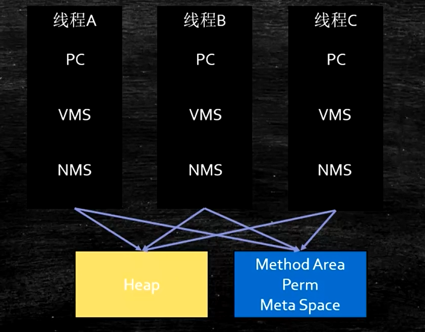

## GC（垃圾回收）

根可达算法：解决循环依赖不会被回收，只有被根引用的对象才不会被回收

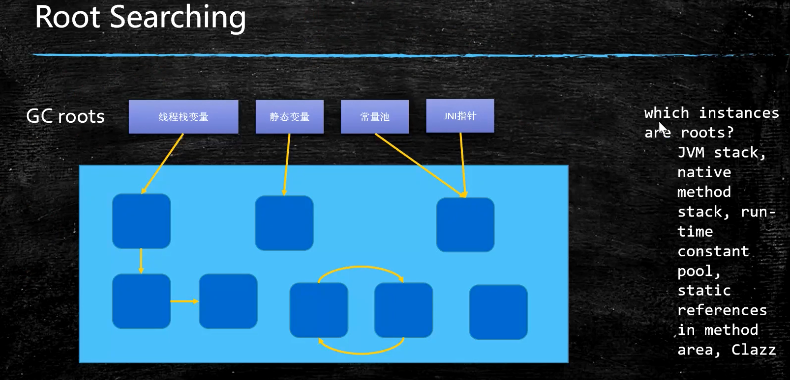

- 线程栈变量

  栈帧中局部变量

- 静态变量

  .class文件中的静态变量

- 常量池

  .class文件中的静态变量引用其他.class文件中的静态变量

- JNI指针

  c、c++本地方法用到的内部对象

类加载器，Thread，虚拟机栈的本地变量表，本地方法栈的变量，static成员，常量引用

> 引用计数方法：记录被引用的数量，如果为0代表没有被引用，将被回收，但是解决不了循环引用无法回收的问题

### GC Algorithms（常见的垃圾回收算法）

#### Mark-Sweep（标记清除）

根据根可达算法找到所有不可回收对象，再找到可回收对象，将可回收对象回收

优点：

算法相对简单，适合不可回收对象多的场景，效率较高

缺点：

需要两次遍历，会产生内存碎片

#### Copying（拷贝）

将内存分为两块，一块用来正常使用，一块空着备用，垃圾回收时找到所有不可回收对象，将他们复制到空着的内存区域，之后将原来的区域全部回收

优点：

一次遍历，适合不可回收对象少的场景，不会产生内存碎片

缺点：

浪费空间，移动复制对象，需要调整对象引用

#### Mark-Compact（标记压缩）

找到所有不可回收对象，将他们向前移动，再找到可回收对象，将可回收对象回收

优点：

不浪费空间，不会产生内存碎片

缺点：

遍历两次，移动对象

### JVM内存分代模型（用于分代垃圾回收）

#### 部分垃圾回收器使用的模型

除Epsilon ZGC Shenandoah之外的GC都是使用逻辑分代模型

G1是逻辑分代，物理不分代

除此之外不仅逻辑分代，而且物理分代


新生代 + 老年代 + 永久代（1.7）Perm Generation / 元数据区（1.8）Metaspace

Method Area 方法区是逻辑概念，具体实现是永久代

Perm Generation可以用命令指定大小，指定完大小就不能再改了，容易出现溢出（占用JVM内存？）

Metaspace如果不设置就无上限（受限于物理内存，直接内存？）

#### 堆内存逻辑分区

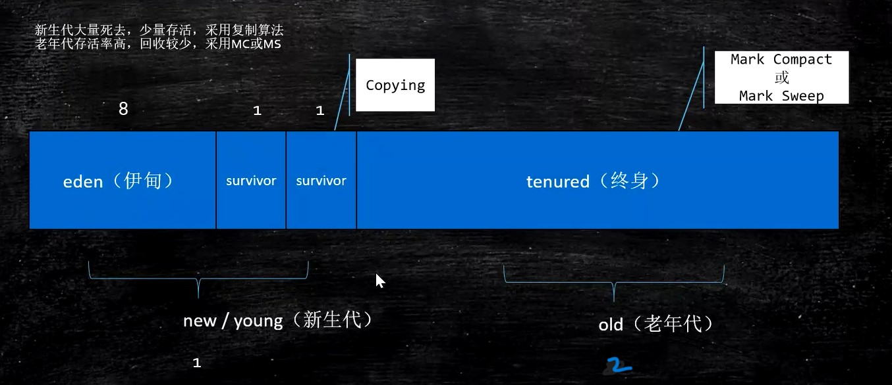

#### 一个对象从出生到消亡

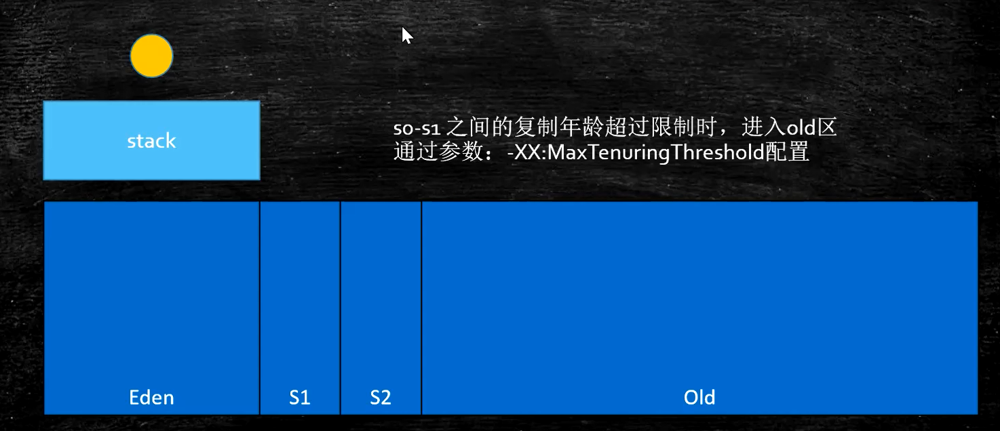

先尝试在stack上分配，分配失败去Eden（伊甸园），GC后会反复在S1和S2移动，到一定年龄去Old（老年区）

> - 栈上分配
>   - 线程私有小对象
>   - 无逃逸 不会被外部引用，只在方法内部
>   - 支持标量替换 对象比较简单，只用对象里的成员变量就可以替代整个对象
>   - 无需调整（一般无需优化）
> - 线程本地分配TLAB（Thread Local Allocation Buffer）
>   - 占用eden，默认1% （每个线程提前分配好内存空间，防止多个线程同时抢占一处内存）
>   - 多线程的时候不用竞争eden就可以申请空间，提高效率
>   - 小对象
>   - 无需调整（一般无需优化）

对象何时进入老年代

- 超过XX:MaxTenuringThreshold
  - Parallel Scavenge 15
  - CMS 6
  - G1 15
  
- 动态年龄
  - s1 -> s2超过50% （eden区和s1区的对象都放进s2后超过了s2容量的50%）
  - 把年龄最大的放入Old
  
- 老年代担保机制

  对象太大，eden区没东西的情况下都装不下，会直接方法老年代中

在Eden区进行的垃圾回收叫做YGC（Young GC），在Old区进行的垃圾回收叫做FGC（Full GC），当Eden区或Old区满的时候触发GC

### 常见的垃圾回收器

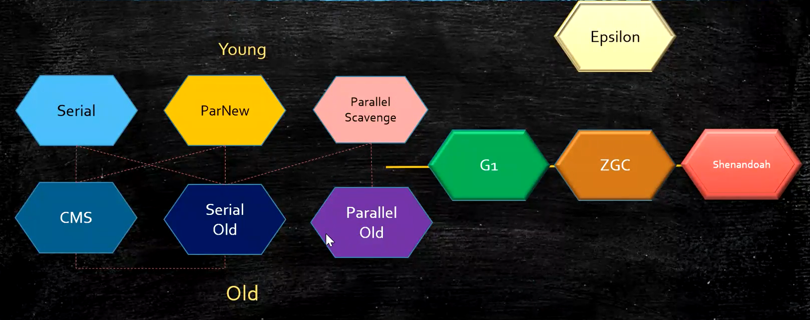

一般的组合：

- Serial - Serial Old  

  几十兆

- Parallel Scavenge - Parallel Old （PS - PO）（1.8默认垃圾回收器）

  上百兆 - 几个G

- ParNew - CMS

  20G

- G1

  上百G

- ZGC

  4T - 16T（jdk13）

- Shenandoah

#### Serial - Serial Old

- serial

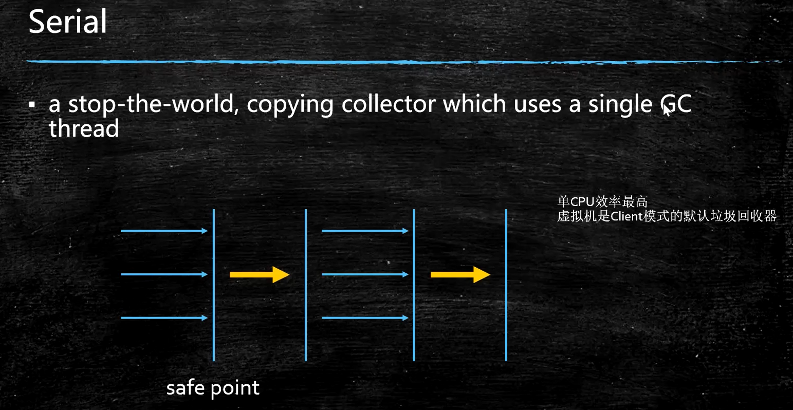

> 很久远的垃圾回收器

STW: stop-the-world,所有工作线程都停下来，由一个GC线程回收垃圾

safe  poinit: 安全的将工作线程停下来，不是立即停止

使用的复制算法

- serial old

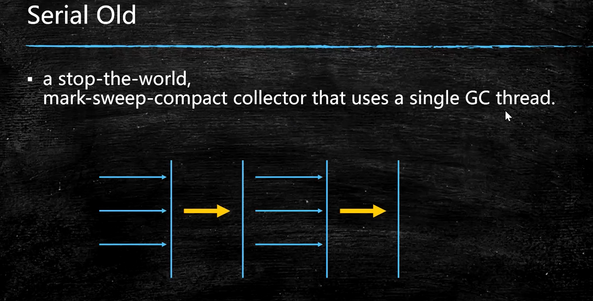

基本同上

使用的Mark-Compact标记压缩算法

#### Parallel Scavenge - Parallel Old （PS - PO）

**Parallel Scavenge**

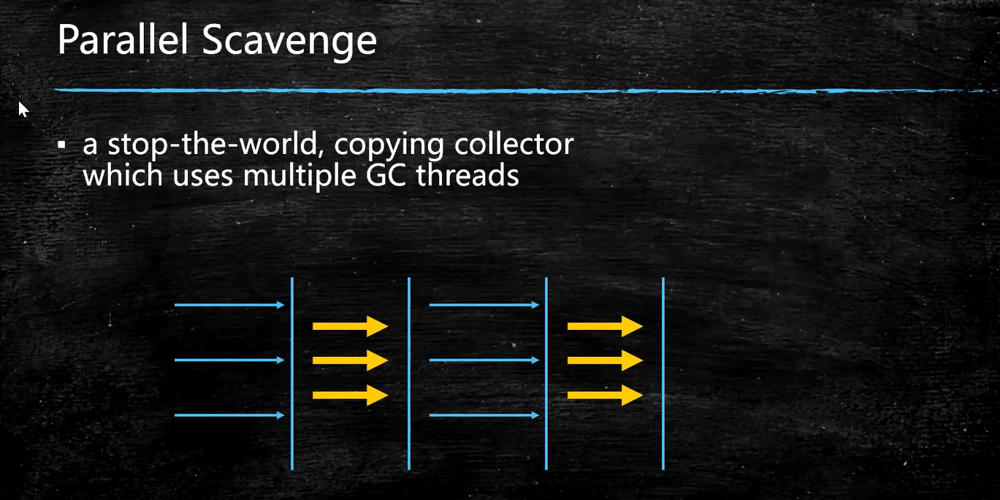

> java1.8默认的垃圾回收器

和Serial很像，只是有多个线程GC

**Parallel Old**

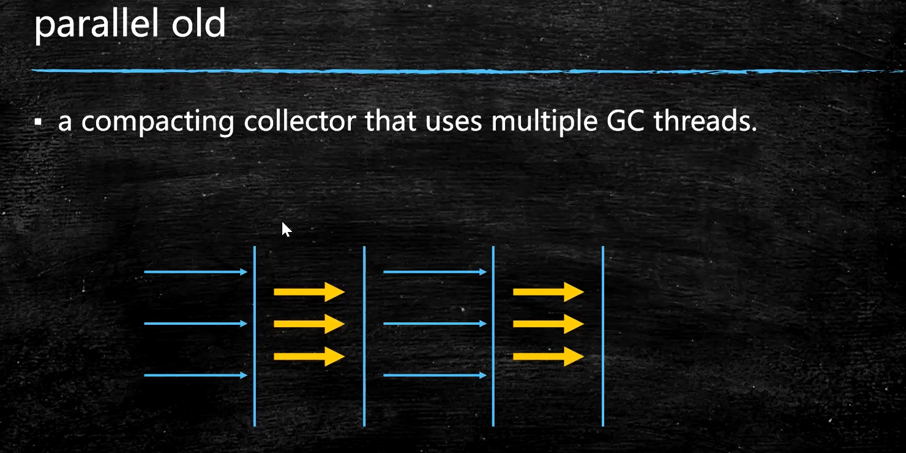

基本同上

使用的Mark-Compact标记压缩算法

#### ParNew - CMS

**ParNew**

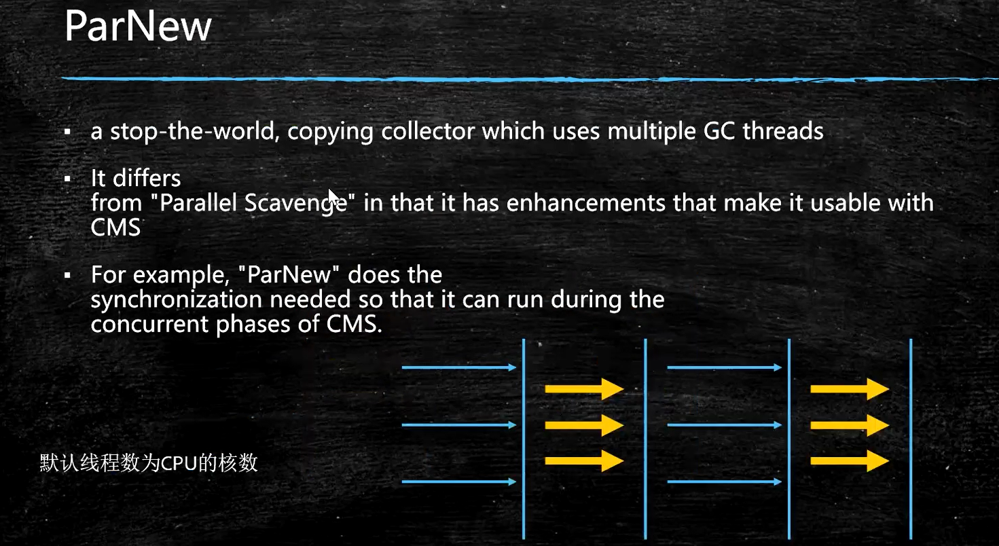

和PS比较像，是PS的增强版，主要增强了和CMS共同使用的场景

**CMS**

concurrent mark sweep 并发标记清理

> 主要为了解决STW时间过长的问题，里程碑式的垃圾回收，但问题比较多，貌似没有哪个版本的jdk默认垃圾回收器是他

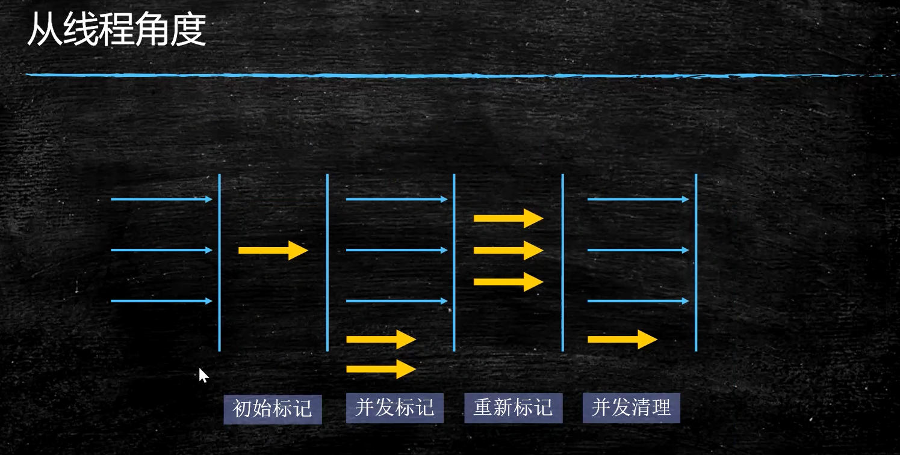

- 初始标记

  STW，先标记根对象，数量较少，时间较短，单线程

- 并发标记

  与工作线程同时运行，标记所有根可达节点和垃圾

- 重新标记

  STW，标记在并发标记过程中，工作线程新产生的垃圾垃圾节点

- 并发清理

  与工作线程同时运行，清理所有垃圾，此时工作线程产生的垃圾叫浮动垃圾，等待下一次GC，因为此时是和工作线程同时运行，只能使用标记清除方法回收垃圾，才能保证正在被使用的对象的引用不会改变

使用的算法：三色标记 + Incremental Update

> 问题：
>
> 由于使用的是标记清除，会产生很多内存碎片，导致Eden区来的对象可能没有空间，会触发Serial Old来清理垃圾，效率很低，内存越大越容易产生内存碎片
>
> 解决方法：
>
> 减少触发CMS的阈值？增加浮动垃圾可以存放的空间？
>
> -XX:CMSInitiatingOccupancyFraction 92% 调低

#### G1

> STW 10ms

算法：三色标记 + SATB

使用G1收集器时，Java堆的内存布局就与其他收集器有很大差别，他将整个Java堆划分为多个大小相等的独立区域（Region），虽然还保留有新生代和老年代的概念，但新生代和老年代不再是物理隔离的了，他们都是一部分Region（不需要连续）的集合

**更精细的控制、可预测的停顿时间、内存碎片的控制、优先级处理**

**每个Region大小都是一样的，可以是1M到32M之间的数值，但是必须保证是2的n次幂**

**如果对象太大，一个Region放不下【超过Region大小的50%】，那么就会直接放到H中**

**设置Region大小：**-XX:G1HeapRegionSize=<n>M

**所谓Garbage-First，其实就是优先回收垃圾最多的Region区域**

> 1. 分代收集（仍然保留了分代的概念
> 2. 空间整合（整体上属于“标记-整理”算法，不会导致空间碎片）
> 3. 可预测的停顿（比CMS更先进的地方在于能让使用者明确指定一个长度为M毫秒的时间片段内，消耗在垃圾收集上的时间不得超过N毫秒）

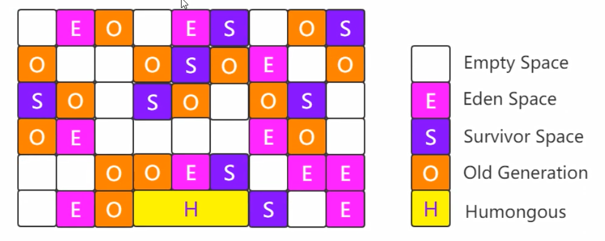

YGC：

复制算法

##### 工作过程（Mixed GC）

- 初始标记（Initial Marking） 单线程标记以下GC Roots能够关联的对象，并且修改TAMS的值，需要暂停用户线程
- 并发标记（Concurrent Marking） 从GC Roots进行可达性分析，找出存活的对象，与用户线程并发执行
- 最终标记（Final Marking） 修正在并发标记阶段因为用户程序的并发执行导致变动的数据，需暂停用户线程
- 筛选回收（Live Data Counting and Evacuation） 对各个Region的回收价值和成本进行排序，根据用户所期望的GC停顿时间指定回收计划（复制清理，STW）

##### 调优策略

1. 不要手动设置新生代和老年代的大小，只要设置整个堆的大小

   > G1收集器再运行过程中，会自己调整新生代和老年代的大小
   >
   > 其实是通过adpat代的大小来调整对象晋升的速度和年龄，从而达到为收集器设置的暂停时间目标
   >
   > 如果手动设置了大小就意味着放弃了G1的自动调优

2. 不断调优暂停时间目标

   > 一般情况下这个值设置到100ms或者200ms都是可以的（不同情况下会不一样），但如果设置成50ms就不太合理。暂停时间设置的太短，就会导致出现G1跟不上垃圾产生的速度，最终退化成Full GC，所以对这个参数的调优是一个持续的过程，逐步调整到最佳状态。暂停时间只是一个目标，并不能总是得到满足

3. 使用-XX:ConcGcThreads=n来增加标记线程的数量

   > IHOP如果阈值设置过高，可能会遇到转移失败的风险，比如对象进行转移时空间不足，如果阈值设置过低，就会使标记周期运行过于频繁，并且有可能混合收集期回收不到空间
   >
   > IHOP值如果设置合理，但是在并发周期时间过长时，可以尝试增加并发线程数，调高ConcGcThreads

4. MixedGC调优

   > -XX:InitiatingHeapOccupancyPercent
   >
   > -XX:G1MixedGCLiveThresholdPercent
   >
   > -XX:G1MixedGCCountTarger
   >
   > -XX:G1OldCSetRegionThresholdPercent

5. 适当增加堆内存大小

6. 不正常的FULL GC

   > 有时候会发现系统刚刚启动的时候，就会发生一次Full GC，但是老年代空间比较充足，一般是由Metaspace区域引起的，Metaspace默认设置的比较小，实际使用的比较多，就会频繁扩容触发Full GC。可以通过MetaspaceSize适当增加其大小，比如256M

##### 什么时候使用G1垃圾回收器

JDK 7开始使用，JDK 8非常成熟，JDK 9默认的垃圾收集器，适用于新老生代

1. 50%以上的堆被存活对象占用
2. 对象分配和晋升的速度变化非常大
3. 垃圾回收时间比较长

#### ZGC

> STW 1ms

算法：ColoredPointers + LoadBarrier

#### Shenandoah

算法：ColoredPointers + WriteBarrier

### 常见的垃圾回收器组合参数(1.8)

- -XX:+UseSerialGC = Serial New(DefNew) + Serial Old

  小型程序，默认情况下不会是这种选项，HotSpot会根据计算及配置和JDK版本自动选择收集器

- -XX:+UseParNewGC = ParNew + SerialOld

  这个组合已经很少用（在某些版本中已经废弃）

- -XX:+UseConc<font color=red>(urrent)</font>MarkSweepGC = ParNew + CMS + Serial Old

- -XX:+UseParallelGC = Parallel Scavenge + Parallel Old（1.8默认）

- -XX:+UserParallelOldGC = Parallel Scavenge + Parallel Old

- -XX:+UseG1GC = G1

- Linux中没找到默认GC的查看方法，而windows中会打印UseParallelGC

  java +XX:+PrintCommandLineFlags -version

  通过GC的日志来分辨

## JVM调优

JVM的命令行参数参考：https://docs.oracle.com/javase/8/docs/technotes/tools/unix/java.html

### hotspot参数分类

- 标准：-  开头，所有hotspot都支持

- 非标准：-X 开头，特定版本hotspot支持特定命令

- 不稳定：-XX 开头，下个版本可能取消

> 查看jvm当前参数配置
>
> java -XX:+PrintFlagsFinal -version | grep 过滤名

### 常用命令行

```cmd
java -XX:+PrintCommandLineFlags HelloGC
# 打印java命令默认的参数
# 结果：-XX:InitialHeapSize=16070592 -XX:MaxHeapSize=257129472 -XX:+PrintCommandLineFlags -XX:+UseCompressedClassPointers -XX:+UserCompressedOops
# 初始化堆大小 最大堆大小 打印java命令默认的参数 压缩类指针 压缩普通对象指针

java -Xmn10M -Xms40M -Xmx50M -XX:+PrintCommandLineFlags -XX:+PrintGC HelloGC
# -Xms 初始化堆大小 -Xmx 最大堆大小 （一般设置一样，防止堆大小频繁弹性变化）
# -Xmn new 新生堆大小
# -XX:+PrintGC 打印GC信息 -XX:+PrintGCTimeStamps 打印GC的时间 -XX:+PrintGCDetails 打印GC详细信息 -XX:+PrintGCCauses 打印GC原因
# 结果：-XX:InitialHeapSize=41963040 -XX:MaxHeapSize=62914560 -XX:MaxNewSize=10485760 -XX:NewSize=10485760 -XX:+PrintCommandLineFlags -XX:+PrintGC -XX:+UseCompressedClassPointers -XX:+UserCompressedOops
# [GC (Allocation Failure) 7839K->7428K(39936K),0.0147751 secs] 新生代GC GC原因空间不足 所占空间从7839K到7428K，新生堆空间总共(39936K)，GC时间0.0147751 secs
# [Full GC (Allocation Failure) 36100K->36099K(45076K),0.0216372 secs] 老年代GC GC原因空间不足 所占空间从36100K到36099K，老年代空间总共(45076K)，GC时间0.0216372 secs
```

CMS：

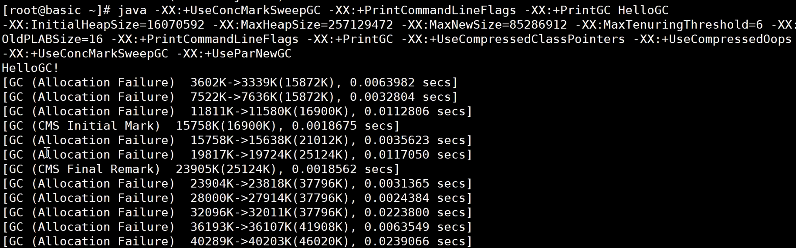

Initial Mark：初始标记

Final Mark：最终标记

#### GC日志详解

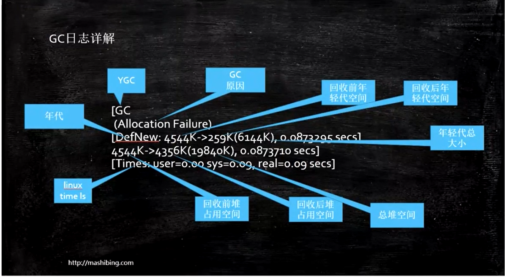

GC日志中heap dump部分：

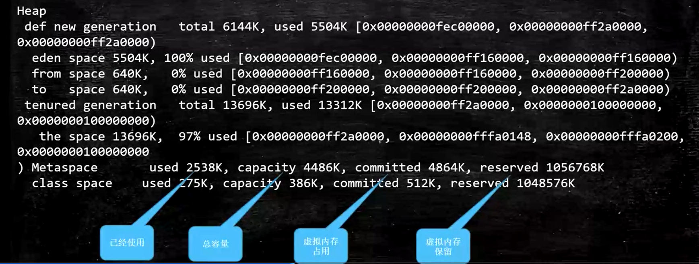

[0x00000000fec0000, 0x000000ff2a0000, 0x000000ff2a0000]

内存占用起始地址，内存占用结束地址，内存总共结束地址

total = eden + 1个survival

#### heap dump

heap dump文件是一个二进制文件，它保存了某一时刻JVM堆中对象使用情况。HeapDump文件是指定时刻的Java堆栈的快照，是一种镜像文件。Heap Analyzer工具通过分析HeapDump文件，哪些对象占用了太多的堆栈空间，来发现导致内存泄露或者可能引起内存泄露的对象。

heapdump是诊断与JVM内存相关的问题的重要手段，例如：内存泄漏、垃圾回收问题和java.lang.OutOfMemoryError。同时也是优化内存消耗的重要手段。

### 调优前基础概念

- 吞吐量 = 用户代码执行时间 /（用户代码执行时间+垃圾回收执行时间）

  科学计算，数据挖掘，吞吐量优先一般：PS + PO

- 响应时间快 = 用户线程停顿时间短 

​	STW时间越短，响应时间越快

​	网站，API，GUI （1.8 G1）

所谓调优，就是要求吞吐量优先，还是响应时间优先，还是满足一定相应时间，要求多大的响应量

#### 什么是调优？

1. 根据需求进行JVM规划和预调优
2. 优化运行JVM运行环境（慢、卡顿）
3. 解决JVM运行过程中出现的各种问题

##### 预调优

从业务场景开始，无监控（压力测试，能看到结果），不调优

步骤：

1. 熟悉业务场景（没有最好的垃圾回收器，只有最合适的垃圾回收器）

   要求响应时间、停顿时间【CMS G1 ZGC】（需要给用户作响应）

   吞吐量 = 用户时间 / （用户时间 + GC时间）【PS】

2. 选择回收器组合

3. 计算内存需求

   内存大，GC不会很频繁，但一次的GC时间可能会很长

   内存小，GC频繁如果能回收大部分垃圾，也可以

4. 选定CPU（越高越好）

   GC速度快，回收时间短

5. 设定年代大小、升级年龄（不清楚）

6. 设定日志参数

   - -Xloggc:/opt/xxx/logs/xxx-xxx-gc-%t.log -XX:+UseGCLogFileRotation -XX:NumberOfGCLogFiles=5 -XX:GCLogFileSize=20M -XX:+PrintGCDetails -XX:+PrintGCDateStamps -XX:+PrintGCCause

     %t：系统时间

     -XX:+UseGCLogFileRotation：循环使用

     -XX:NumberOfGCLogFiles=5：5个日志文件

     -XX:GCLogFileSize=20M：单个日志文件大小20M

     五个日志循环使用，五个都记满了，就从第一个开始覆盖，日记总共100M

   - 每天产生一个日志文件

**案例**

- 案例1：垂直电商，最高每日百万订单，处理订单系统需要什么样的服务器配置？

  > 从内存角度来看，很多不同的服务器配置都能支撑（1.5G 1.6G）
  >
  > 每日一百万订单，分到每个小时就少了很多，但订单不是均匀分布，假如最高峰时期为5点~7点，高峰时期订单72w，一个小时36w订单，再找一个小时内的高峰期，可能是1000订单/秒，一个订单假设512KB，1000 * 512 = 500MB，订单处理的够快，GC后全部清除，内存占用很少
  >
  > 专业一点的问法：要求响应时间在100ms

- 案例2：12306遭遇春节大规模抢票应该如何支撑？

  > 12306应该是中国并发量最大的秒杀网站：号称并发量100W最高
  >
  > CDN -> LVS ->NGINX -> 业务系统 -> 100台机器 每台机器1w并发（单机10K问题，用redis解决）
  >
  > > CDN按区域部署完整系统，离得近区域优先访问该区域的CDN
  > >
  > > LVS：Linux Virtual Server
  >
  > 普通电商订单 -> 下单 -> 订单系统（IO）减库存 -> 等待用户付款
  >
  > > 如果将减库存和等待用户付款作为同一个事务，那吞吐量极低，因为等待用户付款的时候库存被锁，导致其他用户无法抢到库存
  >
  > 12306的一种可能的模型：
  >
  > 下单 -> 减库存（应该也可以放在redis） 和 订单（redis kafka）同时异步进行 -> 等付款
  >
  > > 先减库存，将订单信息放入redis或kafka中，等待用户付款完后再处理订单落库
  > >
  > > 减库存最后还会把压力压倒一台（Mysql）服务器，可以做分布式本地库存 + 单独服务器做库存均衡
  > >
  > > 应该也可以将库存缓存在redis中，使用redis的信号量，等秒杀结束将redis中的库存同步到mysql中
  >
  > 大流量的处理方法：分而治之

##### 优化环境

**案例**

- 有一个50万PV的资料类网站（从磁盘提取文档到内存）原服务器32位，1.5G的堆，用户反馈网站比较缓慢，因此公司决定升级，新的服务器为64位，16G的堆内存，结果用户反馈卡顿十分严重，反而比以前效率更低了

  为什么原网站慢?

  > 很多用户浏览数据，很多数据load到内存，内存不足，频繁GC，STW时间长，响应时间变慢

  为什么会更卡顿

  > 内存越大，FGC时间越长

  如何调优

  > PS/PO 换成 PN + CMS / G1

- 系统CPU经常100%，如何调优（面试高频）

  > CPU100%那么一定有线程在占用系统资源
  >
  > 1. 找出哪个进程占用CPU高（top | jps（只列java的进程））
  > 2. 该进程中的哪个线程占用CPU高（top -Hp）
  > 3. 导出该线程的栈堆（jstack 进程号 | jstack -l PID十六进制）
  > 4. 查找哪个方法（栈帧）消耗时间（jstack）
  > 5. 工作线程占用CPU高 | 垃圾回收线程占用CPU高
  >
  > 
  >
  > 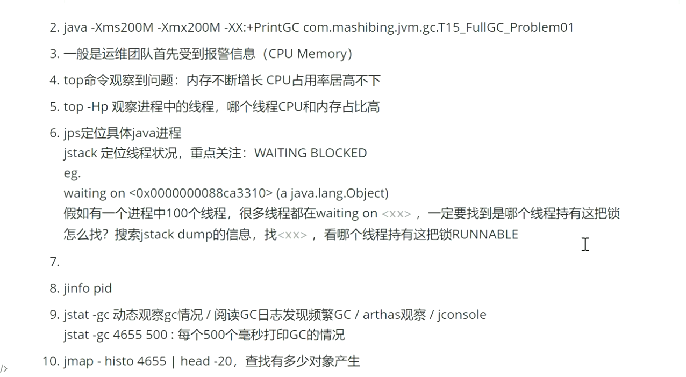
  >
  > 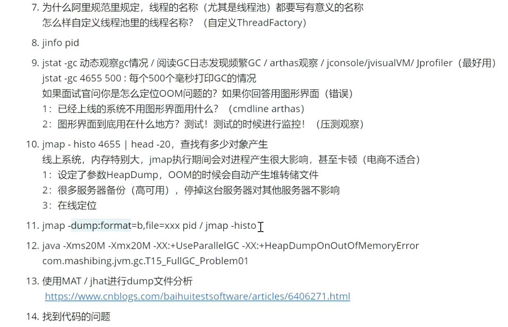
  >
  > 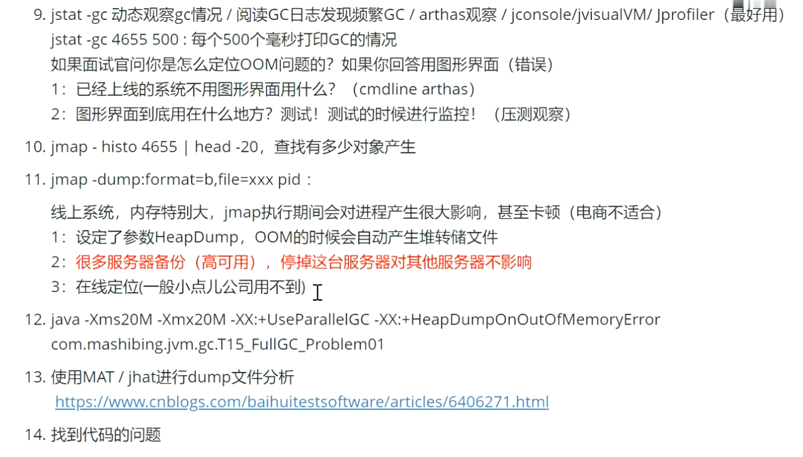

- 系统内存飙高，如何查找问题？（面试高频）

  > 1. 导出堆内存（jmap）
  >
  > 2. 分析（jhat jvisualvm mat jprofiler。。。）
  >
  >    jvisualvm jprofiler图形化界面

- 如何监控JVM

  > jstat jvisualvm jprofiler arthas top。。。

1. 硬件升级系统反而卡顿的问题（见上）

2. 线程池不当运用产生OOM问题（见上）

   不断往List里加对象（实在太low）

3. jira问题

   实际系统不断重启

   解决问题 加内存 + 更换垃圾回收器 G1

   真正问题在哪？不知道

4. tomcat http-header-size过大问题

   Http11OutputBuffer对象过多过大

5. lambda表达式导致方法区溢出问题

   会产生很多class在方法区中，如果产生class的方法一直没有执行完并持续生成，就可能导致方法区溢出

6. 直接内存溢出问题（少见）

   《深入理解java虚拟机》P59，使用Unsafe分配直接内存，或者使用NIO的问题

7. 栈溢出问题

   -Xss设定太小

8. 重写finalize引发频繁GC

   小米云，HBase同步系统，系统通过nginx访问超时报警，最后排查，C++程序员重写finalize引发频繁GC问题

   C++需要手动调用析构函数释放空间，java的finalize

9. 如果有一个系统，内存一直消耗不超过10%，但是观察GC日志，发现FGC总是频繁产生，会是什么引起的？

   System.gc(); 显示调用FGC，不一定会立即执行

10. new 大量线程，会产生native thread OOM，（low）应该用线程池

    解决方案：减少堆空间（太Low），预留更多内存产生native thread

    JVM内存占物理内存比例50% - 80%，剩下的是native thread空间

## 对象

### 1. 对象的创建过程

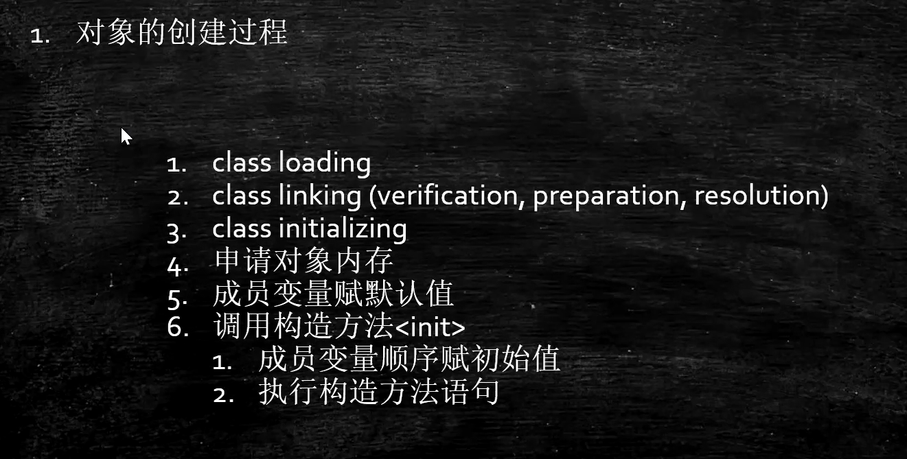

如果.class没有加载到内存中，先加载到内存中，提取出类型信息，方法信息，字段信息存放在方法区，在堆中生成一个代表该类的Class对象，作为方法区这些数据的访问入口，校验.class文件格式，静态变量赋初始值0/null，final修饰的会直接赋值，

解析（resolution）：将符号引用转成为直接引用（比如org.simple.People类引用了org.simple.Language类； 在编译时People类并不知道Language类的实际内存地址，因此只能使用符号org.simple.Language）

初始化：执行类中的静态代码，静态变量赋值，静态语句

### 2.对象在内存中的存储布局

#### 观察虚拟机配置

java -XX:+PrintCommandLinesFlag -version

#### 普通对象

1. 对象头：markword 8字节

2. ClassPointer指针：指向当前对象对应的class对象 

   - -XX:+UseCompressedClassPointers为4字节，不开启为8字节

3. 实例数据：成员变量

   - 引用类型：-XX:+UseCompressedOops为4字节，不开启为8字节

     Oops Ordinary Object Pointers

4. Padding：对齐，8的倍数

> Object对象16字节：对象头8字节，ClassPointer指针4字节（默认开启-XX:+UseCompressedClassPointers），padding对齐4字节

#### 数组对象

1. 对象头：markword 8字节
2. ClassPointer指针：同上
3. 数组长度：4字节
4. 数组数据
5. Padding：对齐，8的倍数

> int[]对象16字节：对象头8字节，ClassPointer指针4字节（默认开启-XX:+UseCompressedClassPointers），数组长度4字节

#### 对象头

记录age，与GC有关，4位，最高15

记录锁状态，与synchronized有关，无锁、偏向锁、轻量级锁、重量级锁，不同锁状态存放的东西不同，偏向锁存不了hashcode的值，轻量级锁和重量级锁的hashcode好像存在栈中


### 3.对象定位

```java
T t = new T();
```


- 句柄池

  t指向两个指针，一个指针指向new T()对象，一个指针指向T.class

- 直接指针（hotspot实现方式）

  t直接指向new T()对象，new T()对象中的ClassPointer指针指向T.class

### 4.对象分配

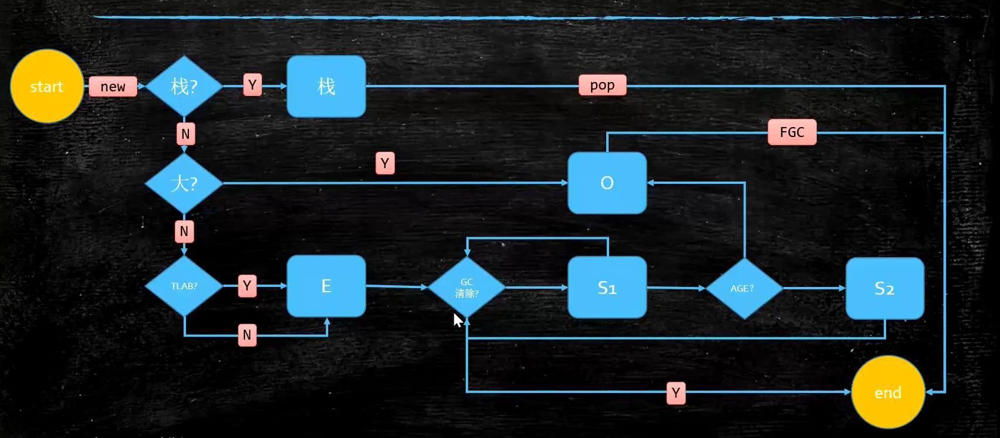
