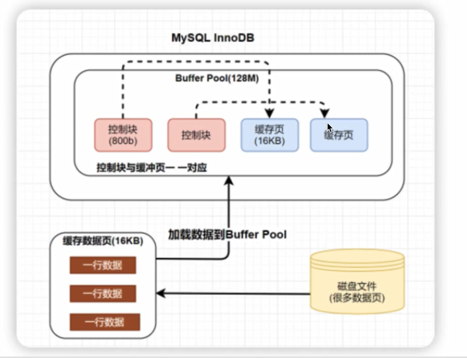

## MySQL架构

1. 连接器

2. 解析器

   生成解析树->词法解析->语法解析

   **解析树**

   

3. 预处理器

   ->语义解析

4. 优化器

   多种执行路径中选择一个优化器认为最好的

5. 执行器

6. 存储引擎（InnoDB，MyISAM）

## 数据页

默认数据页大小为16kb（也就是树中一个节点的大小）

> 可以改，但是需要重新编译源码，一般来说没必要

页结构整体上可以分为三大部分，分别为通用部分（文件头、文件尾）、存储记录空间、索引部分

1. 通用部分

   主要指文件头和文件尾，将页的内容进行封装，通过对文件头和文件尾校验的checkNum方式来确保页的传输是完整的

   文件头有FIL_PAGE_PREV和FIL_PAGE_NEXT字段，通过这两个字段可以找到该页的上一页和下一页，实际上所有页通过这两个字段可以形成一条双向链表

2. 记录部分（User Records&Free Space）

   页的主要作用是存储记录，所以”最小和最大记录“和”用户记录“部分占了页结构的主要空间。另外空闲空间是个灵活的部分，当有新的记录插入时，会从空闲空间中进行分配用于存储新纪录

3. 数据目录部分（Page Directory）

   数据页中行记录按照主键值由小到大顺序串联成一个单链表（**页中记录是以单项链表的形式进行存储的**），且单链表的链表头为最小记录，链表尾为最大记录。并且为了更快速的定位到指定的行记录，通过Page Directory实现目录的功能，借助Page Directory使用二分法快速找到需要查找的行记录

## 索引

排序的数据结构

### 聚簇索引、非聚簇索引

聚簇索引与非聚簇索引的区别就是：叶子节点是否存放一整行记录

- 聚簇索引：将数据存储与索引放到了一块，索引结构的叶子节点保存了行数据
- 非聚簇索引：将数据与索引分开存储，索引结构的叶子节点指向了数据对应的位置

InnoDB主键使用的是聚簇索引，MyISAM不管是主键索引，还是二级索引使用的都是非聚簇索引

在InnoDB引擎中，主键索引采用的就是聚簇索引结构存储

#### 聚簇索引（聚集索引）

- 聚簇索引是一种数据存储方式，InnoDB的聚簇索引就是按照主键顺序构建B+Tree结构。B+Tree的叶子节点就是行记录，行记录和主键值紧凑的存储在一起。这也意味着InnoDB的主键索引就是数据表本身，它按主键顺序存放了整张表的数据，占用的空间就是整个表数据量的大小。通常说的主键索引就是聚簇索引

- InnoDB的表要求必须有聚簇索引：

  - 如果表定义了主键，则主键索引就是聚簇索引
  - 如果表没有定义主键，则第一个非空unique列作为聚簇索引
  - 否则InnoDB会重建一个隐藏的row-id作为聚簇索引

- 辅助索引

  InnoDB辅助索引，也叫做二级索引，是根据索引列构建B+Tree结构。但在B+Tree的叶子节点中只存了索引列和主键的信息。二级索引占用的空间会比聚簇索引小很多，通常创建辅助索引就是为了提升查询效率。一个表InnoDB只能创建一个聚簇索引，但可以创建多个辅助索引


##### 聚簇索引的优点

1. 当你需要取出一定范围的数据时，用聚簇索引也比用非聚簇索引好（数据是紧密相连的，一个页中直接存储一定范围的数据）
2. 当通过聚簇索引查找目标数据时，理论上比非聚簇索引快，因为非聚簇索引定位到对应主键时还要多一次目标记录寻址，即多一次I/O
3. 使用覆盖索引扫描的查询可以直接使用叶节点中的主键值

##### 聚簇索引的缺点

1. 插入速度严重依赖于插入顺序（一般推荐用自增id作为主键，如果插入的主键值要插入到某个已满的页中，存储引擎会将该页分裂成两个页来容纳该行，页分裂）
2. 更新主键的代价很高，因为将会导致被更新的行移动（主键作为排序的值，修改会使他改变所在位置）
3. 二级索引（辅助索引）访问需要两次索引查找，第一次找到主键值，第二次在聚簇索引中根据主键值找到行数据

#### 非聚簇索引

与InnoDB表存储不同，MyISAM使用的是非聚簇索引，非聚簇索引的两颗B+树看上去没什么不同，节点的结构完全一致只是存储的内容不同而已，主键索引B+树的节点存储了主键，辅助键索引B+树存储了辅助键

表数据存储在独立的地方，这两颗B+树的叶子节点都是用一个地址指向真正的表数据，对于表数据来说，这两个键没有任何差别。由于索引树是独立的，通过辅助键检索无需访问主键的索引树


##### 非聚簇索引的优点

非聚簇索引对数据的新增/修改/删除的影响很小

##### 非聚簇索引的缺点

1. 占用磁盘更多
2. 比聚簇索引多一次I/O

### 创建索引的原则

- 在经常需要搜索的列上创建索引，可以加快搜索的速度

- 在作为主键的列上创建索引，强制该列的唯一性和组织表中数据的排列结构

- 在经常用在连接的列上，这些列主要是一些外键，可以加快连接的速度

- 在经常需要根据范围进行搜索的列上创建索引，因为索引已经排序，其指定的范围是连续的

- 在经常需要排序的列上创建索引，因为索引已经排序，这样查询可以利用索引的排序，加快排序查询时间

- 在经常使用where子句中的列上面创建索引，加快条件的判断速度

  > 一般索引字段不超过五个

### 索引类型

- 普通索引

  基本的索引类型，基于普通字段建立的索引，没有任何限制

- 唯一索引

  与”普通索引“类似，不同的就是：索引字段的值必须唯一，但允许有空值

- 主键索引

  一种特殊的唯一索引，不允许有空值，在创建或修改表时追加主键约束即可，每个表只能有一个主键

- 复合索引

  - 用户可以在多个列上建立索引，这种索引叫做复合索引（组合索引）。复合索引可以代替多个单一索引，相比多个单一索引复合索引所需的开销更小
  - 复合索引使用注意事项：
    - 何时使用复合索引，要根据where条件建索引，注意不要过多使用索引，过多使用会对更新操作效率有很大影响
    - 如果表已经建立了(col1, col2)，就没有必要再单独建立(col1)；如果现在有(col1)索引，如果查询需要col1和col2条件，可以建立(col1, col2)复合索引，对于查询有一定提高

- 全文索引

  查询操作在数据量比较少时，可以使用like模糊查询，但是对于大量的文本数据检索，效率极低。如果使用全文索引，查询速度会比like快很多倍

  在Mysql5.6以前的版本，只有MyISAM存储引擎支持全文索引，从Mysql5.6开始MyISAM和InnoDB存储引擎均支持

  全文索引方式有自然语言检索**IN NATURAL LANGUAGE MODE**和布尔检索**IN BOOLEAN MODE**两种

  和常用的like模糊查询不同，全文索引有自己的语法格式，使用match和against关键字

  全文索引使用注意事项：

  - 全文索引必须在字符串、文本字段上建立
  - 全文索引字段值必须在最小字符和最大字符之间的才会有效（innodb：3-84；myisam：4-84）

### 最佳左前缀法则

Mysql创建联合索引的规则是：首先会对联合索引最左边的字段进行排序，在第一个字段的基础之上，再对第二个字段进行排序

### 索引下推

索引下推（index condition pushdown）简称ICP，在Mysql5.6的版本上推出，用于优化查询

需求：查询users表中”名字第一个字是张，年龄为10岁的所有记录“，当前表索引(user_name, user_age)

```sql
SELECT * FROM users WHERE user_name LIKE '张%' AND user_age = 10;
```

根据最左前缀法则，该语法在搜索索引树的时候，只能匹配到名字第一个字是‘张’的记录，之后从该记录开始，逐个回表，到主键索引上找到响应的记录，再比对age这个字段的值是否符合

图1：在(name, age)索引里面特意去掉了age的值，这个过程InnoDB并不会去看age的值，只是按顺序把”name第一个字是‘张’“的记录一条条取出来回表。因此需要回表4次


Mysql5.6引入了索引下推优化，可以在索引遍历过程中，对索引中包含的字段先做判断，过滤掉不符合条件的记录，减少回表字数

图2：InnoDB在(name, age)索引内部就判断了age是否等于10，对于不等于10的记录，直接判断并跳过，减少回表次数


总结

如果没有索引下推优化（或称ICP优化），当进行索引查询时，首先根据索引来查找记录，然后再根据where条件来过滤记录

在支持ICP优化后，Mysql会在取出索引的同时，判断是否可以进行where条件过滤再进行索引查询，也就是说提前执行where的部分过滤操作，在某些场景下，可以大大减少回表次数，从而提升整体性能

### 自适应hash索引

自适应hash索引（Adatptive Hash Index，内部简称AHI）是InnoDB的三大特性之一，还有两个是Buffer Pool简称BP、双写缓冲区（Doublewrite Buffer）

1. 自适应即我们不需要自己处理，当InnoDB引擎根据查询统计发现某一查询满足hash索引的数据结构特点，就会给其建立一个hash索引
2. hash索引底层的数据结构是散列表（hash表），其数据特点就是比较适合在内存中使用，自适应hash索引存在于InnoDB架构中的缓存中（不存在于磁盘架构中），见下面InnoDB架构图
3. 自适应hash索引只适合搜索等值的查询，如select * from table where index_col = 'xxx'，而对于其他查找类型，如范围查找，是不能使用的


Adaptive Hash Index是针对B+树Search Path的优化，因此所有会涉及到Search Path的操作，均可使用此Hash索引进行优化

根据索引键值(前缀)快速定位到叶子节点满足条件记录的Offset，减少了B+树Search Path的代价，将B+树从Root节点至Leaf节点的路径定位，优化为Hash Index的快速查询。


### 为什么模糊搜索%在左边索引会失效

1. %号在右：由于B+树的索引顺序，是按照首字母的大小进行排序，%号在右的匹配又是匹配首字母。所以可以在B+树上进行有序的查找，查找首字母符合要求的数据
2. %号在左：是匹配字符串尾部的数据，我们上面说了排序规则，尾部的字母是没有顺序的，所以不能按照索引顺序查询，就用不到索引
3. 两个%%号：这个是查询任意位置的字母满足条件即可，只有首字母是进行索引排序的，其他位置的字母都是相对无序的，所以查找任意位置的字母是用不上索引的

解决%在左边索引失效的方法，就是使用覆盖索引

虽然会全表遍历二级索引，但是二级索引中记录的东西比主键索引少很多，一页中可以存储更多数据，再加上索引覆盖不用回表（所以应该也是用到了索引，type类型为index，仅仅比All全表扫描好一点）

### 自增还是UUID？数据库主键的类型该如何选择

auto_increment的优点：

1. 字段长度较uuid小很多，可以是bigint甚至是int类型，这对检索的性能会有所提升
2. 在写的方面，因为是自增的，所以主键是趋势自增的，也就是说新增的数据永远在后面，这点对于性能有很大的提升
3. 数据库自动编号，速度快，而且是增量增长，按顺序存放，对于检索非常有利
4. 数字型，占用空间小，易排序，在程序中传递也方便

auto_increment的缺点：

1. 由于是自增，很容易通过网络爬虫知晓当前系统的业务量
2. 高并发的情况下，竞争自增锁会降低数据库的吞吐能力
3. 数据迁移或分库分表场景下，自增方式不再适用

UUID的优点：

1. 不会冲突。进行数据拆分、合并存储的时候，能够保证主键全局的唯一性
2. 可以在应用层生成，提高数据吞吐能力

UUID的缺点：

1. 影响插入速度，并且造成硬盘使用率低。与自增相比，最大的缺陷就是随机IO
2. 字符串类型相比整数类型肯定更消耗空间，而且会比整数类型操作慢

#### uuid和自增id的索引结构对比

##### 自增id的内部结构


自增的主键的值是顺序的，所以InnoDB把每一条记录都存储在一条记录的后面

- 当达到页面的最大填充因子时候（InnoDB默认的最大填充因子是页大小的15/16，会留出1/16的空间留作以后的修改）
- 下一条记录就会写入新的页中，一旦数据按照这种顺序的方式加载，主键页就会近乎与顺序的记录填满，提升了页面的最大填充率，不会有页的浪费
- 新插入的行一定会在原有的最大数据行的下一行，Mysql定位和寻址很快，不会为计算新行的位置而做出额外的消耗，减少了页分裂和碎片的产生

##### 使用uuid的索引内部结构

插入UUID：新的记录可能会插入之前记录的中间，因此需要移动之前的记录


被写满已经刷新到磁盘上的页可能会被重新读取

因为uuid相对顺序的自增id来说是毫无规律可言的，新行的值不一定要比之前的主键的值大，索引InnoDB无法做到总是把新行插入到索引的最后，而是需要为新行寻找新的合适的位置从而来分配新的空间

这个过程需要做很多额外的操作，数据的毫无顺序会导致数据分布散乱，将会导致以下的问题：

1. 写入的目标页很可能已经刷新到磁盘上并且从缓存上移除，或者还没有加载到缓存中，InnoDB在插入之前不得不先找到并从磁盘读取目标页到内存中，这将导致大量的随机IO
2. 因为写入是乱序的，InnoDB不得不频繁的做页分裂操作，一边为新的行分配空间，页分裂导致移动大量的数据，一次插入最少需要修改三个页以上
3. 由于频繁的页分裂，页会变得稀疏并被不规则的填充，最终会导致数据会有碎片
4. 在把随机值（uuid和雪花id）载入到聚簇索引（InnoDB默认的索引类型）以后，有时候会需要做一次OPTIMEIZE TABLE来重建表并优化页的填充 ，这将又需要一定的时间消耗

结论：使用InnoDB应该尽可能的按主键的自增顺序插入，并且尽可能使用单调的增加的聚簇键的值来插入新行。如果是分库分表场景下，分布式主键ID的生成方案，优先选择雪花算法生成全局唯一主键（雪花算法生成的主键在一定程度上是有序的）

## 内存缓冲池（Buffer Pool）

缓冲池，简称BP。其作用是用来缓存表数据与索引数据，减少磁盘IO操作，提升效率

Buffer Pool由**缓存数据页（Page）**和对缓存数据页进行描述的**控制块**组成，为单位，控制块中存储着对应缓存页的所属的表空间、数据页的编号、以及对应缓存页在Buffer Pool中的地址的等信息

Buffer Pool默认大小是128M，以Page页为单位，Page页默认大小16K，而控制块的大小约为数据页的5%，大概是800字节



>  加载一行数据，其实是将行数据所在页都读取进来

### 

InnoDB特有，除索引以外，优化性能的第二选择

用于将频繁修改的数据缓存起来，占用内存的大小一般为内存的60%~80%

- 脏页

  在内存缓存池，还没有同步到磁盘中的数据

- 刷脏

  同步到磁盘的过程

如果内存缓冲池满了，触发内存淘汰策略。

### 如何判断一个页是否在BufferPool中缓存？

Mysql中有一个哈希表数据结构，它使用表空间号 + 数据页号，作为一个key，然后缓存页对应的控制块为value


- 当需要访问某个页的数据时，先从哈希表中根据表空间号+页号看看是否存在对应的缓存页
- 如果有，则直接使用；如果没有，就从free链表中选出一个空闲的缓冲页，然后把磁盘中对应的页加载到改缓存页的位置

### InnoDB引擎如何管理Page页

#### Page页分类

BP的底层采用链表数据结构管理Page，在InnoDB访问表记录和索引时会在Page页中缓存，以后使用可以减少磁盘IO操作，提升效率

Page根据状态可以分为三种类型：

- free page：空闲page，未被使用
- clean page：被使用page，数据没有被修改过
- dirty page：脏页，被使用page，数据被修改过，Page页中数据和磁盘的数据产生了不一定


Page页如何管理

针对上面所说的三种page类型，InnoDB通过三种链表结构来维护和管理

1. free list：表示空闲缓存区，管理free page

   - free链表是把所有空闲的缓存页对应的控制块作为一个个的节点放到一个链表中，这个链表便称之为free链表
   - 基节点：free链表中只有一个基节点是不记录缓存页信息（单独申请空间），它里面就存放了free链表的头节点的地址，尾节点的地址，还有free链表里当前有多少个节点

   

2. flush list：表示需要刷新到磁盘的缓存区，管理dirty page，内部page按照修改时间排序

   - InnoDB引擎为了提高处理效率，在每次修改缓存页后，并不是立刻把修改刷新到磁盘上，而是在未来的某个时间点进行刷新操作，所以需要使用到flush链表存储脏页，凡是被修改过的缓存页对应的控制块都会作为节点加入到flush链表

   - flush链表的结构与free链表的结构相似

     

3. lru list：表示正在使用的缓存区，管理clean page和dirty page，缓存区以midpoint为基点，前面链表称为new列表区，存放经常访问的数据，占63%；后面的链表成为old列表区，存放使用较少数据，占37%

   

### Redo Log（物理日志）

保证了ACID中的持久性

环形日志，持久化内存缓存池中的数据，记录数据的物理地址，记录满一页触发一次刷脏，可以在宕机之后恢复内存缓冲池中数据

大小需要根据内存缓冲池的大小设定，否则太小会引发频繁刷脏

### Undo Log（回滚日志）

保证了ACID中的原子性

用于记录增删改之前的数据状态，用于回滚

## Bin Log

二进制逻辑日志，记录sql语句

用于数据恢复（基于备份）和主从复制

> 看起来和redis中的AOF比较像，基于备份RDB

恢复数据时可以先将二进制sql解析成正常sql，再去数据库执行

## 性能优化

本质：让你的软件的资源利用率尽可能的接近硬件的性能瓶颈

- 非交互式超时时间 

  默认为28800秒（8小时），一般都偏高，可以适当减少

- 最大连接数

  默认为151，可以根据内存大小和线程的栈内存大小进行修改
