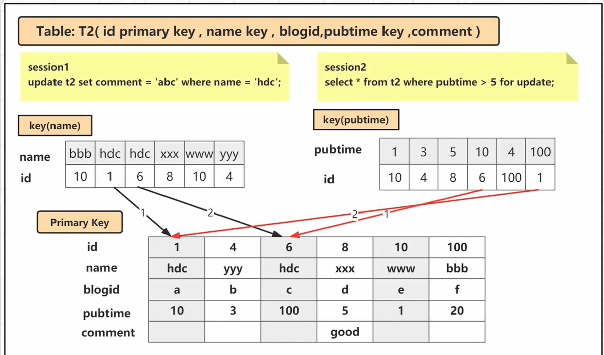

# 数据库锁的种类

Mysql数据库由于其自身架构的特点，存在多种数据存储引擎，Mysql中不同的存储引擎支持不同的锁机制

- MyISAM和MEMORY存储引擎采用的表级锁
- InnoDB存储引擎既支持行级锁，也支持表级锁，默认情况下采用行级锁
- BDB采用的是页面锁，也支持表级锁

## 按照数据操作的类型分

- 读锁（共享锁）：针对同一份数据，多个读操作可以同时进行而不会互相影响
- 写锁（排他锁）：当前写操作没有完成前，它会阻断其他写锁和读锁

## 按照数据操作的粒度分

- 表级锁：开销小，加锁快；不会出现死锁，锁定粒度大，发生锁冲突的概率最高，并发度最低
- 行级锁：开销大，加锁慢；会出现死锁，锁定粒度最小，发生锁冲突的概率最低，并发度也最高
- 页面锁：开销和加锁时间介于表锁和行锁之间；会出现死锁；锁定粒度介于表锁和行锁之间，并发度一般

## 按照操作性能可分为乐观锁和悲观锁

- 乐观锁：一般的实现方式是对记录数据版本进行比对，在数据更新提交的时候才会进行冲突检测，如果发现冲突了，则提示错误信息
- 悲观锁：在对一条数据修改的时候，为了避免同时被其他人修改，在修改数据之前先锁定，再修改的控制方式。共享锁和排他锁是悲观锁的不同实现，但都属于悲观锁范畴

# 共享锁和排他锁

行级锁分为共享锁和排他锁两种

行锁的是mysql锁中粒度最小的一种锁，因为锁的粒度很小，所以发生资源争抢的概率也最小，并发性能最大，但是也会造成死锁，每次加锁和释放锁的开销也会变大

## 使用Mysql行级锁的两个前提

- 使用InnoDB引擎
- 开启事务（隔离级别为Repeatable Read）

## InnoDB行锁的类型

- 共享锁（S）：当事务对数据加上共享锁后，其他用户可以并发读取数据，但任何事务都不能对数据进行修改（获取数据上的排他锁），直到已释放所有共享锁
- 排他锁（X）：如果事务T对数据A加上排他锁，则其他事务不能在对数据A加任何类型的锁，获准排他锁的事务技能读数据，又能修改数据

## 加锁的方式

- InnoDB引擎默认更新语句，update、delete、insert都会自动给涉及到的数据加上排他锁，select语句默认不会加任何锁类型，如果要加可以使用下面的方式：
  - 加共享锁（S）：select * from table_name where  ... lock in share mode;
  - 加排他锁（X）：select * from table_name where ... for update;

## 锁兼容

- 共享锁只能兼容共享锁，不兼容排他锁
- 排他锁互斥共享锁和其他排他锁

# InnoDB的行锁是怎么实现的

InnoDB行锁是通过对索引数据页上的记录加锁实现的，主要实现算法有3中：Record Lock、Gap Lock和Next-key Lock

- Record Lock锁：锁定单个行记录的锁。（记录锁，RC、RR隔离级别都支持）
- GapLock锁：间隙锁，锁定索引记录间隙，确保索引记录的间隙不变。（范围锁，RR隔离级别支持）
- Next-key Lock锁：记录锁和间隙锁组合，同时锁住数据，并且锁住数据前后范围。（记录锁+范围锁，RR隔离级别支持）

> 注意：InnoDB这种行锁实现特点意味着：只有通过索引条件检索数据，InnoDB才使用行级锁，否则，InnoDB将使用表锁

在RR隔离级别，InnoDB对于记录加锁行为都是先采用Next-key Lock，但是当sql操作含有唯一索引时，InnoDB会对next-key lock进行优化，降级为Record Lock，仅锁住索引本身而非范围

各种操作加锁的特点：

1. select from语句：InnoDB引擎采用MVCC机制实现非阻塞读，所以对于普通的select语句，InnoDB不加锁
2. select from lock in share mode语句：追加了共享锁，InnoDB会使用Next-key Lock锁进行处理，如果扫描发现了唯一索引，可以降级为RecordLock锁
3. select from for update语句：追加了排他锁，InnoDB会使用Next-key Lock锁进行处理，如果扫描发现了唯一索引，可以降级为RecordLock锁
4. update where 语句：InnoDB会使用Next-key Lock锁进行处理，如果扫描发现了唯一索引，可以降级为RecordLock锁
5. delete where语句：InnoDB会使用Next-key Lock锁进行处理，如果扫描发现了唯一索引，可以降级为RecordLock锁
6. insert语句：InnoDB会在将要插入的那一行设置一个排他的RecordLock锁

## 例子

主键行锁

唯一键行锁

非唯一键行锁

无索引行锁

# 并发事务会产生哪些问题

事务并发处理可能会带来一些问题，如下：

- 更新丢失

  当两个或多个事务更新同一行记录，会产生更新丢失现象，可以分为回滚覆盖和提交覆盖

  - 回滚覆盖：一个事务回滚操作，把其他事务已提交的数据给覆盖了
  - 提交覆盖：一个事务提交操作，把其他事务已提交的数据给覆盖了

- 脏读

  一个事务读取到了另一个事务修改但未提交的数据

- 不可重复读

  一个事务中多次读取同一行记录不一致，后面读取的跟前面读取的不一致

- 幻读

  一个事务中多次按相同条件查询，结果不一致。后续查询的结果和之前查询结果不同，多了或少了几行记录

“更新丢失”、“脏读”、“不可重复读”和“幻读”等并发事务问题，其实都是数据库一致性问题，为了解决这些问题，Mysql数据库是通过事务隔离级别来解决的，数据库系统提供了以下4中事务隔离级别供用户选择

可重复读能解决幻读问题，快照读通过MVCC，当前读通过加间隙锁和行锁解决，但如果先快照读再当前读还是会出现幻读

数据库的事务隔离级别越高，并发问题就越小，但是并发处理能力越差（代价）。读未提交隔离级别最低，并发问题多，但是并发处理能力好。以后使用时，可以根据系统特点来选择一个合适的隔离级别，比如对不可重复读和幻读并不敏感，更多关心数据库并发处理能力，此时可以使用Read Commited隔离级别

事务隔离级别，针对InnoDB引擎，支持事务的功能。像MyISAM引擎没有关系

**事务隔离级别和锁的关系**

1. 事务隔离级别是SQL92定制的标准，相当于事务并发控制的整体解决方案，本质上是对锁和MVCC使用的封装，隐藏了底层细节
2. 锁是数据库实现并发控制的基础，事务隔离性是采用锁来实现，对相应操作加不同的锁，就可以防止其他事务同时对数据进行读写操作
3. 对用户来讲，首先选择使用隔离级别，当选用的隔离级别不能解决并发问题或需求时，才有必要在开发中手动设置锁

Mysql默认隔离级别：可重复读

Oracle、SQLServer默认隔离级别：读已提交

一般使用时，建议采用默认隔离级别，然后存在的一些并发问题，可以通过悲观锁、乐观锁等实现处理

# MVCC内部细节

## MVCC概念

MVCC（Multi Version Concurrent Control）被称为多版本并发控制，是指在数据库中为了实现高并发的数据访问，对数据进行多版本处理，并通过事务的可见性来保证事务能看到自己应该看到的数据版本

> MVCC最大的好处就是读不加锁，读写不冲突。在读多写少的系统应用中，读写不冲突是非常重要的，极大的提升系统的并发性能，这也是为什么现阶段几乎所有的关系型数据库都支持MVCC的原因，不过目前MVCC只在Read Commited和Repeatable Read两种隔离级别下工作

1. 行记录的三个隐藏字段

   

   - DB_ROW_ID：如果没有为表显式的定义主键，并且表中也没有定义唯一索引，那么InnoDB会自动为表添加一个row_id的隐藏列作为主键
   - DB_TRX_ID：事务中对某条记录做增删改时，就会将这个事务的事务ID写入到trx_id中
   - DB_ROLL_PTR：回滚指针，指向undo log的指针

2. Undo log多版本链

   举例：事务T-100和T-120对表中id = 1的数据行做update操作，事务T-130进行select操作，即使T-100已经提交修改，三次select语句的结果都是“lisi”

   

   - 每一条数据都有多个版本，版本之间通过undo log链条进行连接

   

3. Read View

   Read View是InnoDB在实现MVCC时用到的一致性读视图，即consistent read view，用于支持RC（Read Committed，读提交）和RR（Repeatable Read，可重复读）隔离级别的实现

   Read View简单理解就是对数据在每个时刻的状态拍成照片记录下来，那么之后获取某时刻的数据时就还是原来的照片上的数据，是不会变的

   Read view中比较重要的字段有4个：

   - m_ids：用来表示mysql中哪些事务正在执行，但是没有提交
   - min_trx_id：就是m_ids里最小的值
   - max_trx_id：下一个要生成的事务id值，也就是最大事务id
   - creator_trx_id：就是你这个事务的id

   **通过Read View判断记录的某个版本是否可见的方式总结：**

   - trx_id = creator_trx_id

     如果被访问版本的trx_id，与readview中的creator_trx_id值相同，表明当前事务在访问自己修改过的记录，该版本可以被当前事务访问

   - trx_id < min_trx_id

     如果被访问版本的trx_id小于readview中的min_trx_id值，表明生成该版本的事务在当前事务生成readview前已经提交，该版本可以被当前事务访问

   - trx_id >= max_trx_id

     如果被访问版本的trx_id大于或等于readview中的max_trx_id值，表明生成该版本的事务在当前事务生成readview后才开启，该版本不可以被当前事务访问

   - trx_id > min_trx_id && trx_id < max_trx_id

     如果被访问版本的trx_id值在readview的min_trx_id和max_trx_id之间，就需要判断trx_id属性值是不是在m_ids列表中

     - 在：说明创建readview时生成该版本的事务还是活跃的，该版本不可以被访问
     - 不在：说明创建readview时生成该版本的事务已经被提交，该版本可以被访问

   **何时生成ReadView快照**

   - 在**读已提交（Read Committed，简称RC）**隔离级别下，**每一次**读取数据前都生成一个ReadView
   - 在**可重复读（Repeatable Read，简称RR）**隔离级别下，在一个事务中，只在**第一次**读取数据前生成一个ReadView

4. 快照读（Snapshot Read）和当前读（Current Read）

   在MVCC并发控制中，读操作可以分为两类：快照读Snapshot Read）和当前读（Current Read）

   - 快照读

     快照读是指读取数据时不是读取最新版本的数据，而是基于历史版本读取的一个快照信息（MySQL读取undo log历史版本），快照读可以使普通的select读取数据时不用对标数据进行加锁，从而解决了因为对数据库表的加锁而导致的两个如下问题

     1. 解决了因加锁导致的修改数据时无法对数据读取问题
     2. 解决了因加锁导致的读取数据时无法对数据修改问题

   - 当前读

     当前读是读取的数据库最新的数据，当前读和快照读不同，因为要读取最新的数据而且要保证事务的隔离性，所以当前读是需要对数据进行加锁的（update delete insert select ... lock in share mode, select for update为当前读）

## 总结一下

- 并发环境下，写-写操作有加锁解决方案，但为了提高性能，InnoDB存储引擎提供MVCC，目的是为了解决读-写，写-读操作下不加锁仍能安全进行
- MVCC的过程，本质就是访问版本链，并判断哪个版本可见的过程。该判断算法是通过版本上的trx_id与快照ReadView的若干个信息进行对比
- 快照生成的时机因隔离级别不同，读已提交隔离级别下，每一次读取前都会生成一个快照ReadView；而可重复读则仅在一个事务中，第一次读取前生成一个快照

# Mysql死锁的原因和处理方法

## 表的死锁

### 产生原因

用户A访问表A（锁住了表A），然后又访问表B；另一个用户B访问表B（锁住了表B），然后企图访问表A，这时用户A由于用户B已经锁住表B，它必须等待用户B释放表B才能继续，同样用户B要等用户A释放表A才能继续，这样死锁就产生了

用户A--》 A表（表锁）--》B表（表锁）

用户B--》 B表（表锁）--》A表（表锁）

### 解决方案

这种死锁比较常见，是由程序的BUG产生的，除了调整的程序的逻辑没有其他的办法

仔细分析程序的逻辑，对于数据库的多表操作时，尽量按照相同的顺序进行处理，尽量避免同时锁定两个资源，如操作A和B两张表时，总是按先A后B的顺序处理，必须同时锁定两个资源时，要保证在任何时刻都应该按照相同的顺序来锁定资源

## 行级锁死锁

### 产生原因1：

如果在事务中执行了一条没有索引条件的查询，引发全表扫描，把行级锁上升为全表记录锁定（等价于表级锁），多个这样的事务执行后，就很容易产生死锁和阻塞，最总应用系统会越来越慢，发生阻塞或死锁

### 解决方案1：

sql语句中不要使用太复杂的关联多表的查询；使用explain执行计划对sql语句进行分析，对于有全表扫描和全表锁定的sql语句，建立响应的索引进行优化

### 产生原因2：

- 两个事务分别向拿到对方持有的锁，互相等待，于是产生死锁

  

### 产生原因3：

每个事务只有一个sql，但是有些情况还是会发生死锁

两个事务操作不同的索引列，最后都去锁主键索引，加锁时发现事务一和事务二的加锁顺序正好相反，两个session恰好都持有第一把锁，请求加第二把锁，死锁就发生了

### 解决方案2：

如上面的原因2和原因3，对索引加锁顺序的不一致很可能会导致死锁，所以如果可以，尽量以相同的顺序来访问索引记录和表。在程序以批量方式处理数据的时候，如果事先对数据排序，保证每个线程按固定的顺序来处理记录，也可以大大降低出现死锁的可能

# MySQL的体系架构

# undo log、redo log、bin log的作用是什么

## undo log基本概念

- undo log是一种用于撤销回退的日志，在数据库事务开始之前，Mysql会先记录更新前的数据到undo log日志文件里面，当事务回滚时或者数据库崩溃时，可以利用undo log来进行回滚
- undo log产生和销毁：undo log在事务开始前产生，事务在提交时，并不会立刻删除undo log，innodb会将该事务对应的undo log放入到删除列表中，后面会通过后台线程purge thread进行回收处理

**注意：undo log也会产生redo log，因为undo log也要实现持久性保护**

### undo log的作用

1. 提供回滚操作【undo log实现事务的原子性】

   在数据修改的时候，不仅记录了redo log，还记录了相对应的undo log，如果因为某些原因导致事务执行失败了，可以借助undo log进行回滚

   undo log和redo log记录物理日志不一样，它是逻辑日志。可以认为当delete一条记录时，undo log中会记录一条对应的insert记录，反之亦然，当update一条记录时，他记录一条对应相反的update记录

2. 提供多版本控制（MVCC）【undo log实现多版本并发控制（MVCC）】

   MVCC，即多版本控制。在MySQL数据库InnoDB存储引擎中，用undo log来实现多版本并发控制（MVCC）。当读取的某一行被其他事务锁定时，它可以从undo log中分析出该行记录以前的数据版本是怎样的，从而让用户能够读取到当前事务操作之前的数据【快照读】

## redo log基本概念

- InnoDB引擎对数据的更新，是先将更新记录写入redo log日志，然后会在系统空闲的时候或者是按照设定的更新策略再将日志中的内容更新到磁盘之中。这就是所谓的预写式技术（Write Ahead logging）。这种技术可以大大减少IO操作的频率，提升数据刷新的效率
- redo log：被称为重做日志，包括两部分：一个是内存中的日志缓冲：redo log buffer，另一个是磁盘上的日志文件：redo log file

### redo log的作用

MySQL每执行一条DML语句，先将记录写入redo log buffer。后续某个时间点在一次性将多个操作记录写道redo log file。当故障发生致使内存数据丢失后，InnoDB会在重启时，经过重放redo，将Page恢复到崩溃之前的状态，通过redo log可以实现事务的持久性

## bin log基本概念

- binlog是一个二进制格式的文件，用于记录用户对数据库更新的sql语句信息，例如更改数据库表和更改内容的sql语句都会记录到binlog里，但是不会记录select和show这类操作
- binlog在MySQL的Server层实现（引擎共用）
- binlog为逻辑日志，记录的是一条sql语句的原始逻辑
  - binlog不限制大小，追加写入，不会覆盖以前的日志
  - 默认情况下，binlog日志是二进制格式的，不能使用查看文本工具的命令（比如，cat，vi等）查看，而使用mysqlbinlog解析查看

### bin log的作用

1. 主从复制：在主库中开启binlog功能，这样主库就可以把bin log传递给从库，从库拿到Binlog实现数据恢复达到主从数据一致性
2. 数据恢复：通过mysqlbinlog工具来恢复数据

# redo log与undo log的持久化策略

## redo log持久化

缓冲区数据一般情况下是无法直接写入磁盘的，中间必须经过操作系统缓冲区（OS Buffer）。因此redo log buffer写入redo log file实际上实现写入OS Buffer，然后再通过系统调用fsync()将其刷到redo log file

Redo Buffer持久化到redo log的策略，可通过Innodb_flush_log_at_trx_commit设置： 

| 参数值              | 含义                                                         |
| ------------------- | ------------------------------------------------------------ |
| 0（延迟）           | 事务提交时不会将redo log buffer中日志写入到os buffer，而是每秒写入os buffer并调用fsync()写入到redo log file中。也就是说设置为0时是（大约）每秒刷新写入到磁盘中的，当系统崩溃，会丢失1秒钟的数据 |
| 1（实时写，实时刷） | 事务每次提交都会将redo log buffer中的日志写入os buffer并调用fsync()刷到redo log file中。这种方式即使系统崩溃也不会丢失任何数据，但是因为每次提交都写入磁盘，IO的性能较差 |
| 2（实时写，延时刷） | 每次提交都进写入到os buffer，然后是每秒调用fsync()将os buffer中的日志写入到redo log file |

一般建议选择取值2，因为MySQL挂了数据没有损失，整个服务器挂了才会损失1秒的事务提交数据

## undo log持久化

MySQL中的undo log严格的讲不是log，而是数据，因此他的管理和落盘都跟数据一样：

- undo的磁盘结构并不是顺序的，而是像数据一样按page管理
- undo写入时，也像数据一样产生对应的redo log（因为undo也是对页面的修改，记录undo这个操作本身也会有对应的redo）
- undo的page也像数据一样缓存在buffer pool中，跟数据page一起做LRU换入换出，以及刷脏。undo page的刷脏也像数据一样要等到对应的redo log落盘之后

当事务提交的时候，innodb不会立即删除undo log，因为后续还可能会用到undo log，如隔离级别为repeatable read时，事务读取的都是开启事务时的最新提交行版本，只要该事务不结束，该行版本就不能删除，即undo log不能删除

但是在事务提交的时候，会将该事务对应的undo log放入到删除列表中，未来通过purge来删除。并且提交事务时，还会判断undo log分配的页是否可以重用，如果可以重用，则会分配给后面来的事务，避免为每个独立的事务分配独立的undo log页而浪费存储空间和性能
