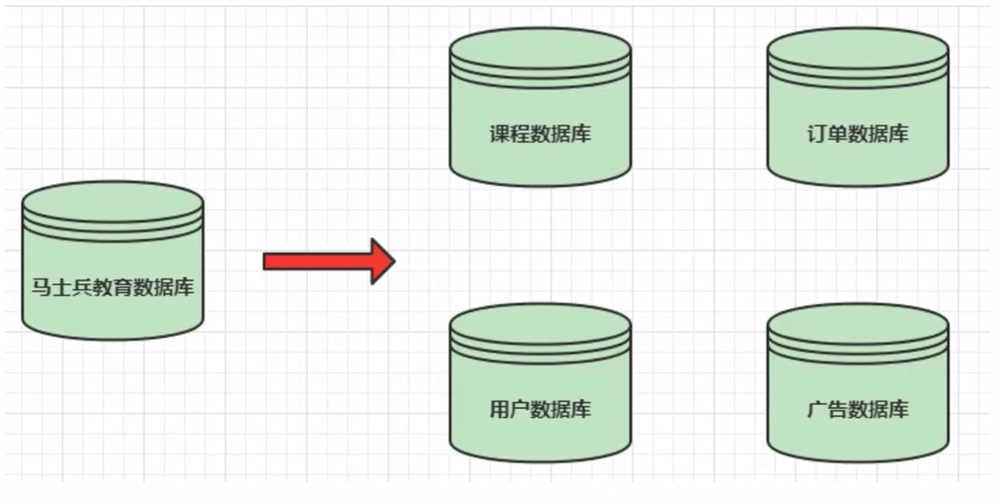
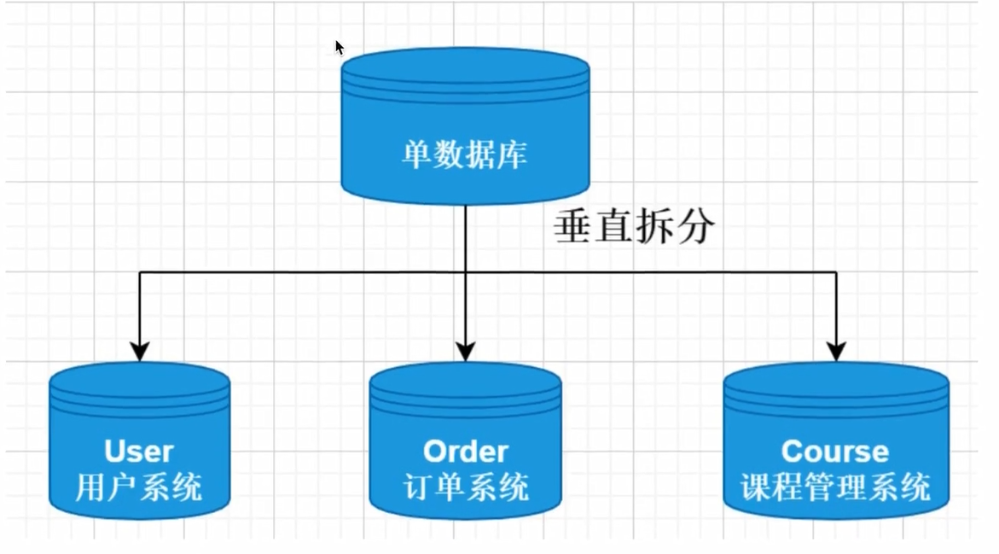
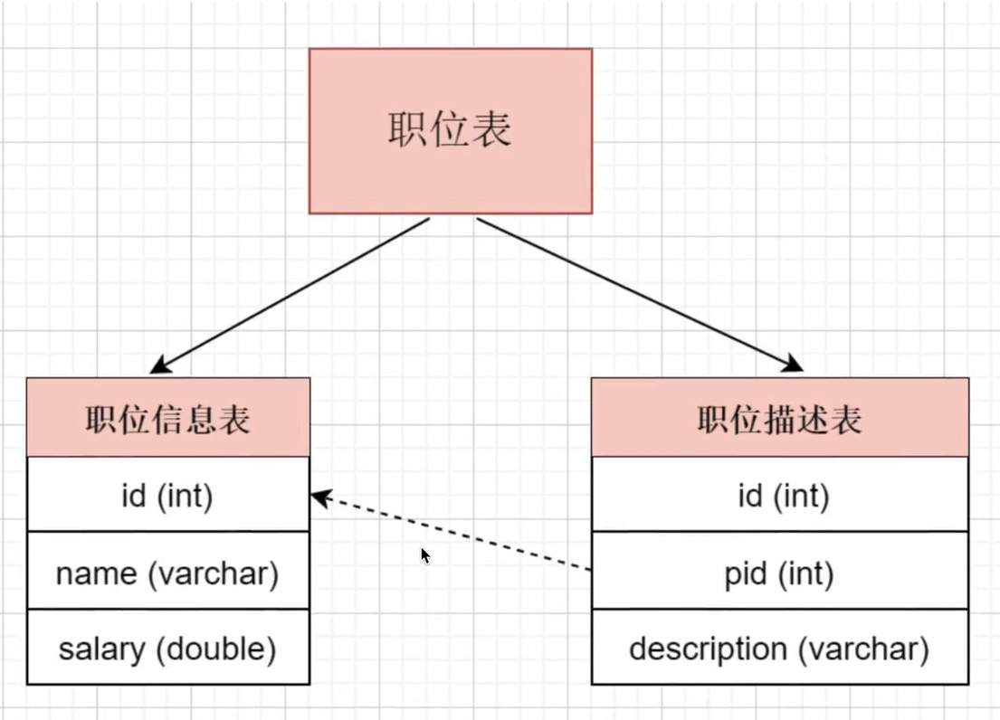
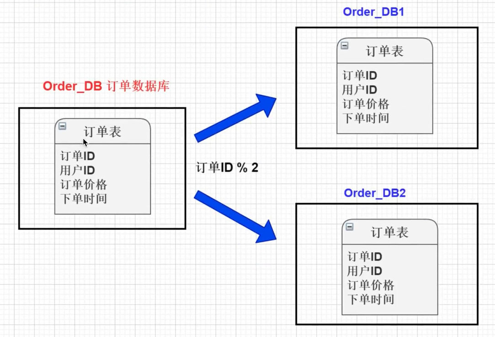
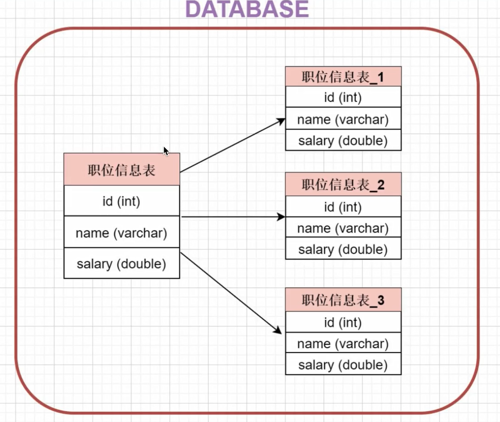
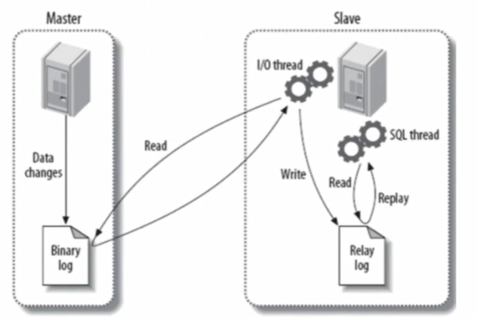
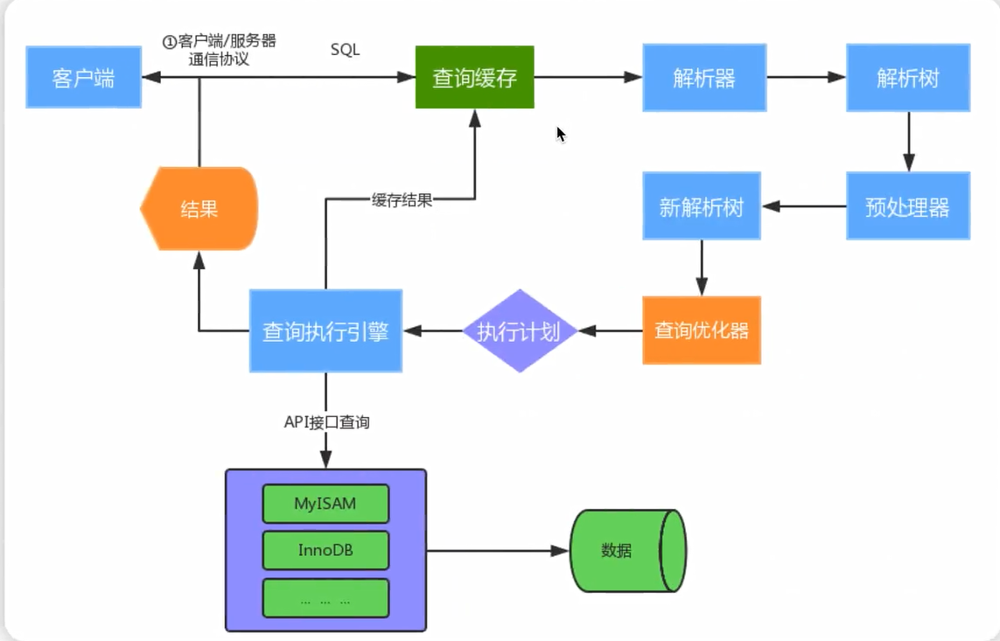

# bin log与redo log的区别

- redo log是InnoDB引擎特有的；binlog是MySQL的Server层实现的，所有引擎都可以使用

- redo log是物理日志，记录的是“在XXX数据页上做了XXX修改”；bin log是逻辑日志，记录的是原始逻辑，其记录是对应的sql语句

  - 物理日志：记录的是每一个page页中具体存储的值是多少，在这个数据页上做了什么修改，比如：某个事务将系统表空间中的第100个页面中偏移量为1000处的那个字节的值1改为2
  - 逻辑日志：记录的是每一个page页面中具体数据是怎么变动的，他会记录一个变动的过程或sql语句的逻辑，比如：把一个page页中的一个数据从1改为2，再从2改为3，逻辑日志就会记录1->2，2->3这个数据变化的过程

- redo log是循环写的，空间一定会用完，需要write pos和check point搭配；bin log是追加写，写到一定大小会切换到下一个，并不会覆盖以前的日志

  - redo log文件内容是以顺序循环的方式写入文件，写满时则回溯到第一个文件，进行覆盖写

    

    - write pos：表时日志当前记录的位置，当ib_logfile_4写满后，会从ib_logfile_1从头开始记录
    - check point：表示将日志记录的修改写进磁盘，完成数据落盘，数据落盘后checkpoint会将日志上的相关记录擦除掉，即write pos -> checkpoint之间的部分
    - 如果write pos追上checkpoint，表示写满，这时候不能再执行新的更新，得停下来先擦掉一些记录，把checkpoint推进一下

- redo log作为服务器异常宕机后事务数据自动恢复使用，bin log可以作为主从复制和数据恢复使用。bin log没有自动crash-safe能力

  > crashsafe指mysql服务器宕机重启后，能够保证：
  >
  > - 所有已经提交的事务的数据仍然存在
  > - 所有没有提交的事务的数据自动回滚

# MySQL的binlog有几种日志格式？分别有什么区别？

binlog日志有三种模式

- ROW（row-based replication,RBR）：日志中会记录每一行数据被修改的情况，然后在slave端对相同的数据进行修改

  - 优点：能清楚记录每一个行数据的修改细节，能完全实现主从数据同步和数据的恢复。而且不会出现某些特定情况下存储过程或function无法被正确复制的问题
  - 缺点：批量操作会产生大量的日志，尤其是alter table会让日志量暴涨

- STATEMENT（statement-based replication，SBR）：记录每一条修改数据的sql语句（批量修改时，记录的不是单条sql语句，而是批量修改的sql语句事件），slave在复制的时候sql进程会解析成和原来master端执行过的相同的sql再次执行。简称sql语句复制

  - 优点：日志量小，减少磁盘IO，提升存储和恢复速度
  - 缺点：在某些情况下会导致主从数据不一致，比如last_insert_id()、now()函数

  

- MIXED（mixed-based replication，MBR）：以上两种模式的混合使用，一般会使用STATEMENT模式保存binlog，对于STATEMENT模式无法复制的操作使用ROW模式保存binlog，MySQL会根据执行的sql语句选择写入模式

企业场景如何选择binlog模式

1. 如果生产中使用MySQL的特殊功能相对少（存储过程、触发器、函数）。选择默认的语句模式Statement
2. 如果生产中使用MySQL的特殊功能较多的，可以选择Mixed模式
3. 如果生产中使用MySQL的特殊功能较多，又希望数据最大化一致，此时最好Row模式；但要注意，该模式的binlog日志量增长非常快

# MySQL线上修改大表结构有哪些风险

在线修改大表的可能影响

- 在线修改大表的表结构执行时间往往不可预估，一般时间较长
- 由于修改表结构是表级锁，因此在修改表结构时，影响表写入操作
- 如果长时间的修改表结构，中途修改失败，由于修改表结构是一个事务，因此失败后会还原结构，在这个过程中表都是锁着不可写入
- 修改大表结构容易导致数据库CPU、IO等性能消耗，使MySQL服务器性能降低
- 在线修改大表结构容易导致主从延时，从而影响业务读取

修改方式：

1. 对表加锁（表此时只读）
2. 复制原表物理结构
3. 修改表的物理结构
4. 把原表数据导入中间表中，数据同步完后，锁定中间表，并删除原表
5. rename中间表为原表
6. 刷新数据字典，并释放锁

使用工具：online-schema-change，使percona推出的一个针对MySQL在线ddl的工具。percona是一个MySQL分支维护公司，专门提供MySQL技术服务的

# count(列名)、count(1)、count(*)区别

count(列名)：不会包含列值为null的行

count(1)和count(*)：包含所有行

# 什么是分库分表？什么时候进行分库分表？

## 什么是分库分表

简单来说，就是指通过某种特定的条件，将我们存放在同一个数据库中的数据分散存放在多个数据库（主机）上面，以达到分散单台设备负载的效果

- 分库分表解决的问题

  分库分表的目的是为了解决由于数据量过大而导致数据库性能降低的问题，将原来单体服务的数据库进行拆分，将数据大表拆分成若干数据表组成，使得单一数据库、单一数据表的数据量变小，从而达到提升数据库性能的目的

- 什么情况下需要分库分表

  - 单机存储容量遇到瓶颈
  - 连接数，处理能力达到上限

> 注意：
>
> 分库分表之前，要根据项目的实际情况，确定我们的数据量是不是够大，并发量是不是够大，来决定是否分库分表
>
> 数据量不够就不要分表，单表数据量超过1000万或100G的时候，速度就会变慢（官方测试）

分库分表包括：垂直分库、垂直分表、水平分库、水平分表四种方式

## 垂直拆分

### 垂直分库

- 数据库由不同的表对应着不同的业务，垂直切分是指按照业务的不同将表进行分类，分布到不同的数据库上面

  - 将数据库部署在不同服务器上，从而达到多个服务器共同分摊压力的效果

    

### 垂直分表

表中字段太多且包含大字段的时候，在查询时对数据库的IO、内存会受到影响，同时更新数据时，产生的binlog文件会很大，MySQL在主从同步时也会有延迟的风险

- 将一个表按照字段分成多表，每个表存储其中一部分字段
- 对职位表进行垂直拆分，将职位基本信息放在一张表，将职位描述信息存放在在另一张表

- 垂直拆分带来的一些提升
  - 解决业务层面的耦合，业务清晰
  - 能对不同业务的数据进行分级管理、维护、监控、扩展等
  - 高并发场景下，垂直分库一定程度上提高访问性能
- 垂直拆分没有彻底解决单表数据量过大的问题

## 水平拆分

### 水平分库

- 将单张表的数据切分到多个服务器上去，每个服务器具有相应的库与表，只是表中数据集合不同。水平分库分表能够有效的缓解单机和单库的性能瓶颈和压力，突破IO、连接数、硬件资源等的瓶颈
- 简单讲就是根据表中的数据的逻辑关系，将同一个表中的数据按照某种条件拆分到多台数据库（主机）上面，例如将订单表按照id是奇数还是偶数，分别存储在不同的库中

### 水平分表

- 针对数据量巨大的单张表（比如订单表），按照规则把一张表的数据切分到多张表里面去。但是这些表还是在同一个库中，所以库级别的数据库操作还是有IO瓶颈

- 总结
  - 垂直分表：将一个表按照字段分成多表，每个表存储其中一部分字段
  - 垂直分库：根据表的业务不同，分表存放在不同的库中，这些库分别部署在不同的服务器
  - 水平分库：把一张表的数据按照一定规则，分配到**不同的数据库**，每一个库只有这张表的部分数据
  - 水平分表：把一张表的数据按照一定规则，分配到**同一个数据库的多张表中**，每个表只有这个表的部分数据

- 水平分表方式
  - 可以通过对主键ID取模的方式将数据分布到不同的表中（但是扩容起来比较麻烦，如果提前扩容又会导致可能数据量并不会那么大，每个表中的数据很少）
  - 奇数偶数（只能分两种）
  - 按照主键ID所在的范围分表（同一时间段大部分的写入操作集中在一个表中）
    - 可以随机ID，把写入操作分摊到不同表中（扩容问题）
    - 结合取模，先确定范围，再取模分摊到各个表中

# Mysql的主从复制

## 主从复制的用途

- 实时灾备，用于故障切换
- 读写分离，提供查询服务
- 备份，避免影响业务

## 主从部署必要条件

- 主库开启binlog日志（设置log-bin参数）
- 主从server-id不同
- 从库服务器能连通主库

## 主从复制的原理

- MySQL中有一种日志叫做bin日志（二进制日志）。这个日志会记录下所有修改了数据库的SQL语句（insert，update，delete，create/alter/drop table，grant等等）
- 主从复制的原理其实就是把主服务器上的bin日志复制到从服务器上执行一遍，这样从服务器上的数据就和主服务器上的数据相同了

**原理**：

1. master服务器将数据的改变记录二进制binlog日志，当master上的数据发生改变时，则将其
2. slave服务器会在一定时间间隔内对master二进制日志进行探测其是否发生改变，如果发生改变，则开始一个master二进制事件
3. 同时主节点为每个I/O线程启动一个dump线程，用于向其发送二进制事件，并保存至从节点本地的中继日志中，从节点将启动SQL线程从中继日志中读取二进制日志，在本地重放，使得其数据和主节点的保持一致，最后I/OThread和SQL Thread将进入睡眠状态，等待下一次被唤醒

**也就是说：**

- 从库会生成两个线程，一个/O线程，一个SQL线程
- I/O线程会去请求主库的binlog，并将得到的binlog写道本地的relay log（中继日志）文件中
- 主库会生成一个log dump线程，用来给从库I/O线程传binlog
- SQL线程，会读取relay log文件中的日志，并解析成sql语句逐一执行

**具体步骤：**

1. 从库通过手动执行change master to语句连接主库，提供了连接的用户一切条件（user、password、port、ip），并且让从库知道，二进制日志的起点位置（file名 position号）；start slave
2. 从库的IO线程和主库的dump线程建立连接
3. 从库根据change master to语句提供的file名和position号，IO线程向主库发起binlog的请求
4. 主库dump线程根据从库的请求，将本地binlog以events的方式发给从库IO线程
5. 从库IO线程接收binlog events，并存放到本地relay log中，传送过来的信息，会记录到master.info中
6. 从库SQL线程应用relay log，并且把应用过的记录到relay log.info，默认情况下，已经应用过的relay会自动被清理purge

> 主库记录到binlog中是追加写，顺序IO，从库记录到relay log也是追加写，顺序IO，执行relay log中的sql语句会是随机IO，所以可以堆在relay log中，当作队列，不影响IO thread读取数据

# 主从复制延迟问题

mysql的主从复制都是单线程的操作，主库对所有DDL和DML产生的日志写进binlog，由于binlog是顺序写的，所以效率很高，slave的sql thread线程将主库的DDL和DML操作事件在slave中重放。DML和DDL的IO操作是随机的，不是顺序的，所以成本要高很多，另一方面，由于sql thread也是单线程的，当主库的并发较高时，产生的DML数量超过slave的sql thread所能处理的速度，或者当slave中有大型query语句产生了锁等待，那么延时就产生了

## 延迟解决方案

1. 我们知道因为主服务器要负责更新操作，他对安全性的要求比从服务器高，所以有些设置可以修改，比如sync_binlog=1，innodb_flush_log_at_trx_commit = 1之类的设置，而slave则不需要这么高的数据安全，完全可以将sync_binlog设置为0或者关闭binlog，innodb_flushlog，innodb_flush_log_at_trx_commit也可以设置为0来提高sql的执行效率，这个能很大程度上提高效率。另外就是使用比主库更好的硬件设备作为slave，通过show slave status进行查看Seconds Behind Master就是我们的延迟时间
2. 主从放到同一个交换机网络下
3. 直接禁用slave端的binlog
4. 业务的持久化层的实现采用分库架构，mysql服务可平行扩展，分散压力
5. 服务的基础架构在业务和mysql之间加入memcache或者redis的cache层，降低mysql的读压力

MySQL5.7以后有并行复制

半同步复制（效率低？）

# MySQL执行一条查询语句的内部执行过程

## MySQL内部支持缓存查询吗

使用缓存的好处：当MySQL接收到客户端的查询sql之后，仅仅只需要对其进行相应的权限验证之后，就会通过Query Cache来查找结果，甚至都不需要经过Optimizer模块进行执行计划的分析优化，更不需要发生任何存储引擎的交互

MySQL5.7支持内部缓存，8.0之后已废弃

MySQL缓存的限制

1. MySQL基本没有手段灵活的管理缓存失效和生效，尤其对于频繁更新的表
2. sql必须完全一致才会导致cache命中
3. 为了节省内存空间，太大的result set不会被cache（<query_cache_limit)
4. MySQL缓存在分库分表环境下是不起作用的
5. 执行sql里有触发器，自定义函数时，MySQL缓存也是不起作用的
6. 在表的结构或数据发生改变时，基于该表相关cache立即全部失效

替代方案

- 应用层组织缓存，最简单的是使用redis，ehcached等

# 为什么InnoDB二级索引叶子节点存储的是主键而不是行的地址

1. 主键一般比地址占用的空间小
2. 主键一般来说不会修改，就算主键改了，大概率地址也得变，并且在修改数据的过程中，存在页分裂，行挪动，地址可能会经常改变

# MySQL双一配置

**sync_binlog**

sync_binlog是MySQL binlog日志的重要参数，用于控制binlog的更新策略，通过对该参数的调优，可以提升数据库的性能和数据安全性：

- 0：

  binlog不刷盘，依赖于操作系统的刷盘机制，在断电或者是操作系统崩溃的情况下，这些事务将全部丢失

- 1：

  这是最安全的方式，binlog在binlog组提交的sync阶段都进行刷盘操作，在断电或操作系统崩溃的情况下，二进制日志中丢失的事务仅处于准备状态，在恢复的时候直接回滚掉

- N：

  binlog将在N次sync队列形成后进行sync刷盘

将**sync_binlog**和innodb_flush_log_at_trx_commit（redo log写入磁盘规则）属性都设置为1，能最大程度保证数据不会丢失
