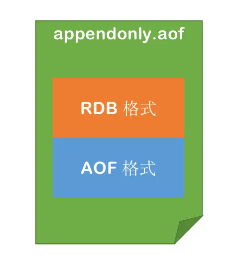

# Redis基本数据类型

- String
- list
- set
- zset
- hash

# Redis为什么快

- 纯内存访问
- 单线程避免上下文切换
- 多路复用IO
- 渐进式Rehash、缓存时间戳

# Redis合适的应用场景

- 缓存
- 计数器
- 分布式会话
- 排行榜
- 最新列表
- 分布式锁
- 消息队列

1. 5大value类型
2. 缓存
3. 为的是服务无状态，延申思考，看你的项目有哪些数据结构或对象，在单机里需要单机锁，在多机需要分布式锁，抽出来放入redis中
4. 无锁化

# Redis是单线程还是多线程

1. 无论什么版本，工作线程就是一个

2. 6.x高版本出现了IO多线程

3. 要真正理解面向IO模型编程的时候，有内核的事，从内核把数据搬运到程序里这是第一步 ，然后搬运回来的数据做的计算是第二步，netty

4. 单线程，满足redis的串行原子、只不过IO多线程后，把输入/输出放到更多的线程里去并行，好处如下：1. 执行时间缩短，更快 2. 更好的压榨系统及硬件的资源（网卡能够高效的使用）

   多个客户端之间被读取的顺序不能被保障

   在一个连接里，socket里的顺序可以被保障

   
   
   搬运时是串行的


epoll不负责数据的读写，只负责通知读写事件，工作线程得到事件后，通知IO线程负责相应的客户端从内核中获取数据，搬运时是并行的，多线程提高了吞吐量

# Redis6.0版本前为什么不使用多线程

1. 使用redis，CPU不是瓶颈，受制于内存、网络
2. 提高redis，Pipeline（命令批量）每秒100万个请求
3. 单线程，内部维护比较低（多线程安全、线程顺序、并发读写）
4. 如果是多线程（线程切换、加锁\解锁、导致死锁问题）
5. 惰性Rehash（渐进性式的Rehash）

# Redis6.0为什么要引入多线程

1. 单线程就够了。 数据->内存 响应时间 100纳秒 比较小的数据包，8w ~ 10w QPS（极限值）

2. 大的公司，需要更大QPS，IO的多线程（内部执行命令还是单线程）

3. 为什么不采用分布式架构----很大的缺点

   服务器数量多，维护成本很高

   Redis命令 不适用 数据分区

   数据分区，无法解决热点读/写的问题

   数据倾斜、重新分配、扩容、缩容，更加复杂

多线程任务 分摊到Redis 同步IO中读写负载

# Redis存在线程安全的问题吗？为什么？

单线程

redis可以保障内部串行

外界使用的时候要保障，业务上要自行保障顺序

# Redis有哪些高级功能

- 慢查询
- Pipline（批处理）
- 事务（弱事务，语法报错回滚，运行时报错不会滚？）
- Lua
- 分布式锁
- RDB和AOF
- 主从 哨兵 集群
- 淘汰算法 过期删除 惰性删除

# 为什么要使用Redis

- 高性能（内存）
- 高并发（并发量10w/s）

# Redis与memcache相对有哪些优势

# 怎么理解Redis中的事务

Redis提供了简单的事务功能，将一组需要一起执行的命令放到multi和exec两个命令之间。multi命令代表事务开始，exec命令代表事务结束。另外discard命令是回滚

语法报错回滚 运行时错误不回滚

# 为什么要使用Pipline

Redis客户端执行一条命令分4各部分：

1. 发送命令
2. 命令排队
3. 命令执行
4. 返回结果


其中1和4花费的时间称为Round Trip Time（RTT，往返时间），也就是数据在网络上传输的时间

Redis提供了批量操作命令（例如mget、mset等），有效的节约RTT

但是大部分命令是不支持批量操作的，例如要执行n次 hgetall命令，并没有mhgetall命令存在，需要消耗n次RTT

举例：Redis的客户端和服务端可能部署在不同的机器上。例如客户端在本地，Redis服务器在阿里云的广州，两地直线距离约为800公里，那么1次RTT时间=800x2/（300000x2/3）=8毫秒，（光在真空中传输速度为每秒30万公里，这里假设光纤为光速的2/3）而Redis命令真正执行的时间通常在微妙（1000微妙=1毫秒）级别，所以才会有Redis性能瓶颈是网络这样的说法

Pipline（流水线）机制能改善上面这类问题，他能将一组Redis命令进行组装，通过一次RTT传输给Redis，再将这组Redis命令的执行结果按顺序返回给客户端，没有使用Pipline执行了n条命令，整个过程需要n次RTT

redis-cli的--pipe选项实际上就是使用pipline机制，但绝大部分情况下，我们使用java语言的redis客户端中的pipline会更多一点

# Redis的过期策略以及内存淘汰机制

## 过期策略和惰性删除

### 过期

Redis所有的数据结构都可以设置过期时间，时间一到，就会自动删除。但是会因为同一时间太多的key过期，以至于忙不过来。同时因为Redis是单线程的，删除的时间也会占用线程的处理时间，如果删除的太过于频繁，会导致线上读写指令出现卡顿

过期的key集合

redis会将每个设置了过期时间的key放入到一个独立的字典中，以后会定时遍历这个字典来删除到期的key。除了定时遍历之外，他还会使用惰性策略来删除过期的key，所谓惰性策略就是在客户端访问这个key的时候，redis对key的过期时间进行检查，如果过期了就立即删除。定时删除是集中处理，惰性删除是零散处理

定时扫描策略

Redis默认会每秒进行十次过期扫描，过期扫描不会遍历过期字典中所有的key，而是采用了一种简单的贪心策略

1. 从过期字典中随机20个key
2. 删除这20个key中已经过期的key
3. 如果过期的key比率超过1/4，那就重复步骤1

设想一个大型的Redis实例中所有的key在同一时间过期了，会出现怎样的结果

毫无疑问，Redis会持续扫描过期字典（循环多次），知道过期字典中过期的key变得稀疏，才会停止（循环次数明显下降）。这就会导致线上读写请求出现明显的卡顿现象。导致这种卡顿的另外一种原因是内存管理器需要频繁回收内存页，这也会产生一定的CPU消耗

如果大批量的key过期，要给过期时间设置一个随机范围，而不能全部在同一时间过期

从库的过期策略

从库不会进行过期扫描，从库对过期的处理是被动的。主库在key到期时，会在AOF文件里增加一条del指令，同步到所有从库，从库通过执行这条del指令来删除过期的key

因为指令同步是异步进行的，所以主库过期的key的del指令没有及时同步到从库的话，会出现主从数据的不一致，主库没有的数据在从库里还存在，比如集群环境分布式锁的算法漏洞就是因为这个同步延迟产生的

### 惰性删除

所谓惰性策略就是在客户端访问这个key的时候，redis对key的过期时间进行检查，如果过期了就立即删除，不会给你返回任何东西

定期删除可能会导致很多过期key到了时间并没有被删除掉，所以就有了惰性删除，假如你的过期key，靠定期删除没有被删除掉，还停留在内存里，除非你的系统去查一下那个key，才会被redis给删除掉。这就是所谓的惰性删除，即当你主动去查过期的key时，如果发现key过期了，就立即进行删除，不返回任何东西

### 总结

定期删除是集中处理，惰性删除是零散处理

## 缓存淘汰算法

当Redis内存超出物理内存限制时，内存的数据会开始和磁盘产生频繁的交换（swap）。交换会让Redis的性能急剧下降，对于访问量比较频繁的Redis来说，这也龟速的存取效率基本上等于不可用

### maxmemory

在生产环境中我们是不允许Redis出现交换行为的，为了限制最大使用内存，Redis提供了配置参数maxmemory来限制内存超出期望大小

当实际内存超出maxmemory时，Redis提供了几种可选策略（maxmemory-policy）来让用户自己决定该如何腾出新的空间以继续提供读写服务

### noeviction

不会继续服务写请求

（DEL请求可以继续服务），读请求可以继续进行。这样可以保证不会丢失数据，但是会让线上的业务不能持续进行。默认的淘汰策略

### volatile-lru

尝试淘汰设置了过期时间的key，最少使用的key优先被淘汰。没有设置过期时间的key不会被淘汰，这样可以保证需要持久化的数据不会突然丢失

### volatile-ttl

跟上面一样，除了淘汰的策略不是LRU，而是key的剩余寿命ttl的值，ttl越小越优先被淘汰

### volatile-random

跟上面一样，不过淘汰的key是过期key集合中随机的key

### allkeys-lru

区别于volatile-lru，这个策略要淘汰的key对象是全体的key集合，而不只是过期的key集合。这意味着没有设置过期时间的key也会被淘汰

### allkeys-random

跟上面一样，不过淘汰的策略是随机的key

### 近似LRU算法

Redis使用的是一种近似LRU算法，之所以不使用LRU算法，是因为需要消耗大量的额外的内存，需要对现有的数据结构进行较大的改造。近似LRU算法则很简单，在现有数据结构的基础上使用随机采样法来淘汰元素，能达到和LRU算法非常近似的效果。Redis为实现近似LRU算法，给每个key增加了一个额外的小字段，这个字段的长度是24bit，也就是最后一次被访问的时间戳

当Redis执行写操作时，发现内存超出maxmemory，就会执行一次LRU淘汰算法，随机采样出5（可以配置maxmemory-samples）个key，然后淘汰掉最旧的key，如果淘汰后内存还是超出maxmemory，那就继续随机采样淘汰，直到内存低于maxmemory为止

# 什么是缓存穿透？如何避免


查询缓存中不存在的值，会直接查询数据库


使用布隆过滤器解决，redis中高级数据结构，bitmaps

bitmaps是一个数组，通过0/1表示是否有值


误判问题

- 通过hash计算在数组上，并不一定在集合中
- 本质是hash冲突
- 通过hash计算不在数组的，一定不在集合中

优化方案

- 增大数组（预估适合值）
- 增加hash函数

# 什么是缓存击穿？如何避免

redis中还没有缓存，数据库中有，或者key失效了，高并发请求

查询数据库加锁

# 什么是缓存雪崩？如何避免

## redis故障

集群，主从

## redis大量key ttl同时过期

ttl时间加上随机值

（限流？）

# 使用Redis如何设计分布式锁

想要实现分布式锁，必须要求Redis有“互斥”的能力，（原子操作，首先redis是单线程的，只要保证竞争锁资源的命令是原子性就可以做锁，CAS）可以使用SETNX命令，这个命令表示SET if Not Exists，即如果key不存在，才会设置它的值，否则什么也不做

## 简单锁

两个客户端进程可以执行这个命令SETNX，达到互斥，就可以实现一个分布式锁

客户端1申请加锁，加锁成功

客户端2申请加锁，因为他后到达，加锁失败

**问题**：

客户端1拿到锁后，如果处理业务逻辑异常，没及时释放锁，或者进程挂了，没机会释放锁，这时客户端就会一直占用这个锁，而其他客户端就永远拿不到这把锁了

## 过期锁

避免死锁，在申请锁时，设置一个过期时间，假设操作共享资源的时间不会超过10s，那么加锁时，给这个key设置10s过期即可

```cmd
setnx lock 1
expire lock 10
```

### 如果锁的时间不好评估

处理业务逻辑的时间可能超过设置的过期时间，导致锁先过期，其他客户端可以拿到锁

#### 简单方案

尽量冗余过期时间，搞大过期时间，降低锁提前过期的概率

#### 分布式锁加入看门狗

加锁时，先设置一个过期时间，然后我们开启一个“守护线程”，定时去检测这个锁的失效时间，如果锁快要过期了，操作共享资源还未完成，那么就自动对锁进行“续期”，重新设置过期时间

这个守护线程我们一般把他叫做“看门狗”线程，如果客户端c挂了，守护线程也会跟着挂掉

定时运行，检查是否过期

Redission中支持看门狗功能，getLock获取锁，lock会上锁并且开启看门狗功能，lock内部调用lock的重载方法leaseTime（锁过期时间）传入-1开启看门狗功能，默认锁过期时间为30s，每10s将锁的过期时间重置为30s

# Redis中几种消息队列

## 基于List的LPUSH + BRPOP的实现

足够简单，消费消息延迟几乎为0，但是需要处理空闲连接的问题

如果线程一直阻塞在那里，Redis客户端的连接就成了闲置连接，闲置过久，服务器一般会主动断开连接，减少限制资源占用，这个时候blpop和brpop会抛出异常，所以在编写客户端消费者的时候要小心，如果捕获到异常，还有重试

其他缺点包括：

做消费者确认ACK麻烦，不能保证消费者消费消息后是否成功处理的问题（宕机或处理异常等），通常需要维护一个Pending列表，保证消息处理确认；不能做广播模式，如pub/sub，消息发布/订阅模型；不能重复消费，一旦消费就会被删除；不支持分组消费

## 基于Sorted-set的实现

多用来实现延迟队列，当然也可以实现有序的普通的消息队列，但是消费者无法阻塞的获取消息，只能沦陷，不允许重复消息

## PUB/SUB，订阅/发布模式

优点：

典型的广播模式，一个消息可以发布到多个消费者，多信道订阅，消费者可以同时订阅多个信道，从而接收多类消息，消息即时发送，消息不用等待消费者读取，消费者会自动接收到信道发布的消息

缺点：

消息一旦发布，不能接收。换句话就是发布时若客户端不在线，则消息丢失，不能寻回，不能保证每个消费者接收的时间是一致的，若消费者客户端出现消息积压，到一定程度，会被强制断开，导致消息意外丢失。通常发生在消息的生产远大于消费速度时，可见，PUB/SUB模式不适合做消息存储，消息积压类的业务，而是擅长处理广播，即时通讯，即时反馈的业务

## 基于Stream类型的实现

基本上已经有了一个消息中间件的雏形，可以考虑在生产过程中使用

# 什么是bigkey

bigkey是指key对应的value所占的内存空间比较大，例如一个字符串类型的value可以最大存到512MB，一个列表类型的value最多可以存储2^23 - 1的元素

如果按照数据结构来细分的话，一般分为字符串类型bigkey和非字符串类型bigkey

字符串类型：体现在单个value值很大，一般认为超过10KB就是bigkey，但这个值和具体的OPS相关

非字符串类型：哈希、列表、集合、有序集合，体现在元素个数过多

bigkey无论是空间复杂度和时间复杂度都不太友好

## bigkey的危害

1. 内存空间不均匀（平衡）：例如在Redis Cluster中，bigkey会造成节点的内存空间使用不均匀
2. 超时阻塞：由于Redis单线程的特性，操作bigkey比较耗时，也就意味着阻塞Redis可能性增大
3. 网络拥塞：每次获取bigkey产生的网络流量较大

假设一个bigkey为1MB，每秒访问量为1000，那么每秒产生1000MB的流量，对于普通的千兆网卡（按照字节算是128MB/s）的服务器来说简直是灭顶之灾，而且一般服务器会采用单机多实例的方式来部署，也就是说一个bigkey可能会对其他实例造成影响，其后果不堪设想

bigkey的存在并不是完全致命的：

如果这个bigkey存在但是几乎不被访问，那么只有内存空间不均匀的问题存在，相对于另外两个问题没有那么重要紧急，但是如果bigkey是一个热点key（频繁访问），那么其带来的危害不可想象，所以在实际开发和运维时一定要密切关注bigkey的存在

## 解决方案

- 大对象拆分
- 减少不必要存储的内容

# Redis如何解决key冲突

1. 业务隔离

   不同业务系统使用不同的redis

2. key的设计

   业务模块+系统名称+关键字 

   biz-pay-orderid

3. 分布式锁

   控制key冲突的修改顺序

   时间戳做乐观锁

# 怎么提供缓存命中率

1. 提前加载
2. 增加缓存的存储空间，增加缓存的数据，提高命中率
3. 调整缓存的存储类型（从String类型 id -> {name:hg,age:12} 改为hash id -> name:hg age:12）
4. 提升缓存的更新频率（监听binlog更新，放入消息队列定时更新）

# Redis持久化的方式

Redis虽然是个内存数据库，但是Redis支持RDB和AOF两种持久化机制，将数据写往磁盘，可以有效的避免因进程退出造成的数据丢失问题，当下次重启时利用之前持久化的文件即可实现数据恢复

## RDB

RDB持久化是把当前进程数据生成快照保存到硬盘的过程，所谓内存快照，就是指内存中的数据在某一个时刻的状态记录。这就类似于照片，当你给朋友拍照时，一张照片就能把朋友一瞬间的形象完全记下来。RDB就是Redis DataBase的缩写

- 全量快照，写入磁盘时间长，阻塞时间久
- 宕机后，全量快照之后的记录会丢失

**持久化手动命令**

- save

  立即生成一个RDB快照，他会阻塞Redis服务器，直到RDB快照生成完成为止，**这个命令不常用，因为它会导致Redis服务器生成快照期间停止响应其他请求**

- bgsave

  使用bgsave命令可以在后台生成RDB快照，而不会阻塞Redis服务器的正常操作，这时通常推荐的手动触发方式

  fork + copy on write

**自动持久化命令**

```txt
save 900 1 # 标识900秒（15分钟）内，如果至少有1个键发生变化，就会触发RDB快照保存
```


可以压缩RDB文件，影响效率，体积会减小


## AOF

AOF（append only file）持久化：以独立日志的方式记录每次写命令，重启时在重新执行AOF文件中的命令达到恢复数据的目的。AOF的主要作用是解决了数据持久化的实时性，目前已经是Redis持久化的主流方式

用于将Redis服务器的写操作以追加的方式记录到一个文本文件中，从而实现数据持久化。每个写操作都会以Redis命令的形式追加到AOF文件的末尾，因此AOF文件是一个按照时间顺序记录写操作的日志文件

### 使用AOF

开启AOF功能需要设置配置：appendonly yes，默认不开启

1. RDB，AOF；主从同步也算是持久化

2. 高版本：开启AOF，AOF是可以通过执行日志的到全部内存数据的方式，

   2.1 体积变大，重复无效指令，重写，后台用线程把内存的kv生成指令写个新的aof

   2.2 4.x新增更有性能模式：把重写方式换成直接RDB放到aof文件的头部，比2.1的方法快了，再追加

**AOF的优缺点**

优点：

1. 数据安全性：AOF记录了每个写操作，因此在服务器故障或崩溃时，只会丢失最后一次写操作之后的数据。这提供了较高的数据安全性
2. 可读性：AOF文件是一个文本文件，易于人类阅读和理解。这使得AOF文件在需要手动恢复数据或进行调试时非常有用
3. 灵活性：AOF文件的追加方式写入使得数据持久化非常实时，可以根据需求选择不同的同步策略，从完全同步到异步
4. 自动重写：Redis提供了AOF文件的自动重写机制，可以避免AOF文件过大，提高了性能

缺点：

1. 文件体积：相对于RDB持久化，AOF文件通常较大，因为它包含了每个写操作的命令文本。这可能会占用较多的磁盘空间
2. 写入性能：AOF持久化会导致每个写操作都需要追加到AOF文件中，这可能会对写入性能产生一定的影响，尤其是在使用同步写入策略时

**工作流程**

1. 所有的写入命令会追加到aof_buf缓冲区中
2. AOF缓冲区根据对应的策略向硬盘做同步操作
3. 随着AOF文件越来越大，需要定期对AOF文件进行重写，达到压缩的目的（设置重写的阈值）
4. 当Redis服务器启动时，会加载AOF文件中的命令进行数据恢复

**为什么使用aof_buf缓冲区**

AOF缓冲区（aof_buf）的存在是为了提高写入性能。因为Redis是单线程响应命令的，如果每次写入都直接同步到硬盘，性能将受到严重影响。通过首先将命令写入缓冲区，Redis可以有效减少IO操作的次数，提高性能。此外，Redis还提供多种缓冲区同步策略，使用户可以根据性能和数据安全的需要进行权衡选择

**AOF同步文件策略**

Redis提供了多种AOF缓冲区同步文件策略，由配置文件（redis.conf）中的参数appendfsync控制，可配置的值及其说明如下表所示：

| 可配置值 | 说明                                                         |
| -------- | ------------------------------------------------------------ |
| always   | 每次通过write写入aof_buf中都会立即强制调用fsync将数据同步到磁盘，确保数据安全，但写入性能较差 |
| everysec | 通过write操作首先追加到aof_buf中，然后每秒执行一次同步操作，将数据同步到AOF文件中，以平衡性能和数据安全性 |
| no       | 只将写入操作同步write追加到aof_buf中，同步操作由操作系统控制。这种配置提供最高的写入性能，但数据安全性较低 |

**有关系统调用write和fsync的说明**

- write操作触发了延迟写（delayed write）机制，Linux内核提供页面缓冲区以提高硬盘I/O性能。write操作将数据写入系统缓冲区后立即返回。同步到硬盘的操作依赖于操作系统的调度机制，例如：缓冲区页面满或达到特定时间间隔，如果系统在同步文件之前崩溃或宕机，缓冲区内的数据可能会丢失
- fsync是针对单个文件的操作，它执行强制硬盘同步，fsync会阻塞直到数据被写入到硬盘

**AOF重写机制**

进行AOF文件的重写是为了解决Redis中可能存在的大量无效命令积累的问题。

```cmd
SET key1 123
SET key1 hehe
SET key1 hg
SET key1 222
```

尽管上面执行了4条写入命令，但最终在Redis中只存在最后一条命令写入的数据，也就是key1的值是222

```cmd
BGREWRITEAOF // 重写命令
```

- 如果没有AOF文件的重写机制，Redis将持续存储大量无效的命令，这会导致AOF文件变得庞大，占用大量磁盘空间，并且降低AOF文件的读取性能
- AOF文件的重写通过将这些无效命令清除，生成一个更加紧凑和高效的新AOF文件，解决了这个问题。新的AOF文件只包含有效的写入命令，这有助于减小文件体积，提高读取性能，并确保不丢失任何有效数据。

**AOF重写的触发方式**

1. 手动触发：通过调用Redis提供的BGREWRITEAOF命令，可以手动触发AOF文件的重写过程，这个命令会立即开始AOF文件的重写，而不会影响Redis的正常运行

2. 自动触发：Redis也支持自动触发AOF文件的重写，触发的时机是基于两个配置参数来决定的

   - auto-aof-rewrite-min-size：这个参数定义了AOF文件的最小大小，以MB为单位，默认值为64MB。只有当AOF文件的大小超过这个阈值时，才会考虑触发自动重写
   - auto-aof-rewrite-percentage：这个参数定义了AOF文件大小相对于上次重写后的增长比例，以百分比表示。默认值为100%，如果AOF文件的大小增长超过了上次重写后的这个百分比，就会触发自动重写

   例如，如果将auto-aof-rewrite-min-size设置为64MB，auto-aof-rewrite-percentage设置为100%，那么只有当AOF文件的大小超过64MB，并且比上次重写后增长了100%或更多时，自动重写才会触发

## 混合持久化

在开启混合持久化的情况下，AOF重写时会把Redis的持久化数据，以RDB的格式写入到AOF文件的开头，之后的数据再以AOF的格式化追加的文件的末尾



**混合持久化的注意事项**

- 混合持久化虽然有很多优点，但也有一些需要注意的地方：
  - 如果RDB部分损坏或丢失，那么整个AOF文件都无法恢复数据
  - 如果AOF部分损坏或丢失，那么只能恢复RDB部分的数据，可能会有一些数据丢失
  - 如果再执行AOF重写时发送故障或中断，那么可能会导致旧的AOF文件被覆盖或删除，造成数据丢失
- 因此，在使用混合持久化时，需要定期备份AOF文件，以防止数据丢失

# Redis持久化原理

异步后台进程完成持久

fork + copy on write

rdb：fork一个子进程对内存进行持久化，子进程和父进程共享内存数据，父进程如果要修改某个页，会复制一份去修改，所以子进程不会被影响，这就是copy on write的原理

# Redis为什么需要把数据放在内存中


# 如何保证缓存与数据库双写时的一致性

1. redis是缓存，可以接受稍微的时差
2. 减少DB的操作，如果删除缓存，又会回到缓存击穿的问题
3. 真的要落地，还是canal，将binlog的修改内容拿去同步缓存

写操作主要分成两种：

- 新增

  缓存本来就没有

- 修改/删除

  缓存中已经存在

## 双写的四种策略

### 先更新缓存，再更新数据库

先更新完缓存，如果更新数据失败了，缓存和数据库不一致，很难排查

两个线程同时更新，可能因为网络原因导致A先更新了缓存，B更新了缓存，B先更新了数据库，A再更新数据库，导致缓存中是B的数据，而数据库中是A的数据，数据不一致

### 先更新数据库，再更新缓存

先更新完数据库，如果更新缓存失败了，缓存和数据库不一致，很难排查

两个线程同时更新，可能因为网络原因导致A先更新了数据库，B更新了数据库，B先更新了缓存，A再更新缓存，导致数据库中是B的数据，而缓存中是A的数据，数据不一致

### 先更新数据库，再删除缓存

先更新完数据库，如果删除缓存失败了，缓存和数据不一致，很难排查

> 删除缓存失败可以重试

另外一个线程先读到数据库旧数据，本线程更新数据库，删缓存，另一个线程将旧数据写入缓存，此时数据不一致

> 这种场景难以出现，因为一般写入缓存的操作是比更新数据库快的，所以不容易出现写入缓存最后再执行，但极端情况还是会出现，比如：GC使他等待了一会，所以也可以通过延迟双删解决

### 先删除缓存，再更新数据库

先删除缓存，如果更新数据库失败了，查询还是会从数据库中查询，再放入缓存，数据一致

先删除缓存，如果这时有另外一个线程读取缓存，发现没有，再去读取数据库的旧数据并且放入缓存中，原来得线程更新数据库，此时会出现不一致

> 可以用延迟双删，等待一段时间之后，再删除一次缓存，将其他线程写入的旧数据缓存删掉
>
> 延迟时间理想状态是大于写入缓存的时间和主从同步的时间，但也不好确定，一般1秒应该够了
>
> 第二次删除还是会失败，但可以多次重试

### Canal监听binlog


- 前两种的通病都是因为并发导致更新数据库和更新缓存的顺序不一致导致的，解决方案可以为通过乐观锁判断保证更新的顺序，但是如果读少写多的情况下，首先乐观锁会频繁失败重试，其次很多数据来不及被读取就又被修改了，浪费了很多更新的操作，但是缓存命中率会高于后两种方案，因为会直接把缓存更新，不需要在查询的时候重新查询数据库来更新缓存
- 后两种的问题不在于两个线程同时更新数据，而在于一个线程更新数据，另一个线程读取数据，导致缓存先被删除，读取到旧的数据后写入缓存，造成数据不一致的问题，其中先更新数据库再删除的这种方法出现的概率会小一点，解决方案就是通过延迟双删将这种可能出现的脏数据删除掉，不过对延迟的时间需要估算

# 热点数据和冷数据

1. 热数据

   考虑使用缓存、redis。点赞数、收藏数 不断的变化 同步redis

   数据更新之前至少读取2次 才能放缓存

2. 冷数据

# 什么情况下会导致Redis阻塞

同步，时间长就是阻塞

1. 客户端 阻塞 命令花费时间久，keys * Hgetall smembers 时间复杂度O(N)
2. bigkey删除 集合删除（100w的元素，删除2s）占用空间大的key删除，耗时久
3. 清空库 flushdb flushall
4. AOF日志“同步”写，记录AOF日志，大量的写操作导致大量的AOF写日志，1个同步写磁盘耗时1~2ms
5. 从库加载RDB文件，RDB文件一般比较大，加载时间长

# Redis和memcached

1. Redis功能更加强大 KV模式，5种数据String、list、hash、set、zset，持久化 RDB AOF

   Memcached KV简单存储，纯粹内存，不支持持久化

2. 内存管理角度：

   redis：过期、内存淘汰策略

   memcached：预分配池的管理，内存slab块，增长因子

3. IO的角度：

   redis：多路复用IO，命令单线程，子任务

   memcached：非阻塞的IO多路复用，多线程

4. 线程角度：

5. 功能角度：

   redis：事务、复制、lua、mq、集群

   memcached：集群自主实现

# Redis过期策略有哪些？LRU算法知道吗

近似LRU算法

LFU算法

# Redis信号量

队列可以实现，信号量为10，向队列中放10个元素，拿就是pop，放回就是push，队列有阻塞拿的命令

Redission实现了信号量
