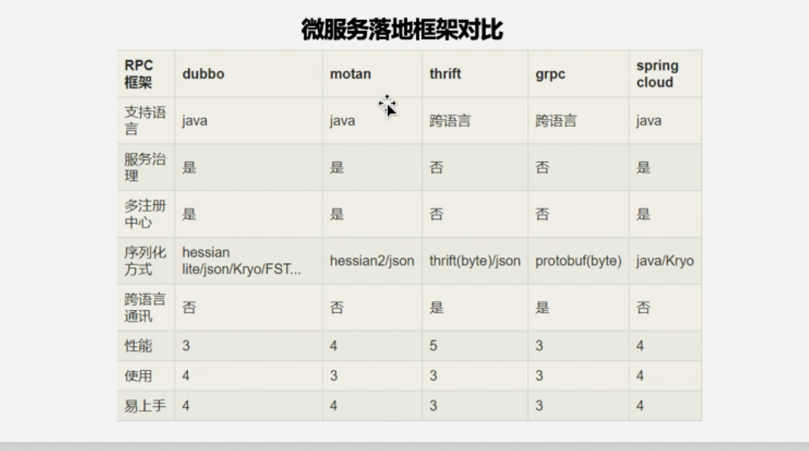
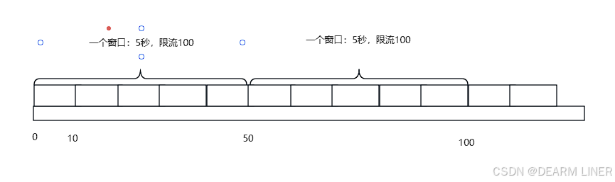
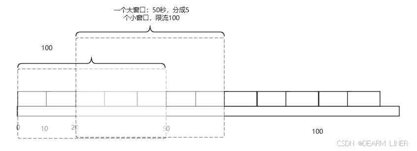
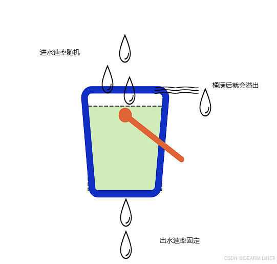
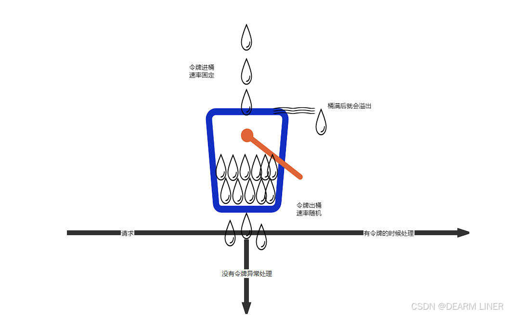

# 微服务概念

**为什么需要微服务**

传统开发模式下，绝大部分的Web应用都是采用单体架构的风格来进行构建的，这意味着Web应用是作为单个可部署的软件制品进行交付的，所有的接口、业务逻辑、持久层都被打包在一个Web应用中，并且部署在一台服务器上，这种开发模式会带来诸多不便，多团队协同开发的成本极高

**单体应用存在的问题**

- 随着业务的发展，开发变得越来越复杂
- 修改、新增某个功能，需要对整个系统进行测试、重新部署
- 一个模块出现问题，很可能导致整个系统崩溃
- 多个开发团队同时对数据进行管理，容易产生安全漏洞
- 各个模块使用同一种技术进行开发，各个模块很难根据实际情况选择更适合的技术框架，局限性很大
- 模块内容过于复杂，如果员工离职，可能需要很长时间才能完成工作交接

**分布式、集群概念**

- 集群

  一台服务器无法负载高并发的数据访问量，那么就设置十台服务器一起分担压力，十台不行就设置一百台（物理层面）。很多人干同一件事情，来分摊压力

- 分布式

  将一个复杂问题拆分成若干个简单的小问题，将一个大型的项目架构拆分成若干个微服务来协同完成（软件设计层面）。将一个庞大的工作拆分成若干个小步骤，分别由不同的人完成这些小步骤，最终将所有的结果进行整合实现大的需求

**微服务的优点**

- 各个服务的开发、测试、部署都相互独立，比如用户服务就可以拆分作为一个单独的服务，而他的开发也不用依赖于其他服务，如果用户量很大，我们可以很容易的对其进行负载
- 当一个新需求出现时，特别是在一个庞大的项目系统中，你得去考虑各方的问题，兼容性、影响度等等，而使用微服务则可以直接跳过这些费时又烧脑的环节
- 使用微服务将项目进行拆分之后，各服务之间就消除了诸多限制，只需要保证对外提供的接口正常可用，至于使用什么语言、什么框架通通不用关心

**微服务的不足**

- 上面我们提到了微服务的拆分是基于业务的，不是我们随心所欲的，想怎么拆就怎么拆的，那么问题来了，由谁来拆，怎么拆？这就给团队协作沟通带来了很多挑战
- 当服务调用方需要使用某个服务的接口时，首先需要找到该服务的提供方，通常在一个大公司中，这种场景是跨部门的，沟通成本可想而知。同时，如果服务的提供方需要对某个接口进行修改，也得和各个服务调用方进行沟通
- 由于各个服务相互独立，他们的数据也是独立的，这就会带来一个问题，当调用多个服务接口来进行操作时，如何保证各个服务的数据一致性，这既是问题，也是难点

**微服务框架**



# 为什么是Spring Cloud

- Spring Cloud完全基于SpringBoot，服务调用方式是基于REST API，整合了各种成熟的产品和架构，同时基于SpringBoot也使得整体的开发、配置、部署都非常方便
- Spring系的产品集功能齐全、简单好用、性能优越、文档规范等等于一身，因为SpringCloud还是微服务架构中一个十分优越的实现方案

# Spring Cloud

- 服务治理 Eureka

  服务治理的核心由三部分组成：服务提供者、服务消费者、注册中心

  - 在分布式系统架构中，每个微服务在启动时，将自己的信息存储在注册中心，叫做服务注册
  - 服务消费者从注册中心获取服务提供者的网络信息，通过该信息调用服务，叫做服务发现

  > Spring Cloud的服务治理使用Eureka来实现，Eureka是Netflix开源的基于REST的服务治理解决方案，Spring Cloud集成了Eureka，提供服务注册和服务发现的功能，可以和基于Spring Boot搭建的微服务应用轻松完成整合，开箱即用，Spring Cloud Eureka

- 服务通信 Ribbon

- 服务通信 Feign

- 服务网关 Zuul

- 服务容错 Hystrix

- 服务配置 Config

- 服务监控 Actuator

- 服务跟踪 Zipkin

**Spring Cloud Eureka**

- Eureka Server，注册中心
- Eureka Client，所有要进行注册的微服务通过Eureka Client连接到Eureka Server，完成注册

**RestTemplate的使用**

RestTemplate是Spring框架提供的基于REST的服务组件，底层是对HTTP请求及响应进行了封装，提供了很多访问REST服务的方法，可以简化代码开发

1. 创建Maven工程，pom.xml
2. 向Spring容器中注入RestTemplate的Bean对象

**服务网关**

Spring Cloud集成了Zuul组件，实现服务网关

- 什么是Zuul

  Zuul是Netflix提供的一个开源的API网关服务器，是客户端和网站后端所有请求的中间层，对外开放一个API，将所有请求导入统一的入口，屏蔽了服务端的具体实现逻辑，Zuul可以实现反向代理的功能，在网关内部实现动态路由、身份认证、IP过滤、数据监控等

  > 可以对服务与请求路径做路由映射配置

  Zuul自带了负载均衡功能

**Ribbon负载均衡**

Spring Cloud Ribbon是一个负载均衡解决方案，Ribbon是Netflix发布的负载均衡器，Spring Cloud Ribbon是基于Netflix Ribbon实现的，是一个用于对HTTP请求进行控制的负载均衡客户端

在注册中心对Ribbon进行注册后，Ribbon就可以基于某个负载均衡算法，如轮询、随机、加权轮询、加权随机等自动帮助服务消费者调用接口，开发者也可以根据具体需求自定义Ribbon负载均衡算法。实际开发中，Spring Cloud Ribbon需要结合Spring Cloud Eureka来使用，Eureka Server提供所有可以调用的服务提供者列表，Ribbon基于特定的负载均衡算法从这些服务提供者中选择要调用的具体实例

- 通过在RestTemplate在加@LoadBalanced注解开启Ribbon负载均衡功能

  ```java
  // 注册到Eureka注册中心后
  restTemplate.getForObject("http://服务名/服务路径")
  ```

**Feign**

与Ribbon一样，Feign也是由Netflix提供的，Feign是一个声明式、模板化的Web Service客户端，它简化了开发者编写Web服务客户端的操作，开发者可以通过简单的接口和注解来调用HTTP API，Spring Cloud Feign，他整合了Ribbon和Hystrix，具有可插拔、基于注解、负载均衡、服务熔断等一系列便携功能

相比较于Ribbon + RestTemplate的方式，Feign大大简化了代码的开发，Feign支持多种注解，包括Feign注解、JAX-RS注解、Spring MVC注解等，Spring Cloud对Feign进行了优化，整合了Ribbon和Eureka，从而让Feign的使用更加方便

- Ribbon和Feign的区别

  Ribbon是一个通用的HTTP客户端工具，Feign是基于Ribbon实现的

- Feign的特点

  1. Feign是一个声明式的Web Service客户端
  2. 支持Feign注解、Spring MVC注解、JAX-RS注解
  3. Feign基于Ribbon实现，使用起来更加简单
  4. Feign集成了Hystrix，具备服务熔断的功能

- 开启Feign的功能

  ```java
  @EnableFeignClients
  // 在启动类上添加
  ```

- 创捷一个接口

  ```java
  @FeignClient(value = "provider")
  public interface FeignProviderClient {
      @GetMapping("/student/findAll")
      public Collection<Student> finaAll();
      @GetMapping("/student/index")
      public String index();
  }
  ```

- 在其他使用的类中注入FeignProviderClient

  ```java
  @Autowired
  private FeignProviderClient feignProviderClient;
  ```

- 开启熔断功能

  ```yaml
  feign:
  	hystrix:
  		enabled: true
  ```

- 声明一个类实现FeignProviderClient，重写接口中的方法，提供熔断机制的返回值

  ```java
  public class FeignError implements FeignProviderClient {
      @Override
      public String index() {
          return "服务维护中";
      }
  }
  ```

- 在FeignProviderClient中添加fallback属性，属性值就为实现的类

  ```java
  @FeignClient(value = "provider", fallback = FeignError.class)
  ```

**Hystrix熔断机制**

在不改变各个服务调用关系的前提下，针对错误情况进行预先处理

- 设计原则
  1. 服务隔离机制
  2. 服务降级机制
  3. 熔断机制
  4. 提供实时的监控和报警功能
  5. 提供实时的配置修改功能

Hystrix数据监控需要结合Spring Cloud Actuator来使用，Actuator提供了对服务的健康监控、数据统计，可以通过hystrix.stream节点获取监控的请求数据，提供了可视化的监控界面，监控当前服务的信息

**Spring Cloud配置中心**

Spring Cloud Config，通过服务端可以为多个客户端提供配置服务。Spring Cloud Config可以将配置文件存储在本地，也可以将配置文件存储在远程Git仓库，创建Config Server，通过它管理所有的配置文件

在bootstrap.yml配置读取哪里的配置文件

- 本地配置

  bootstrap.yml配置文件中的spring.application.name与spring.profiles.active结合为他的配置文件的名字

- 远程git配置

  bootstrap.yml配置文件中的spring.cloud.config.name对应的是配置文件的名字

**服务跟踪**

Spring Cloud Zipkin

Zipkin是一个可以采集并且跟踪分布式系统中请求数据的组件，让开发者可以更加直观的监控到请求在各个微服务所消耗的时间等，Zipkin：Zipkin Server、Zipkin Client

# 限流算法

- 计数器法

  1. 将时间分为固定的窗口大小，例如1s
  2. 在窗口时间段内，每来一个请求，对计数器加1
  3. 当计数器达到设定限制后，该窗口时间内的之后的请求都被丢弃处理
  4. 该窗口时间结束后，计数器清零，从新开始计数

  

  - 优点：实现简单，直观易懂，设置明确的阈值，易于理解和配置。
  - 缺点：存在窗口切换时的突增问题，即在时间窗口的临界点附近，如果请求数突然增加，可能会导致短时间内大量请求通过限流检查，从而对系统造成压力。

  > 如果一个系统的qps为100/s，上一秒的前900ms都没有请求，而在最后100ms出现了100个请求，下一秒的前100ms出现了100个请求，这样会导致临界值请求数超出，200ms处理200请求显然超出了系统的阈值

- 滑动窗口计数法

  1. 将时间化为细粒度的区间，每个区间维持一个计数器，每进入一个请求则将计数器加一
  2. 多个区间组成一个时间窗口，每流逝一个区间时间后，则抛弃最老的一个区间，纳入新区间
  3. 若当前窗口的区间计数器总和超过设定的限制数量，则本窗口内的后续请求都被丢弃

  

  - 优点：能够更精确地控制流量，尤其是在处理短时间内突发的高请求量时，通过动态调整时间窗口的起始点和结束点，可以有效地平滑流量波动，避免系统因瞬间高负载而崩溃。
  - 缺点：实现相对复杂，需要维护多个时间窗口的计数器，并且需要处理时间窗口的滑动逻辑。

- 漏桶算法

  如果外部请求超出当前阈值，则会在桶里（队列）积蓄，一直到溢出，系统并不关心溢出的流量。从出口处限制请求速率，并不存在计数器的临界问题，请求曲线始终是平滑的。无法应对突发流量，相当于一个空桶+固定处理线程

  

  - 优点：能够提供一个稳定的流量输出，有效避免突发流量对系统的冲击，保证所有请求都按照相同的速率被处理，从而保证公平性。
  - 缺点：漏出速率是固定的，无法应对需要突发传输的场景。在网络未发生拥塞时，漏桶算法可能无法充分利用网络资源。

  > 由于线程是固定的，导致处理的速率无法改变，高峰期容易堆积，相当于通过线程的数量限制了不会超过阈值

- 令牌桶算法

  令牌桶限流算法使用一个固定容量的桶来存放令牌，这些令牌以恒定的速率被添加到桶中。当请求需要发送到网络时，它们会消耗桶中的令牌。如果桶中有足够的令牌，请求将被允许发送；否则，请求可能需要等待或被丢弃。

  

  - 优点：可以处理突发流量的问题。只要桶中有足够的令牌，就可以以峰值速率发送流量。通过调整令牌桶的容量和令牌生成速率，可以灵活地控制流量的平滑程度和突发程度。
  - 缺点：实现相对复杂，需要维护令牌桶的状态和令牌生成逻辑。

# 什么是熔断？什么是服务降级？

- 服务熔断

  当服务A调用的某个服务B不可用时，上有服务A为了保证自己不受影响，从而不再调用服务B，直接返回一个结果，减轻服务A和服务B的压力，直到服务B恢复

- 服务降级

  当发现系统压力过载时，可以通过关闭某个服务，或限流某个服务来减轻系统压力，这就是服务降级

相同点：

1. 都是为了防止系统崩溃
2. 都让用户体验到某些功能暂时不可用

不同点：

​	熔断是下游服务故障触发的，降级是为了降低系统负载

# 什么是服务雪崩？什么是服务限流？

1. 当服务A调用服务B，服务B调用服务C，此时大量请求突然请求服务A，假如服务A本身能扛住这些请求，但是如果服务C扛不住，导致服务C请求堆积，从而服务B请求堆积，从而服务A不可用，这就是服务雪崩，解决方式就是服务降级和服务熔断
2. 服务限流是指在高并发请求下，为了保护系统，可以对访问服务的请求进行数量上的限制，从而防止系统被大量请求压垮，在秒杀中，限流是非常重要的


