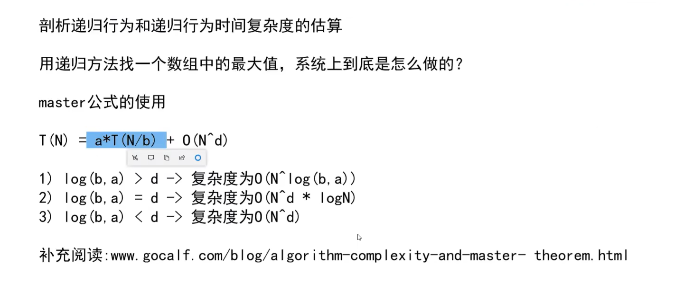

### 异或 ^

举例
0 ^ 0 = 0
0 ^ 1 = 1
1 ^ 0 = 1
1 ^ 1 = 0
表面上看就是相同为0，不同为1

另一种看法：
&nbsp;&nbsp;1 0 1 1 0
^ 1 1 0 1 1
———————————
&nbsp;&nbsp;0 1 1 0 1
可以看成为不进位的加法

特性：
0 ^ N = N （任何数异或0等于任何数）
N ^ N = 0 （任何数异或自己等于0）
a ^ b = b ^ a （交换律）
a ^ b ^ c = a ^ (b ^ c) （结合律）

一堆数在一起异或，无论位置怎么改变，结果是不变的
原因：
依然把异或看作为不进位的加法，一堆数的位置无论怎么变化，各个位上面的结果依然看的是1为奇数个，还是偶数个，如果为奇数个该位的结果则为1，偶数个则为0，与顺序无关

取巧交换：
a = a ^ b （a：a ^ b， b：b）
b = a ^ b （a：a ^ b， b：a）
a = a ^ b （a：b， b：a）

例题：
（1）出现奇数次的数
数组中一个数出现了奇数次，剩下的数出现了偶数次，找到出现奇数次的数
（2）两个出现奇数次的数
数组中两个数出现了奇数次，剩下的数出现了偶数次，找到出现奇数次的两个数
```java
int[] arr = new int[]{1,1,2,2,3,3,3,5,5,5};
int eor = 0;
// 得到两个奇数次数的异或结果
for (int i = 0; i < arr.length; i++) {
    eor ^= arr[i];
}
// 解法1：
// 因为两个数不相等，所以结果不为0，必有一位为1，那么这两个数在这一位就不相同，所以找到这一位
int temp = eor;
int count = 0;
while (temp > 0) {
    int r = temp & 1;
    if (r == 1) {
        break;
    }
    count++;
    temp = temp >> 1;
}
// 将所有数为这一位为1的和为0的，首先这两个数必不在一组，剩余的数每个也只会出现在一组中，成为例题1的情况
int eorp = 0;
for (int i = 0; i < arr.length; i++) {
    if ((arr[i] >> count & 1) == 1) {
        eorp ^= arr[i];
    }
}

// 解法2
// eor & (~eor + 1)直接获取最右边为1的数
int eorp = 0;
int rightOne = eor & (~eor + 1);
for (int i = 0; i < arr.length; i++) {
    if ((arr[i] & rightOne) == rightOne) {
        eorp ^= arr[i];
    }
}

System.out.println(eorp);
System.out.println(eor ^ eorp);
```

### 算法
优化场景：
1. 数据状况符合优化
2. 问题的情况符合优化

### 二分法
有序可以二分，但不是只有有序才能二分（只有两种数也是有序）
只要能通过某些条件甩掉一边，把数据变成一半一半就都可以用二分法
例题1：
无序数组长度为n，如果一个数比他相邻两边的数小，那这个数就是局部最小数，如果在索引为0的数比索引为1的数小，就是局部最小数，如果索引为n-1的数比索引为n-2的数小，也是局部最小数，现在在这个数组中随便找出一个局部最小数，要求事件复杂度的为O(logn)

解题方法：
首先判断首尾是否为局部最小数，如果都不是的话，说明从数组首为递减趋势，到数组尾为递增趋势（因为索引为1的数比首大，索引为n-2的数比尾小），那么这个数组中必然存在一个拐点，从递减变为递增，也就是局部最小数的位置，
采用二分法找到中间的数，判断这个数两边的递增递减趋势
如果左递增，右递减，则两边都存在局部最小值
如果左递增，右递增，则左边必存在局部最小值
如果左递减，右递减，则右边必存在局部最小值
如果左递减，右递增，则自己就是局部最小值

例题2：
有序数组[1,1,1,1,3,3,3,3,3,5,5,5,5,6,6,6]，找到在最左边大于等于3的索引

解题方法：
```java
int[] arr = new int[]{1,1,1,1,3,3,3,3,3,5,5,5,5,6,6,6};
int n = 3;
int index = 0;
int l = 0;
int r = arr.length - 1;
while (l <= r) {
    // int mid = (l + r) / 2;
    // 防止特殊情况l + r都很大导致结果溢出，改成l + (r - l) / 2
    int mid = l + ((r - l) >> 1)
    if (arr[mid] < n) {
        l = mid + 1;
    } else {
        index = mid;
        r = mid - 1;
    }
}
System.out.println(index);
```

### 递归
#### master公式


#### 归并排序
```java
public static void mergeSort(int[] arr, int l, int r) {
    if (l == r) {
        return;
    }

    int mid = l + ((r - l) >> 1);
    mergeSort(arr, l, mid);
    mergeSort(arr, mid + 1, r);
    merge(arr, l, mid, r);
}

public static void merge(int[] arr, int l, int mid, int r) {
    int[] help = new int[r - l + 1];
    int i = 0;
    int p1 = l;
    int p2 = mid + 1;

    while (p1 <= mid && p2 <= r) {
        help[i++] = arr[p1] <= arr[p2] ? arr[p1++] : arr[p2++];
    }

    while (p1 <= mid) {
        help[i++] = arr[p1++];
    }

    while (p2 <= r) {
        help[i++] = arr[p2++];
    }

    for (int index = 0; index < help.length; index++) {
        arr[l + index] = help[index];
    }
}
```

归并思想解决问题

1. 在数组中所有左侧小于当前数的总和为当前数的小和，求数组[1,3,4,2,5]中所有小和

（1）按照小和的定义想，找出当前数左侧所有小于当前数的和
    使用归并排序将数组从大到小排序，当左侧数组的遍历的数比右侧数组的遍历的数小时，那么左侧数组从这个遍历的数开始向右的所有数都比右侧的这个数小，利用这个特性可以容易得到小和（但是还是要遍历）
```java
public static void mergeSortSmallSum(int[] arr, int l, int r) {
    if (l == r) {
        return;
    }

    int mid = l + ((r - l) >> 1);
    mergeSortSmallSum(arr, l, mid);
    mergeSortSmallSum(arr, mid + 1, r);
    mergeCal2(arr, l, mid, r);
}

public static void mergeCal2(int[] arr, int l, int mid, int r) {
    int[] helps = new int[r - l + 1];

    int p1 = l;
    int p2 = mid + 1;
    int index = 0;
    while (p1 <= mid && p2 <= r) {
        if (arr[p1] < arr[p2]) {
            // 直接得到右侧数组遍历的数的小数
            for (int i = 0; p1 + i <= mid; i++) {
                list.add(arr[p1 + i]);
            }

            helps[index++] = arr[p2++];
        } else if (arr[p1] == arr[p2]){
            helps[index++] = arr[p1++];
        } else {
            helps[index++] = arr[p1++];
        }
    }

    while (p1 <= mid) {
        helps[index++] = arr[p1++];
    }

    while (p2 <= r) {
        helps[index++] = arr[p2++];
    }

    for (int i = 0; i < helps.length; i++) {
        arr[l + i] = helps[i];
    }
}
```
（2）反过来想，一个数右侧所有比他大的数有多少个，那么这个数就是多少个数的小数
    使用归并排序从小到大排序，如果左侧遍历的数比右侧遍历的数小，那么说明左侧遍历的数比右侧遍历的数的右侧所有数都要小，右侧有多少个数那么左侧这个遍历的数就是多少个数的小数（不需要遍历，因为不关心右侧哪些数比左侧的数大，只需知道多少个）
```java
public static void mergeSortSmallSum(int[] arr, int l, int r) {
    if (l == r) {
        return;
    }

    int mid = l + ((r - l) >> 1);
    mergeSortSmallSum(arr, l, mid);
    mergeSortSmallSum(arr, mid + 1, r);
    mergeCal(arr, l, mid, r);
}

public static void mergeCal(int[] arr, int l, int mid, int r) {
    int[] helps = new int[r - l + 1];

    int p1 = l;
    int p2 = mid + 1;
    int index = 0;
    while (p1 <= mid && p2 <= r) {
        if (arr[p1] < arr[p2]) {
            for (int i = 0; i < r - p2 + 1; i++) {
                list.add(arr[p1]);
            }

            helps[index++] = arr[p1++];
        } else if (arr[p1] == arr[p2]){
            helps[index++] = arr[p2++];
        } else {
            helps[index++] = arr[p2++];
        }
    }

    while (p1 <= mid) {
        helps[index++] = arr[p1++];
    }

    while (p2 <= r) {
        helps[index++] = arr[p2++];
    }

    for (int i = 0; i < helps.length; i++) {
        arr[l + i] = helps[i];
    }
}

/**
 * 直接求小和，不借助list
**/
public static int process(int[] arr, int l, int r) {
    if (l == r) {
        return 0;
    }

    int mid = l + ((r - l) >> 1);

    return process(arr, l, mid) + process(arr, mid + 1, r) + mergeSum(arr, l, mid, r);
}

public static int mergeSum(int[] arr, int l, int mid, int r) {
    int[] helps = new int[r - l + 1];

    int p1 = l;
    int p2 = mid + 1;
    int index = 0;
    int res = 0;
    while (p1 <= mid && p2 <= r) {
        if (arr[p1] < arr[p2]) {
            res += arr[p1] * (r - p2 + 1);
            helps[index++] = arr[p1++];
        } else if (arr[p1] == arr[p2]){
            helps[index++] = arr[p2++];
        } else {
            helps[index++] = arr[p2++];
        }
    }

    while (p1 <= mid) {
        helps[index++] = arr[p1++];
    }

    while (p2 <= r) {
        helps[index++] = arr[p2++];
    }

    for (int i = 0; i < helps.length; i++) {
        arr[l + i] = helps[i];
    }

    return res;
}
```
2. 逆序对问题，在数组中，一个数的右侧有某个数比他小，那么这两个数就能组成逆序对，求一个数组中有多少个逆序对（同上个问题，变成求右侧数组有多少个数比左侧数组遍历的数小）

#### 快速排序
问题1：
一个数组，给定一个num，希望将小于等于num的数放在数组左侧，大于num的数放在数组右侧，时间复杂度O(n)，空间复杂度O(1)
```java
// 将数组分为小于等于区，待定区，大于区，quickP遍历的为待定区，发现小于等于num的数后，与小于等于区后一个数交换，扩充小于等于区，发现大于num的数后继续遍历（相当于大于区扩充），遍历到数组最后（相当于小于等于区和大于区推着待定区）
int[] arr = new int[]{2, 3, 6, 5, 1, 4, 7, 8, 9, 0};
int num = 5;
int slowP = -1;
int quickP = 0;

while (quickP < arr.length) {
    if (arr[quickP] <= num) {
        int temp = arr[quickP];
        arr[quickP] = arr[slowP + 1];
        arr[slowP + 1] = temp;

        slowP++;
    }

    quickP++;
}
```

问题2：
荷兰旗问题，一个数组，给定一个num，希望将小于num的数放在数组左侧，大于num的数放在数组右侧，等于num的数放在数组中间，时间复杂度O(n)，空间复杂度O(1)
```java
int[] arr = new int[]{2, 3, 6, 5, 1, 4, 7, 8, 9, 0};
int num = 5;
int smallP = -1;
int bigP = arr.length;
int p = 0;

while (p < bigP - 1) {
    if (arr[p] < num) {
        int temp = arr[p];
        arr[p] = arr[smallP + 1];
        arr[smallP + 1] = temp;

        smallP++;
        p++;
    } else if (arr[p] > num){
        int temp = arr[p];
        arr[p] = arr[bigP - 1];
        arr[bigP - 1] = temp;

        bigP--;
    } else {
        p++;
    }


}
```
快速排序1.0和快速排序2.0就是建立在问题1和问题2之上，使用递归不停的对小于区和大于区中的数划分，使用当前区域最后一个数作为num

但问题就是排序的快慢会取决于num，如果极端情况num为最大或者最小的数，就会使时间复杂度上升为O(N²)，所以很看来源的数据

快速排序3.0：
    随机取任何一个数作为num，将num的类型作为等概率事件，可将时间复杂度优化为O(Nlogn)
```java
public static void quickSort(int[] arr, int l, int r) {
    if (l >= r) {
        return;
    }

    int index = l + (int) (Math.random() * (r - l + 1));
    int t = arr[index];
    arr[index] = arr[r];
    arr[r] = t;
    int num = arr[r];
    int smallP = l - 1;
    int bigP = r;
    int p = l;

    while (p < bigP) {
        if (arr[p] < num) {
            int temp = arr[p];
            arr[p] = arr[smallP + 1];
            arr[smallP + 1] = temp;

            smallP++;
            p++;
        } else if (arr[p] > num) {
            int temp = arr[p];
            arr[p] = arr[bigP - 1];
            arr[bigP - 1] = temp;

            bigP--;
        } else {
            p++;
        }
    }

    arr[r] = arr[bigP];
    arr[bigP] = num;

    quickSort(arr, l, smallP);
    quickSort(arr, bigP + 1, r);
}
```

#### 堆排序
堆排序两个核心函数：
1. heapInsert 
用于初始化堆，将堆变为大根堆
2. heapify
对大根堆任意位置的数修改后，可以将其继续变为大根堆

heapSize为堆的范围
```java
public static void heapSort(int[] arr) {
    if (arr == null || arr.length < 2) {
        return;
    }

//        for (int i = 0; i < arr.length; i++) { // O(N)
//            heapInsert(arr, i);                // O(logN)
//        }

    // 整体为O(N)，比上面稍快
    for (int i = arr.length - 1; i >= 0; i++) {
        heapify(arr, i, arr.length);            
    }

    int heapSize = arr.length;
    while (heapSize > 0) {
        int temp = arr[0];
        arr[0] = arr[heapSize - 1];
        arr[heapSize - 1] = temp;

        heapify(arr, 0, --heapSize);
    }
}

public static void heapInsert(int[] arr, int index) {
    while (arr[(index - 1) / 2] < arr[index]) {
        int temp = arr[index];
        arr[index] = arr[(index - 1) / 2];
        arr[(index - 1) / 2] = temp;

        index = (index - 1) / 2;
    }
}

public static void heapify(int[] arr, int index, int heapSize) {
    int left = index * 2 + 1;

    // 判断是否有孩子
    while (left < heapSize) {
        // 判断左右孩子节点谁大
        int largest = left + 1 < heapSize && arr[left + 1] > arr[left] ? left + 1 : left;
        // 判断当前节点与左右孩子节点比谁大
        largest = arr[index] > arr[largest] ? index : largest;
        if (largest == index) {
            break;
        }

        int temp = arr[index];
        arr[index] = arr[largest];
        arr[largest] = temp;

        index = largest;
        left = index * 2 + 1;
    }
}
```
问题：
1. 一个数组几乎有序，几乎有序的意思为数组中的每个数只需要移动很少的次数即可使整个数组有序，假设每个数需要移动的次数不大于k，需要一种时间复杂度最低的排序方式
```java
public static void sortedArrDistanceLessK(int[] arr, int k) {
    // 优先级队列默认为小根堆
    PriorityQueue<Integer> heap = new PriorityQueue<>();

    int i = 0;
    /**
        * 因为数组中的每个数只需要移动最多k次就能排好序，数组最小的数必定在前k + 1之间，倒数第二小数必定在前1到k + 2之间，以此类推
        * 初始化小根堆，小根堆的大小为k + 1，先存入数组前k + 1个数，此时小根堆堆顶就为数组最小的数
        */
    for (; i < Math.min(arr.length, k); i++) {
        heap.add(arr[i]);
    }

    /**
        * 取出最小数放在数组0位置，向小根堆放入第k + 2个数得到倒数第二小的数，放到数组1位置，以此类推
        */
    int index = 0;
    for (; i < arr.length; i++) {
        heap.add(arr[i]);
        arr[index++] = heap.poll();
    }

    while (!heap.isEmpty()) {
        arr[index++] = heap.poll();
    }
}
```

#### 基数排序（桶排序）
像冒泡排序，快速排序等等为通用排序，即给任何数据只要能比较大小就能排序，但还有一种特殊的排序

假设给定一个数组[2,1,3,1,4,0]，对他进行排序，创建一个长度为5的数组，该数组的索引代表给定数组中数的值，索引对应的值代表给定数组中该数有多少个，当遍历完整个数组放入创建的数组之后，已经完成了排序。
但是这种排序有个弊端，如果给定的数组最小-2000000000，最大200000000，那这个辅助数组就不好创建并且占用空间太大了

改良桶排序
```java
public static void radixSort(int[] arr, int l, int r, int digit) {
    int[] bucket = new int[r - l + 1];

    int i = 0;
    int j = 0;
    int radix = 10;
    for (int d = 1; d <= digit; d++) {
        // 10个空间
        // count[0] 当前位（d位）是0的数有多少个
        // count[1] 当前位（d位）是0，1的数有多少个
        // count[2] 当前位（d位）是0，1，2的数有多少个
        // count[3] 当前位（d位）是小于等于3的数有多少个
        int[] count = new int[radix];
        for (i = l; i <= r; i++) {
            j = getDigit(arr[i], d);
            count[j]++;
        }

        for (i = 1; i < radix; i++) {
            count[i] = count[i] + count[i - 1];
        }

        for (i = r; i >= l; i--) {
            j = getDigit(arr[i], d);
            bucket[count[j] - 1] = arr[i];
            count[j]--;
        }

        for (i = l, j = 0; i <= r; i++, j++) {
            arr[i] = bucket[j];
        }
    }
}

private static int getDigit(int num, int d) {
    num %= Math.pow(10, d);
    num /= Math.pow(10, d - 1);
    return num;
}
```
||时间|空间|稳定性|
|---|---|---|---|
|选择排序|O(N²)|O(1)|×|
|冒泡排序|O(N²)|O(1)|√|
|插入排序|O(N²)|O(1)|√|
|归并排序|O(NlogN)|O(N)|√|
|快速排序|O(NlogN)|O(logN)|×|
|堆排序|O(NlogN)|O(1)|×|

实验证明快速排序更快，所以推荐快速排序

1) 基于比较排序时间复杂度小于O(NlogN)，目前没有
2) 时间复杂度在O(NlogN)，空间复杂度小于O(N)，目前无法做到稳定性

### 链表

#### 单链表反转
```java
private static void reserveNodeList() {
    Node<Integer> head = new Node<>();
    head.setValue(1);
    Node<Integer> p = head;

    for (int i = 2; i < 5; i++) {
        Node<Integer> next = new Node<>();
        next.setValue(i);

        p.setNext(next);
        p = p.getNext();
    }


//        while (p != null) {
//            System.out.println(p.value);
//            p = p.getNext();
//        }
    Node<Integer> p1 = new Node<>();
    Node<Integer> p2 = new Node<>();

    p1 = head;
    p2 = p1.getNext();
    Node<Integer> q = new Node<>();

    while (p2 != null) {
        p1.setNext(q.getNext());
        q.setNext(p1);
        p1 = p2;
        p2 = p2.getNext();
    }

    p1.setNext(q.getNext());
    q.setNext(p1);

    q = q.getNext();
    while (q != null) {
        System.out.println(q.value);
        q = q.getNext();
    }
}

public static class Node<V> {
    private V value;
    private Node<V> next;

    public V getValue() {
        return value;
    }

    public void setValue(V value) {
        this.value = value;
    }

    public Node<V> getNext() {
        return next;
    }

    public void setNext(Node<V> next) {
        this.next = next;
    }
}
```
#### 找联表中点
用于看链表是否为回文联表（只需判断一半，省时间），可以将中点后半部分放入栈中，与前半部分比较，也可以将中点后半部分反转，与前半部分比较（比栈省空间，需要多个指针）
```java
private static void fastSlowPointer() {
    Node<Integer> head = new Node<>();
    head.setValue(1);
    Node<Integer> p = head;

    for (int i = 2; i < 5; i++) {
        Node<Integer> next = new Node<>();
        next.setValue(i);

        p.setNext(next);
        p = p.getNext();
    }

    p = head;
    while (p != null) {
        System.out.println(p.value);
        p = p.getNext();
    }

    Node<Integer> f = head;
    Node<Integer> s = head;
//            s       f
//        1 2 3 4 5 6
//  快指针到终点， 慢指针到中间（奇数）或中间前一个（偶数）
    while (f != null) {
        f = f.next;
        if (f == null) {
            break;
        }
        f = f.next;
        if (f == null) {
            break;
        }
        s = s.next;
    }

    System.out.println(s.value);
//  快指针到终点， 慢指针到中间（奇数）或中间后一个（偶数）
    while (f != null) {
        f = f.next;
        if (f == null) {
            break;
        }
        f = f.next;

        s = s.next;
    }

    System.out.println(s.value);
}
```
#### 链表荷兰旗（有稳定性）
需要六个指针，分别小于头、小于尾、等于头、等于尾、大于头、大于尾，最后连接时还需要判断每个区域是否有节点存在，否则会空指针
```java
private static void linkedListDutchFlag() {
    int[] arr = new int[]{2,8,3,1,7,4,6,5,0,9};
    Node<Integer> head = new Node<>();
    head.setValue(arr[0]);
    Node<Integer> p = head;

    for (int i = 1; i < arr.length; i++) {
        Node<Integer> next = new Node<>();
        next.setValue(arr[i]);

        p.setNext(next);
        p = p.getNext();
    }

    p = head;
    while (p != null) {
        System.out.println(p.value);
        p = p.getNext();
    }
    /**
        * 小于头、小于尾
        */
    Node<Integer> sh = null;
    Node<Integer> st = null;
    /**
        * 等于头、等于尾
        */
    Node<Integer> eh = null;
    Node<Integer> et = null;
    /**
        * 大于头、大于尾
        */
    Node<Integer> gh = null;
    Node<Integer> gt = null;

    p = head;
    while (p != null) {
        if (p.value < 5) {
            if (sh == null) {
                sh = p;
                st = p;
            } else {
                st.next = p;
                st = st.next;
            }

        } else if (p.value == 5) {
            if (eh == null) {
                eh = p;
                et = p;
            } else {
                et.next = p;
                et = et.next;
            }

        } else {
            if (gh == null) {
                gh = p;
                gt = p;
            } else {
                gt.next = p;
                gt = gt.next;
            }

        }

        p = p.next;
    }

    if (st != null) {
        st.next = eh;
        et = et == null ? st : et;
    }

    if (et != null) {
        et.next = gh;
    }

    p = sh != null ? sh : (eh != null ? eh : gh);

    while (p != null) {
        System.out.println(p.value);
        p = p.getNext();
    }
}
```
#### 特殊节点
节点上还有一个指针ran指向链表上任意一个节点，如何复制这个链表？如何时间复杂度为O(N)，空间复杂度为O(1)呢？

1. 简单方法，不考虑空间复杂度，用HashMap
```java

```
2. 考虑空间复杂度，借助链表完成
```java

```
#### 特殊链表
两个有环或者无环链表，判断他们是否相交，并找出第一个相交的节点
```java
/**
 * @author pujq
 * @version 1.0
 * @description TODO
 * @since 2024/1/25 16:22
 *
 * 求两个链表是否相交，相交的话是否成环，第一个相交节点是哪个
 */
public class Test {
    /*

     */
    public static Node head1 = new Node();
    public static Node head2 = new Node();

    public static void main(String[] args) {
//        init1_1();
//        init1_2();
//        init2();
//        init3_1();
//        init3_2();
        init3_3();

        Node loop1 = getLoop(head1);
        Node loop2 = getLoop(head2);

        if (loop1 == null && loop2 == null) {
            Node cur1 = head1;
            Node cur2 = head2;

            int n = 0;

            while (cur1.getNext() != null) {
                n++;
                cur1 = cur1.getNext();
            }

            while (cur2.getNext() != null) {
                n--;
                cur2 = cur2.getNext();
            }

            if (cur1 == cur2) {
                cur1 = n > 0 ? head1 : head2;
                cur2 = cur1 == head1 ? head2 : head1;

                n = Math.abs(n);
                while (n > 0) {
                    n--;
                    cur1 = cur1.getNext();
                }

                while (cur1 != cur2) {
                    cur1 = cur1.getNext();
                    cur2 = cur2.getNext();
                }
                System.out.println("两个链表相交，不成环，相交节点为" + cur1.getValue());
            } else {
                System.out.println("两个链表不相交，也不成环");
            }
        }
        else if ((loop1 == null && loop2 != null) || (loop1 != null && loop2 == null)) {
            /*
            一个链表不成环，另一个链表成环，那么这两个链表必定不相交
             */
            System.out.println("一个链表不成环，另一个链表成环，这两个链表不相交");
        }
        else {
            if (loop1 == loop2) {
                Node cur1 = head1;
                Node cur2 = head2;

                int n = 0;
                while (cur1 != loop1) {
                    n++;
                    cur1 = cur1.getNext();
                }

                while (cur2 != loop1) {
                    n--;
                    cur2 = cur2.getNext();
                }

                cur1 = n > 0 ? head1 : head2;
                cur2 = cur1 == head1 ? head2 : head1;

                n = Math.abs(n);
                while (n > 0) {
                    n--;
                    cur1 = cur1.getNext();
                }

                while (cur1 != cur2) {
                    cur1 = cur1.getNext();
                    cur2 = cur2.getNext();
                }

                System.out.println("两节点相交并成环，相交节点为" + cur1.getValue());
            }
            else {
                Node cur1 = loop1.getNext();
                while (cur1 != loop1) {
                    if (cur1 == loop2) {
                        System.out.println("两个链表相交并成环，第一个交点为" + loop1.getValue() + "或者" + loop2.getValue());
                        return;
                    }
                    cur1 = cur1.getNext();
                }

                System.out.println("两个链表成环但不相交");
            }
        }
    }

    /**
     * 两个链表不成环
     * 1. 两个链表不相交
     */
    public static void init1_1() {
        Node cur1 = head1;
        generateList(cur1, 5);

        Node cur2 = head2;
        generateList(cur2, 4);
    }

    /**
     * 2. 两个链表相交
     */
    public static void init1_2() {
        Node cur1 = head1;
        cur1 = generateList(cur1, 5);

        Node cur2 = head2;
        cur2 = generateList(cur2, 4);

        Node node = new Node(666);
        cur1.setNext(node);
        cur2.setNext(node);

        generateList(node, 3);
    }

    /**
     * 一个链表成环，一个链表不成环
     */
    public static void init2() {
        Node cur1 = head1;
        cur1 = generateList(cur1, 5);

        Node cur2 = head2;
        cur2 = generateList(cur2, 4);

        Node loop = cur2;

        cur2 = generateList(cur2, 6);

        cur2.setNext(loop);
    }

    /**
     * 两条链表成环
     * 1. 两条链表相交，入环点相同
     */
    public static void init3_1() {
        Node cur1 = head1;
        cur1 = generateList(cur1, 5);

        Node cur2 = head2;
        cur2 = generateList(cur2, 4);

        Node node = new Node(666);
        cur1.setNext(node);
        cur2.setNext(node);

        node = generateList(node, 3);

        Node loop = node;

        node = generateList(node, 7);

        node.setNext(loop);
    }

    /**
     * 2. 两链表相交，入环点不同
     */
    public static void init3_2() {
        Node cur1 = head1;
        cur1 = generateList(cur1, 5);

        Node cur2 = head2;
        cur2 = generateList(cur2, 4);

        Node node1 = new Node(666);
        cur1.setNext(node1);

        node1 = generateList(node1, 3);

        Node node2 = new Node(888);
        cur2.setNext(node2);

        node1.setNext(node2);

        node2 = generateList(node2, 7);

        node2.setNext(cur1.getNext());
    }

    /**
     * 2. 两链表不相交
     */
    public static void init3_3() {
        Node cur1 = head1;
        cur1 = generateList(cur1, 5);

        Node loop1 = cur1;

        cur1 = generateList(cur1, 6);

        cur1.setNext(loop1);

        Node cur2 = head2;
        cur2 = generateList(cur2, 4);

        Node loop2 = cur2;

        cur2 = generateList(cur2, 6);

        cur2.setNext(loop2);
    }

    public static Node generateList(Node head, int n) {
        Node cur = head;
        while (n > 0) {
            n--;
            cur.setNext(new Node());
            cur = cur.getNext();
        }

        return cur;
    }

    public static Node getLoop(Node head) {
        if (head == null || head.getNext() == null || head.getNext().getNext() == null) {
            return null;
        }

        Node fast = head.getNext().getNext();
        Node slow = head.getNext();

        while (fast != slow) {
            if (fast.getNext() == null || fast.getNext().getNext() == null) {
                return null;
            }

            fast = fast.getNext().getNext();
            slow = slow.getNext();
        }
        /*
        可以获得入环点
         */
        fast = head;
        while (fast != slow) {
            fast = fast.getNext();
            slow = slow.getNext();
        }

        return fast;
    }
}

public class Node {
    private int value;
    private Node next;

    public Node() {
    }

    public Node(int value) {
        this.value = value;
    }

    public int getValue() {
        return value;
    }

    public void setValue(int value) {
        this.value = value;
    }

    public Node getNext() {
        return next;
    }

    public void setNext(Node next) {
        this.next = next;
    }
}
```
## 二叉树
